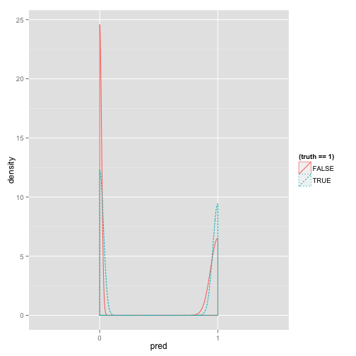
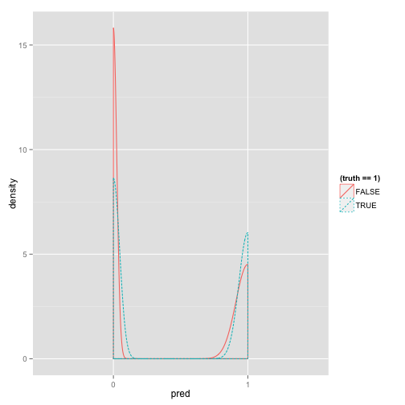

# Markdown version of Buzz data analysis

by: Nina Zumel and John Mount
Win-Vector LLC
11-8-2013


To run this example you need a system with R installed (see [http://cran.r-project.org](http://cran.r-project.org)), and data from 
[https://github.com/WinVector/zmPDSwR/tree/master/Buzz](https://github.com/WinVector/zmPDSwR/tree/master/Buzz).


We are not perfoming any new analysis here, just supplying a direct application of Random Forests on the data.

Data from: [http://ama.liglab.fr/datasets/buzz/](http://ama.liglab.fr/datasets/buzz/)
Using: 
       [TomsHardware-Relative-Sigma-500.data](http://ama.liglab.fr/datasets/buzz/classification/TomsHardware/Relative_labeling/sigma=500/TomsHardware-Relative-Sigma-500.data)

(described in [TomsHardware-Relative-Sigma-500.names](http://ama.liglab.fr/datasets/buzz/classification/TomsHardware/Relative_labeling/sigma=500/TomsHardware-Relative-Sigma-500.names) )

Crypto hashes:
shasum TomsHardware-*.txt
*  5a1cc7863a9da8d6e8380e1446f25eec2032bd91  TomsHardware-Absolute-Sigma-500.data.txt
*  86f2c0f4fba4fb42fe4ee45b48078ab51dba227e  TomsHardware-Absolute-Sigma-500.names.txt
*  c239182c786baf678b55f559b3d0223da91e869c  TomsHardware-Relative-Sigma-500.data.txt
*  ec890723f91ae1dc87371e32943517bcfcd9e16a  TomsHardware-Relative-Sigma-500.names.txt

To run this example you need a system with R installed 
(see [cran](http://cran.r-project.org)),
Latex (see [tug](http://tug.org)) and data from 
[zmPDSwR](https://github.com/WinVector/zmPDSwR/tree/master/Buzz).

To run this example:
* Download buzzm.Rmd and TomsHardware-Relative-Sigma-500.data.txt from the github URL.
* Start a copy of R, use setwd() to move to the directory you have stored the files.
* Make sure knitr is loaded into R ( install.packages('knitr') and
library(knitr) ).
* In R run: (produces [buzzm.md](https://github.com/WinVector/zmPDSwR/blob/master/Buzz/buzzm.md) from buzzm.Rmd).

```r
knit('buzzm.Rmd')
```


<!-- set up caching and knitr chunk dependency calculation -->
<!-- note: you will want to do clean re-runs once in a while to make sure -->
<!-- you are not seeing stale cache results. -->
```{setup,tidy=F,cache=F,eval=T,echo=F,results='hide'}
opts_chunk$set(autodep=T)
dep_auto()
```


Now you can run the following data prep steps:


```r
infile <- "TomsHardware-Relative-Sigma-500.data.txt"
paste('checked at',date())
```

```
## [1] "checked at Fri Nov  8 11:21:37 2013"
```

```r
system(paste('shasum',infile),intern=T)  # write down file hash
```

```
## [1] "c239182c786baf678b55f559b3d0223da91e869c  TomsHardware-Relative-Sigma-500.data.txt"
```

```r
buzzdata <- read.table(infile, header=F, sep=",")

makevars <- function(colname, ndays=7) {
  paste(colname, 0:ndays, sep='')
}

varnames <- c("num.new.disc",
             "burstiness",
             "number.total.disc",
             "auth.increase",
             "atomic.containers", # not documented
             "num.displays", # number of times topic displayed to user (measure of interest)
             "contribution.sparseness", # not documented
             "avg.auths.per.disc",
             "num.authors.topic", # total authors on the topic
             "avg.disc.length",
             "attention.level.author",
             "attention.level.contrib"
)

colnames <- as.vector(sapply(varnames, FUN=makevars))
colnames <-  c(colnames, "buzz")
colnames(buzzdata) <- colnames

# Split into training and test
set.seed(2362690L)
rgroup <- runif(dim(buzzdata)[1])
buzztrain <- buzzdata[rgroup > 0.1,]
buzztest <- buzzdata[rgroup <=0.1,]
```


This currently returns a training set with 7114 rows and a test set with 
791 rows, which 
is the same
as when this document was prepared.

Notice we have exploded the basic column names into the following:

```r
print(colnames)
```

```
##  [1] "num.new.disc0"            "num.new.disc1"           
##  [3] "num.new.disc2"            "num.new.disc3"           
##  [5] "num.new.disc4"            "num.new.disc5"           
##  [7] "num.new.disc6"            "num.new.disc7"           
##  [9] "burstiness0"              "burstiness1"             
## [11] "burstiness2"              "burstiness3"             
## [13] "burstiness4"              "burstiness5"             
## [15] "burstiness6"              "burstiness7"             
## [17] "number.total.disc0"       "number.total.disc1"      
## [19] "number.total.disc2"       "number.total.disc3"      
## [21] "number.total.disc4"       "number.total.disc5"      
## [23] "number.total.disc6"       "number.total.disc7"      
## [25] "auth.increase0"           "auth.increase1"          
## [27] "auth.increase2"           "auth.increase3"          
## [29] "auth.increase4"           "auth.increase5"          
## [31] "auth.increase6"           "auth.increase7"          
## [33] "atomic.containers0"       "atomic.containers1"      
## [35] "atomic.containers2"       "atomic.containers3"      
## [37] "atomic.containers4"       "atomic.containers5"      
## [39] "atomic.containers6"       "atomic.containers7"      
## [41] "num.displays0"            "num.displays1"           
## [43] "num.displays2"            "num.displays3"           
## [45] "num.displays4"            "num.displays5"           
## [47] "num.displays6"            "num.displays7"           
## [49] "contribution.sparseness0" "contribution.sparseness1"
## [51] "contribution.sparseness2" "contribution.sparseness3"
## [53] "contribution.sparseness4" "contribution.sparseness5"
## [55] "contribution.sparseness6" "contribution.sparseness7"
## [57] "avg.auths.per.disc0"      "avg.auths.per.disc1"     
## [59] "avg.auths.per.disc2"      "avg.auths.per.disc3"     
## [61] "avg.auths.per.disc4"      "avg.auths.per.disc5"     
## [63] "avg.auths.per.disc6"      "avg.auths.per.disc7"     
## [65] "num.authors.topic0"       "num.authors.topic1"      
## [67] "num.authors.topic2"       "num.authors.topic3"      
## [69] "num.authors.topic4"       "num.authors.topic5"      
## [71] "num.authors.topic6"       "num.authors.topic7"      
## [73] "avg.disc.length0"         "avg.disc.length1"        
## [75] "avg.disc.length2"         "avg.disc.length3"        
## [77] "avg.disc.length4"         "avg.disc.length5"        
## [79] "avg.disc.length6"         "avg.disc.length7"        
## [81] "attention.level.author0"  "attention.level.author1" 
## [83] "attention.level.author2"  "attention.level.author3" 
## [85] "attention.level.author4"  "attention.level.author5" 
## [87] "attention.level.author6"  "attention.level.author7" 
## [89] "attention.level.contrib0" "attention.level.contrib1"
## [91] "attention.level.contrib2" "attention.level.contrib3"
## [93] "attention.level.contrib4" "attention.level.contrib5"
## [95] "attention.level.contrib6" "attention.level.contrib7"
## [97] "buzz"
```


We are now ready to create a simple model predicting "buzz" as function of the
other columns.


```r
# build a model
# let's use all the input variables
nlist = varnames
varslist = as.vector(sapply(nlist, FUN=makevars))

# these were defined previously,  in Chapter 9
loglikelihood <- function(y, py) {
  pysmooth <- ifelse(py==0, 1e-12,
                     ifelse(py==1, 1-1e-12, py))
  sum(y * log(pysmooth) + (1-y)*log(1 - pysmooth))
}
accuracyMeasures <- function(pred, truth, threshold=0.5, name="model") {
  dev.norm <- -2*loglikelihood(as.numeric(truth), pred)/length(pred)
  ctable = table(truth=truth,
                 pred=pred)
  accuracy <- sum(diag(ctable))/sum(ctable)
  precision <- ctable[2,2]/sum(ctable[,2])
  recall <- ctable[2,2]/sum(ctable[2,])
  f1 <- precision*recall
  print(paste("precision=", precision, "; recall=" , recall))
  print(ctable)
  data.frame(model=name, accuracy=accuracy, f1=f1, dev.norm)
}


library(randomForest)
```

```
## randomForest 4.6-7
## Type rfNews() to see new features/changes/bug fixes.
```

```r
bzFormula <- paste('as.factor(buzz) ~ ',paste(varslist,collapse=' + '))
fmodel <- randomForest(as.formula(bzFormula),
                      data=buzztrain,
                      mtry=floor(sqrt(length(varslist))),
                      ntree=101,
                      importance=T)

print('training')
```

```
## [1] "training"
```

```r
rtrain <- data.frame(truth=buzztrain$buzz, pred=predict(fmodel, newdata=buzztrain))
print(accuracyMeasures(rtrain$pred, rtrain$truth))
```

```
## [1] "precision= 1 ; recall= 0.999360613810742"
##      pred
## truth    0    1
##     0 5550    0
##     1    1 1563
##   model accuracy     f1 dev.norm
## 1 model   0.9999 0.9994 0.007768
```

```r

print('test')
```

```
## [1] "test"
```

```r
rtest <- data.frame(truth=buzztest$buzz, pred=predict(fmodel, newdata=buzztest))
print(accuracyMeasures(rtest$pred, rtest$truth))
```

```
## [1] "precision= 0.831460674157303 ; recall= 0.836158192090395"
##      pred
## truth   0   1
##     0 584  30
##     1  29 148
##   model accuracy     f1 dev.norm
## 1 model   0.9254 0.6952    4.122
```


Notice the extreme fall-off from training to test performance, the random forest
over fit.  In fact the random forest fit all the data if it sees it during training:


```r
fmodel <- randomForest(as.formula(bzFormula),
                      data=buzzdata,
                      mtry=floor(sqrt(length(varslist))),
                      ntree=101,
                      importance=T)
print('all data')
```

```
## [1] "all data"
```

```r
rall <- data.frame(truth=buzztrain$buzz, pred=predict(fmodel, newdata=buzztrain))
print(accuracyMeasures(rall$pred, rall$truth))
```

```
## [1] "precision= 1 ; recall= 0.999360613810742"
##      pred
## truth    0    1
##     0 5550    0
##     1    1 1563
##   model accuracy     f1 dev.norm
## 1 model   0.9999 0.9994 0.007768
```


To try and control the over-fitting we build a new model with the tree
complexity limited to 100 nodes and the node size to at least 20.
This is not necessarily a better model (in fact it scores slightly
poorer on test), but it is one where the training procedure didn't
have enough freedom to memorize the training data (and therefore maybe
had visibility into some trade-offs.


```r
fmodel <- randomForest(as.formula(bzFormula),
                      data=buzztrain,
                      mtry=floor(sqrt(length(varslist))),
                      ntree=101,
                      maxnodes=100,
                      nodesize=20,
                      importance=T)

print('training')
```

```
## [1] "training"
```

```r
rtrain <- data.frame(truth=buzztrain$buzz, pred=predict(fmodel, newdata=buzztrain))
print(accuracyMeasures(rtrain$pred, rtrain$truth))
```

```
## [1] "precision= 0.864364981504316 ; recall= 0.896419437340154"
##      pred
## truth    0    1
##     0 5330  220
##     1  162 1402
##   model accuracy     f1 dev.norm
## 1 model   0.9463 0.7748    2.967
```

```r

print('test')
```

```
## [1] "test"
```

```r
rtest <- data.frame(truth=buzztest$buzz, pred=predict(fmodel, newdata=buzztest))
print(accuracyMeasures(rtest$pred, rtest$truth))
```

```
## [1] "precision= 0.809782608695652 ; recall= 0.84180790960452"
##      pred
## truth   0   1
##     0 579  35
##     1  28 149
##   model accuracy     f1 dev.norm
## 1 model   0.9204 0.6817    4.401
```


And we can also make plots.

Training performance:
<!-- Trick: since this block is cached the side-effect (saving a new copy -->
<!-- of the PDF will not happen unless the block is re-run. -->

```r
library(ggplot2)
ggplot(rtrain, aes(x=pred, color=(truth==1),linetype=(truth==1))) + 
   geom_density(adjust=0.1,)
```

 


Test performance:
<!-- Trick: since this block is cached the side-effect (saving a new copy -->
<!-- of the PDF will not happen unless the block is re-run. -->

```r
ggplot(rtest, aes(x=pred, color=(truth==1),linetype=(truth==1))) + 
   geom_density(adjust=0.1)
```

 


Note the classifier scores are concentrated near zero and one
(meaning the printed confusion matrices pretty much capture the whole
story and the density plots or any sort of ROC plot doesn't add much
value in this case).

Save prepared R environment.
<!-- Another way to conditionally save, check for file. -->
<!-- message=F is letting message() calls get routed to console instead -->
<!-- of the document. -->

```r
fname <- 'thRS500.Rdata'
if(!file.exists(fname)) {
   save(list=ls(),file=fname)
   message(paste('saved',fname))  # message to running R console
   print(paste('saved',fname))    # print to document
} else {
   message(paste('skipped saving',fname)) # message to running R console
   print(paste('skipped saving',fname))   # print to document
}
```

```
## [1] "skipped saving thRS500.Rdata"
```

```r
paste('checked at',date())
```

```
## [1] "checked at Fri Nov  8 11:23:56 2013"
```

```r
system(paste('shasum',fname),intern=T)  # write down file hash
```

```
## [1] "304895b8b5860ac5c995e10bd3b8c995820d60a0  thRS500.Rdata"
```


