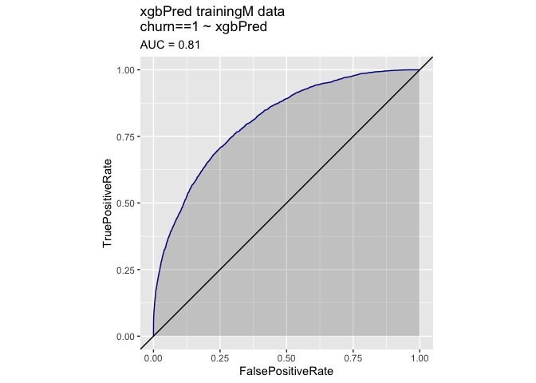
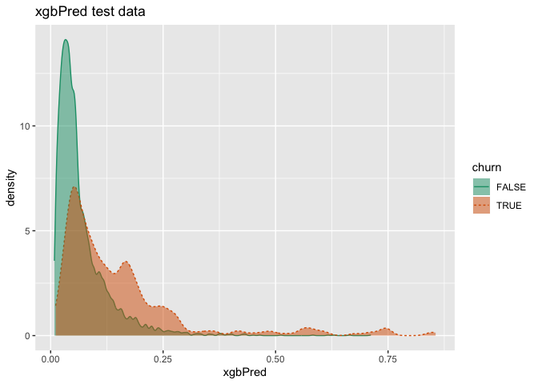
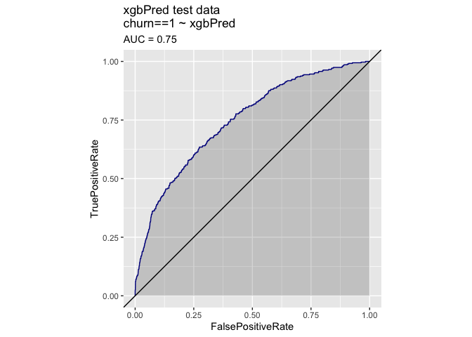
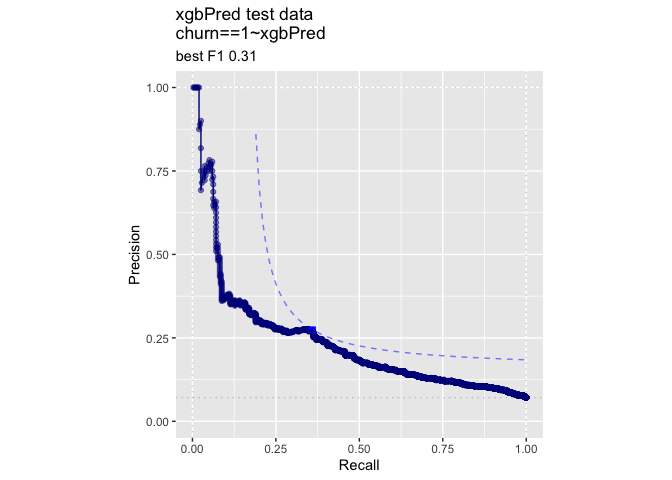

KDD2009vtreat
================
John Mount

Practical data science with R built chapter 6 built a number of single
variable models. In Listing 6.11 it used an ad-hoc entropy based out of
sample effect size estimate for variable selection. This likely (though
it isn’t completely rigorous) picked variables conservatively.

We show here how to repeat this work on the KDD2009 dataset using more
standard techniques more quickly. For vtreat details see:
<http://www.win-vector.com/blog/2014/08/vtreat-designing-a-package-for-variable-treatment/>
and Chapter 6 of Practical Data Science with R:
<http://www.amazon.com/Practical-Data-Science/dp/1617291560> For details
on data see: <https://github.com/WinVector/zmPDSwR/tree/master/KDD2009>
There is an issue that any data row used to build the single variable
models isn’t exchangable with future unseen rows for the purposes of
scoring and training. So the most hygienic way to work is to use one
subset of data to build the single variable models, and then another to
built the composite model, and a third for scoring. In particular models
trained using rows used to build sub-models think the sub-models have
large effects that the sub-models will in the future, and under-estimate
degrees of freedom of complicated sub-models.

``` r
date()
```

    ## [1] "Sat Jul  6 18:02:57 2019"

``` r
#load some libraries
library('vtreat')
packageVersion("vtreat")
```

    ## [1] '1.4.3'

``` r
library('WVPlots') 

library('parallel')
library('xgboost')


# load the data as in the book
# change this path to match your directory structure
#dir = '~/Documents/work/PracticalDataScienceWithR/zmPDSwR/KDD2009/' 
#dir = '~/Documents/work/zmPDSwR/KDD2009/' 
dir = "./"


d = read.table(paste(dir,'orange_small_train.data.gz',sep=''),
                header=T,sep='\t',na.strings=c('NA',''), 
               stringsAsFactors=FALSE)
churn = read.table(paste(dir,'orange_small_train_churn.labels.txt',sep=''),
                    header=F,sep='\t')
d$churn = churn$V1
appetency = read.table(paste(dir,'orange_small_train_appetency.labels.txt',sep=''),
                        header=F,sep='\t')
d$appetency = appetency$V1
upselling = read.table(paste(dir,'orange_small_train_upselling.labels.txt',sep=''),
                        header=F,sep='\t')
d$upselling = upselling$V1
set.seed(729375)
d$rgroup = runif(dim(d)[[1]])
dTrain = subset(d,rgroup<=0.9)  # set for building models and impact coding
dTest = subset(d,rgroup>0.9) # set for evaluation
rm(list=c('d','churn','appetency','upselling','dir'))

dim(dTrain)
```

    ## [1] 45028   234

``` r
dim(dTest)
```

    ## [1] 4972  234

``` r
outcomes = c('churn','appetency','upselling')
vars = setdiff(colnames(dTrain),
                c(outcomes,'rgroup'))
yName = 'churn'
yTarget = 1

set.seed(239525)

ncore <- parallel::detectCores()
cl = parallel::makeCluster(ncore)
date()
```

    ## [1] "Sat Jul  6 18:03:05 2019"

``` r
date()
```

    ## [1] "Sat Jul  6 18:03:05 2019"

``` r
var_values <- vtreat::value_variables_C(dTrain,
    vars,yName,yTarget,
    smFactor=2.0, 
    parallelCluster=cl
    )

knitr::kable(var_values)
```

|        |          rsq | count |       sig | var    |
| ------ | -----------: | ----: | --------: | :----- |
| Var1   | 2.376463e-05 |     2 | 0.9059967 | Var1   |
| Var10  | 9.813199e-04 |     2 | 0.0000028 | Var10  |
| Var100 | 3.502919e-05 |     2 | 0.7245050 | Var100 |
| Var101 | 6.009046e-04 |     2 | 0.0003219 | Var101 |
| Var102 | 1.742866e-04 |     2 | 0.0842595 | Var102 |
| Var103 | 9.813199e-04 |     2 | 0.0000028 | Var103 |
| Var104 | 2.278508e-04 |     2 | 0.0402904 | Var104 |
| Var105 | 2.278508e-04 |     2 | 0.0402904 | Var105 |
| Var106 | 9.593148e-04 |     2 | 0.0000037 | Var106 |
| Var107 | 9.813199e-04 |     2 | 0.0000028 | Var107 |
| Var108 | 2.411380e-05 |     2 | 0.8993961 | Var108 |
| Var109 | 1.922021e-04 |     2 | 0.0656641 | Var109 |
| Var11  | 8.812072e-04 |     2 | 0.0000098 | Var11  |
| Var110 | 1.029613e-04 |     2 | 0.2365791 | Var110 |
| Var111 | 8.364368e-04 |     2 | 0.0000170 | Var111 |
| Var112 | 2.752908e-03 |     2 | 0.0000000 | Var112 |
| Var113 | 6.466721e-03 |     3 | 0.0000000 | Var113 |
| Var114 | 8.842007e-04 |     2 | 0.0000094 | Var114 |
| Var115 | 2.278508e-04 |     2 | 0.0402904 | Var115 |
| Var116 | 2.376463e-05 |     2 | 0.9059967 | Var116 |
| Var117 | 9.593148e-04 |     2 | 0.0000037 | Var117 |
| Var118 | 5.017689e-07 |     1 | 0.9131691 | Var118 |
| Var119 | 2.669092e-03 |     2 | 0.0000000 | Var119 |
| Var12  | 3.286502e-05 |     2 | 0.7550253 | Var12  |
| Var120 | 9.813199e-04 |     2 | 0.0000028 | Var120 |
| Var121 | 2.376463e-05 |     2 | 0.9059967 | Var121 |
| Var122 | 8.842007e-04 |     2 | 0.0000094 | Var122 |
| Var123 | 2.752908e-03 |     2 | 0.0000000 | Var123 |
| Var124 | 9.593148e-04 |     2 | 0.0000037 | Var124 |
| Var125 | 2.013427e-03 |     2 | 0.0000000 | Var125 |
| Var126 | 1.382784e-02 |     2 | 0.0000000 | Var126 |
| Var127 | 5.822901e-04 |     2 | 0.0004071 | Var127 |
| Var128 | 5.822901e-04 |     2 | 0.0004071 | Var128 |
| Var129 | 2.376463e-05 |     2 | 0.9059967 | Var129 |
| Var13  | 5.312771e-03 |     2 | 0.0000000 | Var13  |
| Var130 | 8.812072e-04 |     2 | 0.0000098 | Var130 |
| Var131 | 8.857586e-05 |     2 | 0.2948029 | Var131 |
| Var132 | 2.752908e-03 |     2 | 0.0000000 | Var132 |
| Var133 | 2.752908e-03 |     2 | 0.0000000 | Var133 |
| Var134 | 2.752908e-03 |     2 | 0.0000000 | Var134 |
| Var135 | 9.593148e-04 |     2 | 0.0000037 | Var135 |
| Var136 | 6.724954e-05 |     2 | 0.4136311 | Var136 |
| Var137 | 2.376463e-05 |     2 | 0.9059967 | Var137 |
| Var138 | 9.593148e-04 |     2 | 0.0000037 | Var138 |
| Var139 | 9.813199e-04 |     2 | 0.0000028 | Var139 |
| Var14  | 8.812072e-04 |     2 | 0.0000098 | Var14  |
| Var140 | 2.972593e-03 |     2 | 0.0000000 | Var140 |
| Var142 | 8.540294e-05 |     2 | 0.3097124 | Var142 |
| Var143 | 2.752908e-03 |     2 | 0.0000000 | Var143 |
| Var144 | 5.421069e-03 |     2 | 0.0000000 | Var144 |
| Var145 | 9.593148e-04 |     2 | 0.0000037 | Var145 |
| Var146 | 9.813199e-04 |     2 | 0.0000028 | Var146 |
| Var147 | 9.813199e-04 |     2 | 0.0000028 | Var147 |
| Var148 | 9.813199e-04 |     2 | 0.0000028 | Var148 |
| Var149 | 3.035956e-04 |     2 | 0.0146283 | Var149 |
| Var150 | 9.593148e-04 |     2 | 0.0000037 | Var150 |
| Var151 | 6.334417e-04 |     2 | 0.0002138 | Var151 |
| Var152 | 9.593148e-04 |     2 | 0.0000037 | Var152 |
| Var153 | 2.752908e-03 |     2 | 0.0000000 | Var153 |
| Var154 | 2.376463e-05 |     2 | 0.9059967 | Var154 |
| Var155 | 9.593148e-04 |     2 | 0.0000037 | Var155 |
| Var156 | 1.905424e-05 |     2 | 1.0000000 | Var156 |
| Var157 | 8.364368e-04 |     2 | 0.0000170 | Var157 |
| Var158 | 6.009046e-04 |     2 | 0.0003219 | Var158 |
| Var159 | 8.842007e-04 |     2 | 0.0000094 | Var159 |
| Var16  | 9.813199e-04 |     2 | 0.0000028 | Var16  |
| Var160 | 2.752908e-03 |     2 | 0.0000000 | Var160 |
| Var161 | 9.593148e-04 |     2 | 0.0000037 | Var161 |
| Var162 | 8.842007e-04 |     2 | 0.0000094 | Var162 |
| Var163 | 2.752908e-03 |     2 | 0.0000000 | Var163 |
| Var164 | 9.593148e-04 |     2 | 0.0000037 | Var164 |
| Var165 | 6.009046e-04 |     2 | 0.0003219 | Var165 |
| Var166 | 9.813199e-04 |     2 | 0.0000028 | Var166 |
| Var168 | 2.632379e-04 |     2 | 0.0250101 | Var168 |
| Var17  | 9.593148e-04 |     2 | 0.0000037 | Var17  |
| Var170 | 8.842007e-04 |     2 | 0.0000094 | Var170 |
| Var171 | 5.822901e-04 |     2 | 0.0004071 | Var171 |
| Var172 | 9.813199e-04 |     2 | 0.0000028 | Var172 |
| Var173 | 2.752908e-03 |     2 | 0.0000000 | Var173 |
| Var174 | 9.593148e-04 |     2 | 0.0000037 | Var174 |
| Var176 | 8.812072e-04 |     2 | 0.0000098 | Var176 |
| Var177 | 8.842007e-04 |     2 | 0.0000094 | Var177 |
| Var178 | 1.729184e-04 |     2 | 0.0858903 | Var178 |
| Var179 | 9.593148e-04 |     2 | 0.0000037 | Var179 |
| Var18  | 9.593148e-04 |     2 | 0.0000037 | Var18  |
| Var180 | 2.376463e-05 |     2 | 0.9059967 | Var180 |
| Var181 | 2.752908e-03 |     2 | 0.0000000 | Var181 |
| Var182 | 9.593148e-04 |     2 | 0.0000037 | Var182 |
| Var183 | 8.842007e-04 |     2 | 0.0000094 | Var183 |
| Var184 | 8.842007e-04 |     2 | 0.0000094 | Var184 |
| Var186 | 2.376463e-05 |     2 | 0.9059967 | Var186 |
| Var187 | 2.376463e-05 |     2 | 0.9059967 | Var187 |
| Var188 | 8.842007e-04 |     2 | 0.0000094 | Var188 |
| Var189 | 1.215778e-02 |     2 | 0.0000000 | Var189 |
| Var19  | 9.593148e-04 |     2 | 0.0000037 | Var19  |
| Var190 | 7.148827e-05 |     2 | 0.3861432 | Var190 |
| Var191 | 5.822881e-04 |     2 | 0.0004071 | Var191 |
| Var192 | 5.621971e-03 |     2 | 0.0000000 | Var192 |
| Var193 | 7.309619e-03 |     2 | 0.0000000 | Var193 |
| Var194 | 6.818729e-04 |     2 | 0.0001165 | Var194 |
| Var195 | 8.627090e-04 |     2 | 0.0000123 | Var195 |
| Var196 | 1.182542e-04 |     2 | 0.1882689 | Var196 |
| Var197 | 9.702002e-04 |     2 | 0.0000033 | Var197 |
| Var198 | 4.062008e-03 |     2 | 0.0000000 | Var198 |
| Var199 | 8.519979e-03 |     2 | 0.0000000 | Var199 |
| Var2   | 8.842007e-04 |     2 | 0.0000094 | Var2   |
| Var200 | 5.225536e-03 |     2 | 0.0000000 | Var200 |
| Var201 | 6.739672e-04 |     2 | 0.0001287 | Var201 |
| Var202 | 3.203968e-03 |     2 | 0.0000000 | Var202 |
| Var203 | 2.129657e-04 |     2 | 0.0493503 | Var203 |
| Var204 | 1.715598e-03 |     2 | 0.0000000 | Var204 |
| Var205 | 7.834535e-03 |     2 | 0.0000000 | Var205 |
| Var206 | 1.260427e-02 |     2 | 0.0000000 | Var206 |
| Var207 | 5.925474e-03 |     2 | 0.0000000 | Var207 |
| Var208 | 8.690949e-05 |     2 | 0.3025293 | Var208 |
| Var21  | 2.669092e-03 |     2 | 0.0000000 | Var21  |
| Var210 | 4.061590e-03 |     2 | 0.0000000 | Var210 |
| Var211 | 1.982178e-03 |     2 | 0.0000000 | Var211 |
| Var212 | 9.900362e-03 |     2 | 0.0000000 | Var212 |
| Var213 | 8.362860e-04 |     2 | 0.0000170 | Var213 |
| Var214 | 5.225536e-03 |     2 | 0.0000000 | Var214 |
| Var215 | 1.905564e-05 |     2 | 1.0000000 | Var215 |
| Var216 | 4.452981e-03 |     2 | 0.0000000 | Var216 |
| Var217 | 1.197942e-02 |     2 | 0.0000000 | Var217 |
| Var218 | 1.218248e-02 |     2 | 0.0000000 | Var218 |
| Var219 | 2.882058e-04 |     2 | 0.0179332 | Var219 |
| Var22  | 2.752908e-03 |     2 | 0.0000000 | Var22  |
| Var220 | 4.062008e-03 |     2 | 0.0000000 | Var220 |
| Var221 | 3.638509e-03 |     2 | 0.0000000 | Var221 |
| Var222 | 4.062008e-03 |     2 | 0.0000000 | Var222 |
| Var223 | 1.066714e-04 |     2 | 0.2237208 | Var223 |
| Var224 | 2.279107e-04 |     2 | 0.0402577 | Var224 |
| Var225 | 5.896221e-03 |     2 | 0.0000000 | Var225 |
| Var226 | 2.463084e-03 |     2 | 0.0000000 | Var226 |
| Var227 | 5.584397e-03 |     2 | 0.0000000 | Var227 |
| Var228 | 9.281733e-03 |     2 | 0.0000000 | Var228 |
| Var229 | 7.058449e-03 |     2 | 0.0000000 | Var229 |
| Var23  | 9.813199e-04 |     2 | 0.0000028 | Var23  |
| Var24  | 2.381645e-04 |     2 | 0.0350371 | Var24  |
| Var25  | 2.752908e-03 |     2 | 0.0000000 | Var25  |
| Var26  | 9.813199e-04 |     2 | 0.0000028 | Var26  |
| Var27  | 9.813199e-04 |     2 | 0.0000028 | Var27  |
| Var28  | 2.758522e-03 |     2 | 0.0000000 | Var28  |
| Var29  | 2.992132e-05 |     2 | 0.7995316 | Var29  |
| Var3   | 8.812072e-04 |     2 | 0.0000098 | Var3   |
| Var30  | 2.376463e-05 |     2 | 0.9059967 | Var30  |
| Var33  | 6.334417e-04 |     2 | 0.0002138 | Var33  |
| Var34  | 8.842007e-04 |     2 | 0.0000094 | Var34  |
| Var35  | 2.752908e-03 |     2 | 0.0000000 | Var35  |
| Var36  | 8.842007e-04 |     2 | 0.0000094 | Var36  |
| Var37  | 9.593148e-04 |     2 | 0.0000037 | Var37  |
| Var38  | 2.752908e-03 |     2 | 0.0000000 | Var38  |
| Var4   | 9.593148e-04 |     2 | 0.0000037 | Var4   |
| Var40  | 8.842007e-04 |     2 | 0.0000094 | Var40  |
| Var41  | 2.376463e-05 |     2 | 0.9059967 | Var41  |
| Var43  | 8.842007e-04 |     2 | 0.0000094 | Var43  |
| Var44  | 2.752908e-03 |     2 | 0.0000000 | Var44  |
| Var45  | 6.815674e-05 |     2 | 0.4075594 | Var45  |
| Var46  | 8.842007e-04 |     2 | 0.0000094 | Var46  |
| Var47  | 2.376463e-05 |     2 | 0.9059967 | Var47  |
| Var49  | 8.842007e-04 |     2 | 0.0000094 | Var49  |
| Var5   | 9.813199e-04 |     2 | 0.0000028 | Var5   |
| Var50  | 2.376463e-05 |     2 | 0.9059967 | Var50  |
| Var51  | 6.809351e-04 |     2 | 0.0001179 | Var51  |
| Var53  | 9.100583e-05 |     2 | 0.2839318 | Var53  |
| Var54  | 8.842007e-04 |     2 | 0.0000094 | Var54  |
| Var56  | 1.729184e-04 |     2 | 0.0858903 | Var56  |
| Var57  | 2.044753e-04 |     3 | 0.0831623 | Var57  |
| Var58  | 2.376463e-05 |     2 | 0.9059967 | Var58  |
| Var59  | 2.278508e-04 |     2 | 0.0402904 | Var59  |
| Var6   | 2.669092e-03 |     2 | 0.0000000 | Var6   |
| Var60  | 9.813199e-04 |     2 | 0.0000028 | Var60  |
| Var61  | 6.334417e-04 |     2 | 0.0002138 | Var61  |
| Var62  | 1.707981e-05 |     2 | 1.0000000 | Var62  |
| Var63  | 1.905424e-05 |     2 | 1.0000000 | Var63  |
| Var64  | 7.138463e-05 |     2 | 0.3867893 | Var64  |
| Var65  | 2.974265e-03 |     2 | 0.0000000 | Var65  |
| Var66  | 1.905424e-05 |     2 | 1.0000000 | Var66  |
| Var67  | 9.813199e-04 |     2 | 0.0000028 | Var67  |
| Var68  | 8.842007e-04 |     2 | 0.0000094 | Var68  |
| Var69  | 9.813199e-04 |     2 | 0.0000028 | Var69  |
| Var7   | 9.401229e-03 |     2 | 0.0000000 | Var7   |
| Var70  | 9.813199e-04 |     2 | 0.0000028 | Var70  |
| Var71  | 8.364368e-04 |     2 | 0.0000170 | Var71  |
| Var72  | 2.007878e-03 |     2 | 0.0000000 | Var72  |
| Var73  | 2.011271e-02 |     3 | 0.0000000 | Var73  |
| Var74  | 6.365026e-03 |     2 | 0.0000000 | Var74  |
| Var75  | 8.842007e-04 |     2 | 0.0000094 | Var75  |
| Var76  | 2.752908e-03 |     2 | 0.0000000 | Var76  |
| Var77  | 3.158199e-05 |     2 | 0.7739775 | Var77  |
| Var78  | 2.752908e-03 |     2 | 0.0000000 | Var78  |
| Var80  | 9.813199e-04 |     2 | 0.0000028 | Var80  |
| Var81  | 2.669092e-03 |     2 | 0.0000000 | Var81  |
| Var82  | 9.593148e-04 |     2 | 0.0000037 | Var82  |
| Var83  | 2.752908e-03 |     2 | 0.0000000 | Var83  |
| Var84  | 8.812072e-04 |     2 | 0.0000098 | Var84  |
| Var85  | 2.752908e-03 |     2 | 0.0000000 | Var85  |
| Var86  | 2.376463e-05 |     2 | 0.9059967 | Var86  |
| Var87  | 2.376463e-05 |     2 | 0.9059967 | Var87  |
| Var88  | 5.822901e-04 |     2 | 0.0004071 | Var88  |
| Var89  | 1.729184e-04 |     2 | 0.0858903 | Var89  |
| Var9   | 2.376463e-05 |     2 | 0.9059967 | Var9   |
| Var90  | 2.376463e-05 |     2 | 0.9059967 | Var90  |
| Var91  | 8.364368e-04 |     2 | 0.0000170 | Var91  |
| Var92  | 1.829928e-05 |     2 | 1.0000000 | Var92  |
| Var93  | 9.813199e-04 |     2 | 0.0000028 | Var93  |
| Var94  | 3.706455e-04 |     2 | 0.0060810 | Var94  |
| Var95  | 8.842007e-04 |     2 | 0.0000094 | Var95  |
| Var96  | 8.842007e-04 |     2 | 0.0000094 | Var96  |
| Var97  | 9.813199e-04 |     2 | 0.0000028 | Var97  |
| Var98  | 1.749498e-05 |     2 | 1.0000000 | Var98  |
| Var99  | 9.593148e-04 |     2 | 0.0000037 | Var99  |

``` r
summary(var_values$sig < 1/nrow(var_values))
```

    ##    Mode   FALSE    TRUE 
    ## logical      59     153

``` r
vars <- var_values$var[var_values$sig < 1/nrow(var_values)]


date()
```

    ## [1] "Sat Jul  6 18:08:22 2019"

``` r
date()
```

    ## [1] "Sat Jul  6 18:08:22 2019"

``` r
# Run other models (with proper coding/training separation).
#
# This gets us back to AUC 0.74 range

customCoders = list('c.PiecewiseV.num' = vtreat::solve_piecewise,
                    'n.PiecewiseV.num' = vtreat::solve_piecewise,
                    'c.knearest.num' = vtreat::square_window,
                    'n.knearest.num' = vtreat::square_window,
                    'c.spline.num' = vtreat::spline_variable,
                    'n.spline.num' = vtreat::spline_variable)
                   # 'n.poolN.center' = vtreat::ppCoderN, 
                   # 'c.poolC.center' = vtreat::ppCoderC)
                   # 'n.NonDecreasingV.num' = vtreat::solveNonDecreasing,
                   # 'n.NonIncreasingV.num' = vtreat::solveNonIncreasing, 
                   # 'c.NonDecreasingV.num' = vtreat::solveNonDecreasing,
                   # 'c.NonIncreasingV.num' = vtreat::solveNonIncreasing)
cfe = mkCrossFrameCExperiment(dTrain,
                              vars,yName,yTarget,
                              customCoders=customCoders,
                              smFactor=2.0, 
                              parallelCluster=cl)
```

    ## [1] "vtreat 1.4.3 start initial treatment design Sat Jul  6 18:08:22 2019"
    ## [1] " start cross frame work Sat Jul  6 18:15:08 2019"
    ## [1] " vtreat::mkCrossFrameCExperiment done Sat Jul  6 18:17:50 2019"

``` r
treatmentsC = cfe$treatments
scoreFrame = treatmentsC$scoreFrame
table(scoreFrame$code)
```

    ## 
    ##       catB       catP      clean      isBAD   knearest        lev 
    ##         28         28        122        120          2        121 
    ## PiecewiseV     spline 
    ##        118         83

``` r
selvars <- scoreFrame$varName
treatedTrainM <- cfe$crossFrame[,c(yName,selvars),drop=FALSE]
treatedTrainM[[yName]] = treatedTrainM[[yName]]==yTarget

treatedTest = prepare(treatmentsC,
                      dTest,
                      pruneSig=NULL, 
                      varRestriction = selvars,
                      parallelCluster=cl)
treatedTest[[yName]] = treatedTest[[yName]]==yTarget

# prepare plotting frames
treatedTrainP = treatedTrainM[, yName, drop=FALSE]
treatedTestP = treatedTest[, yName, drop=FALSE]
date()
```

    ## [1] "Sat Jul  6 18:17:51 2019"

``` r
date()
```

    ## [1] "Sat Jul  6 18:17:51 2019"

``` r
mname = 'xgbPred'
print(paste(mname,length(selvars)))
```

    ## [1] "xgbPred 622"

``` r
params <- list(max_depth = 5, 
              objective = "binary:logistic",
              nthread = ncore)
model <- xgb.cv(data = as.matrix(treatedTrainM[, selvars, drop = FALSE]),
                label = treatedTrainM[[yName]],
                nrounds = 400,
                params = params,
                nfold = 5,
                early_stopping_rounds = 10,
                eval_metric = "logloss")
```

    ## [1]  train-logloss:0.503118+0.000619 test-logloss:0.504132+0.001167 
    ## Multiple eval metrics are present. Will use test_logloss for early stopping.
    ## Will train until test_logloss hasn't improved in 10 rounds.
    ## 
    ## [2]  train-logloss:0.400317+0.001025 test-logloss:0.402179+0.002146 
    ## [3]  train-logloss:0.338216+0.001284 test-logloss:0.341292+0.002991 
    ## [4]  train-logloss:0.299239+0.001445 test-logloss:0.303358+0.003886 
    ## [5]  train-logloss:0.274050+0.001584 test-logloss:0.279312+0.004833 
    ## [6]  train-logloss:0.257435+0.001738 test-logloss:0.263867+0.005338 
    ## [7]  train-logloss:0.246297+0.001758 test-logloss:0.254254+0.005848 
    ## [8]  train-logloss:0.238483+0.001759 test-logloss:0.247876+0.006400 
    ## [9]  train-logloss:0.232978+0.001624 test-logloss:0.243947+0.006830 
    ## [10] train-logloss:0.228714+0.001697 test-logloss:0.241427+0.006993 
    ## [11] train-logloss:0.225146+0.001731 test-logloss:0.239994+0.007271 
    ## [12] train-logloss:0.222296+0.001564 test-logloss:0.238938+0.007755 
    ## [13] train-logloss:0.219822+0.001521 test-logloss:0.238190+0.007910 
    ## [14] train-logloss:0.217801+0.001439 test-logloss:0.237995+0.007935 
    ## [15] train-logloss:0.215918+0.001480 test-logloss:0.237707+0.007992 
    ## [16] train-logloss:0.213984+0.001646 test-logloss:0.237540+0.008098 
    ## [17] train-logloss:0.212287+0.001626 test-logloss:0.237529+0.008226 
    ## [18] train-logloss:0.210559+0.001695 test-logloss:0.237715+0.008316 
    ## [19] train-logloss:0.209040+0.001769 test-logloss:0.237638+0.008203 
    ## [20] train-logloss:0.207600+0.001686 test-logloss:0.237583+0.008416 
    ## [21] train-logloss:0.206182+0.001846 test-logloss:0.237564+0.008456 
    ## [22] train-logloss:0.204802+0.001708 test-logloss:0.237705+0.008422 
    ## [23] train-logloss:0.203413+0.001602 test-logloss:0.237697+0.008590 
    ## [24] train-logloss:0.202214+0.001850 test-logloss:0.237877+0.008622 
    ## [25] train-logloss:0.201347+0.001721 test-logloss:0.237981+0.008500 
    ## [26] train-logloss:0.199966+0.001484 test-logloss:0.238009+0.008654 
    ## [27] train-logloss:0.198762+0.001469 test-logloss:0.238275+0.008497 
    ## Stopping. Best iteration:
    ## [17] train-logloss:0.212287+0.001626 test-logloss:0.237529+0.008226

``` r
nrounds <- model$best_iteration
print(paste("nrounds", nrounds))
```

    ## [1] "nrounds 17"

``` r
model <- xgboost(data = as.matrix(treatedTrainM[, selvars, drop = FALSE]),
                 label = treatedTrainM[[yName]],
                 nrounds = nrounds,
                 params = params)
```

    ## [1]  train-error:0.071733 
    ## [2]  train-error:0.071800 
    ## [3]  train-error:0.071644 
    ## [4]  train-error:0.071800 
    ## [5]  train-error:0.071711 
    ## [6]  train-error:0.071578 
    ## [7]  train-error:0.071733 
    ## [8]  train-error:0.071644 
    ## [9]  train-error:0.071689 
    ## [10] train-error:0.071667 
    ## [11] train-error:0.071600 
    ## [12] train-error:0.070956 
    ## [13] train-error:0.070845 
    ## [14] train-error:0.070734 
    ## [15] train-error:0.070245 
    ## [16] train-error:0.070134 
    ## [17] train-error:0.070023

``` r
treatedTrainP[[mname]] = predict(model, 
                                 newdata=as.matrix(treatedTrainM[, selvars, drop = FALSE]), 
                                 type='response')
treatedTestP[[mname]] = predict(model,
                                newdata=as.matrix(treatedTest[, selvars, drop = FALSE]), 
                                n.trees=nTrees)
date()
```

    ## [1] "Sat Jul  6 18:22:34 2019"

``` r
date()
```

    ## [1] "Sat Jul  6 18:22:34 2019"

``` r
t1 = paste(mname,'trainingM data')
print(DoubleDensityPlot(treatedTrainP, mname, yName, 
                        title=t1))
```

<!-- -->

``` r
print(ROCPlot(treatedTrainP, mname, yName, yTarget,
              title=t1))
```

<!-- -->

``` r
print(WVPlots::PRPlot(treatedTrainP, mname, yName, yTarget,
              title=t1))
```

<!-- -->

``` r
t2 = paste(mname,'test data')
print(DoubleDensityPlot(treatedTestP, mname, yName, 
                        title=t2))
```

<!-- -->

``` r
print(ROCPlot(treatedTestP, mname, yName, yTarget,
              title=t2))
```

<!-- -->

``` r
print(WVPlots::PRPlot(treatedTestP, mname, yName, yTarget,
              title=t2))
```

<!-- -->

``` r
print(date())
```

    ## [1] "Sat Jul  6 18:22:42 2019"

``` r
print("*****************************")
```

    ## [1] "*****************************"

``` r
date()
```

    ## [1] "Sat Jul  6 18:22:42 2019"

``` r
if(!is.null(cl)) {
    parallel::stopCluster(cl)
    cl = NULL
}
```
