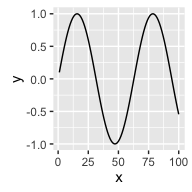

example 10.1 of section 10.2.1
==============================

(example 10.1 of section 10.2.1) : Documentation and deployment : Using knitr to produce milestone documentation : What is knitr?
=================================================================================================================================

Title: knitr-annotated Markdown
===============================

Annotation marks were interfering with execution.
=================================================

This is also the file to be saved as "simple.Rmd"
=================================================

Two examples:

-   plotting
-   calculating

Plot example:

``` r
library(ggplot2)

ggplot(data=data.frame(x=c(1:100),y=sin(0.1*c(1:100)))) +
   geom_line(aes(x=x,y=y))
```



Calculation example:

``` r
pi*pi
```

    ## [1] 9.869604
