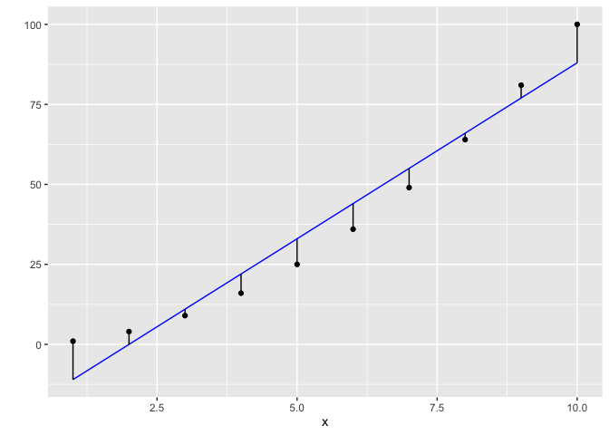
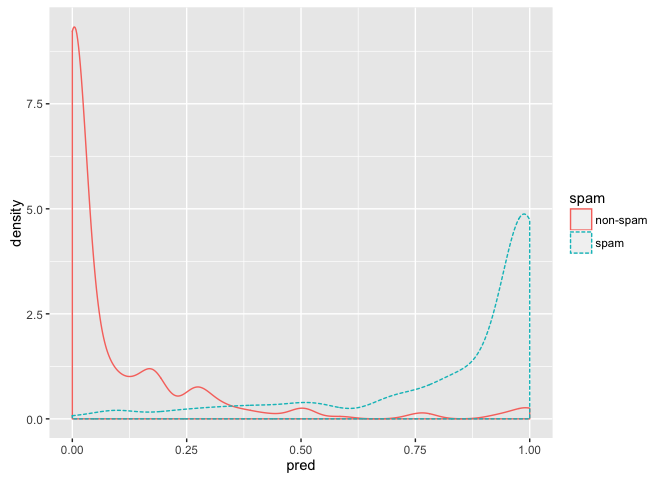
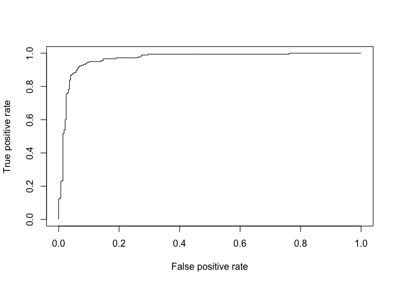
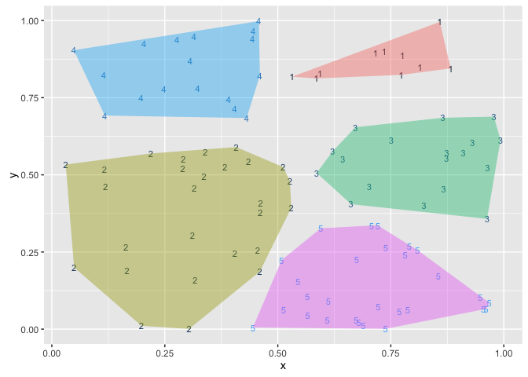

``` r
source('runDir.R')
```

``` r
runDir('../CodeExamples/c05_Choosing_and_evaluating_models',
       '../Spambase')
```

    [1] "############################### start  57 Fri Jun 17 10:32:53 2016"
    [1] "#####  running  ../CodeExamples/c05_Choosing_and_evaluating_models/00057_example_5.1_of_section_5.2.1.R"
    [1] "#####   in directory ../Spambase"

    > # example 5.1 of section 5.2.1 
    > # (example 5.1 of section 5.2.1)  : Choosing and evaluating models : Evaluating models : Evaluating classification models 
    > # Title: Building and applying a logistic regression spam model 
    > 
    > spamD <- read.table('spamD.tsv',header=T,sep='\t')

    > spamTrain <- subset(spamD,spamD$rgroup>=10)

    > spamTest <- subset(spamD,spamD$rgroup<10)

    > spamVars <- setdiff(colnames(spamD),list('rgroup','spam'))

    > spamFormula <- as.formula(paste('spam=="spam"',
        paste(spamVars,collapse=' + '),sep=' ~ '))

    > spamModel <- glm(spamFormula,family=binomial(link='logit'),
        data=spamTrain)

    Warning: glm.fit: fitted probabilities numerically 0 or 1 occurred


    > spamTrain$pred <- predict(spamModel,newdata=spamTrain,
        type='response')

    > spamTest$pred <- predict(spamModel,newdata=spamTest,
        type='response')

    > print(with(spamTest,table(y=spam,glmPred=pred>0.5)))
              glmPred
    y          FALSE TRUE
      non-spam   264   14
      spam        22  158

    > ##           glmPred
    > ## y          FALSE TRUE
    > ##   non-spam   264   14
    > ##   spam        22  158
    > 
    [1] "############################### end  57 Fri Jun 17 10:32:54 2016"
    [1] "############################### start  58 Fri Jun 17 10:32:54 2016"
    [1] "#####  running  ../CodeExamples/c05_Choosing_and_evaluating_models/00058_example_5.2_of_section_5.2.1.R"
    [1] "#####   in directory ../Spambase"

    > # example 5.2 of section 5.2.1 
    > # (example 5.2 of section 5.2.1)  : Choosing and evaluating models : Evaluating models : Evaluating classification models 
    > # Title: Spam classifications 
    > 
    > sample <- spamTest[c(7,35,224,327),c('spam','pred')]

    > print(sample)
             spam         pred
    115      spam 0.9903246227
    361      spam 0.4800498077
    2300 non-spam 0.0006846551
    3428 non-spam 0.0001434345

    > ##          spam         pred
    > ## 115      spam 0.9903246227
    > ## 361      spam 0.4800498077
    > ## 2300 non-spam 0.0006846551
    > ## 3428 non-spam 0.0001434345
    > 
    [1] "############################### end  58 Fri Jun 17 10:32:54 2016"
    [1] "############################### start  59 Fri Jun 17 10:32:54 2016"
    [1] "#####  running  ../CodeExamples/c05_Choosing_and_evaluating_models/00059_example_5.3_of_section_5.2.1.R"
    [1] "#####   in directory ../Spambase"

    > # example 5.3 of section 5.2.1 
    > # (example 5.3 of section 5.2.1)  : Choosing and evaluating models : Evaluating models : Evaluating classification models 
    > # Title: Spam confusion matrix 
    > 
    > cM <- table(truth=spamTest$spam,prediction=spamTest$pred>0.5)

    > print(cM)
              prediction
    truth      FALSE TRUE
      non-spam   264   14
      spam        22  158

    > ##          prediction
    > ## truth      FALSE TRUE
    > ##   non-spam   264   14
    > ##   spam        22  158
    > 
    [1] "############################### end  59 Fri Jun 17 10:32:54 2016"
    [1] "############################### start  60 Fri Jun 17 10:32:54 2016"
    [1] "#####  running  ../CodeExamples/c05_Choosing_and_evaluating_models/00060_example_5.4_of_section_5.2.1.R"
    [1] "#####   in directory ../Spambase"

    > # example 5.4 of section 5.2.1 
    > # (example 5.4 of section 5.2.1)  : Choosing and evaluating models : Evaluating models : Evaluating classification models 
    > # Title: Entering data by hand 
    > 
    > t <- as.table(matrix(data=c(288-1,17,1,13882-17),nrow=2,ncol=2))

    > rownames(t) <- rownames(cM)

    > colnames(t) <- colnames(cM)

    > print(t)
             FALSE  TRUE
    non-spam   287     1
    spam        17 13865

    > ##          FALSE  TRUE
    > ## non-spam   287     1
    > ## spam        17 13865
    > 
    [1] "############################### end  60 Fri Jun 17 10:32:54 2016"
    [1] "############################### start  61 Fri Jun 17 10:32:54 2016"
    [1] "#####  running  ../CodeExamples/c05_Choosing_and_evaluating_models/00061_example_5.5_of_section_5.2.2.R"
    [1] "#####   in directory ../Spambase"

    > # example 5.5 of section 5.2.2 
    > # (example 5.5 of section 5.2.2)  : Choosing and evaluating models : Evaluating models : Evaluating scoring models 
    > # Title: Plotting residuals 
    > 
    > d <- data.frame(y=(1:10)^2,x=1:10)

    > model <- lm(y~x,data=d)

    > d$prediction <- predict(model,newdata=d)

    > library('ggplot2')

    > ggplot(data=d) + geom_point(aes(x=x,y=y)) +
         geom_line(aes(x=x,y=prediction),color='blue') +
         geom_segment(aes(x=x,y=prediction,yend=y,xend=x)) +
         scale_y_continuous('')



    [1] "############################### end  61 Fri Jun 17 10:32:54 2016"
    [1] "############################### start  62 Fri Jun 17 10:32:54 2016"
    [1] "#####  running  ../CodeExamples/c05_Choosing_and_evaluating_models/00062_example_5.6_of_section_5.2.3.R"
    [1] "#####   in directory ../Spambase"

    > # example 5.6 of section 5.2.3 
    > # (example 5.6 of section 5.2.3)  : Choosing and evaluating models : Evaluating models : Evaluating probability models 
    > # Title: Making a double density plot 
    > 
    > ggplot(data=spamTest) +
        geom_density(aes(x=pred,color=spam,linetype=spam))

    [1] "############################### end  62 Fri Jun 17 10:32:54 2016"
    [1] "############################### start  63 Fri Jun 17 10:32:54 2016"
    [1] "#####  running  ../CodeExamples/c05_Choosing_and_evaluating_models/00063_example_5.7_of_section_5.2.3.R"
    [1] "#####   in directory ../Spambase"

    > # example 5.7 of section 5.2.3 
    > # (example 5.7 of section 5.2.3)  : Choosing and evaluating models : Evaluating models : Evaluating probability models 
    > # Title: Plotting the receiver operating characteristic curve 
    > 
    > library('ROCR')

    Loading required package: gplots


    Attaching package: 'gplots'

    The following object is masked from 'package:stats':

        lowess




    > eval <- prediction(spamTest$pred,spamTest$spam)

    > plot(performance(eval,"tpr","fpr"))




    > print(attributes(performance(eval,'auc'))$y.values[[1]])
    [1] 0.9660072

    > ## [1] 0.9660072
    > 
    [1] "############################### end  63 Fri Jun 17 10:32:55 2016"
    [1] "############################### start  64 Fri Jun 17 10:32:55 2016"
    [1] "#####  running  ../CodeExamples/c05_Choosing_and_evaluating_models/00064_example_5.8_of_section_5.2.3.R"
    [1] "#####   in directory ../Spambase"

    > # example 5.8 of section 5.2.3 
    > # (example 5.8 of section 5.2.3)  : Choosing and evaluating models : Evaluating models : Evaluating probability models 
    > # Title: Calculating log likelihood 
    > 
    > sum(ifelse(spamTest$spam=='spam',
        log(spamTest$pred),
        log(1-spamTest$pred)))
    [1] -134.9478

    > ## [1] -134.9478
    > sum(ifelse(spamTest$spam=='spam',
        log(spamTest$pred),
        log(1-spamTest$pred)))/dim(spamTest)[[1]]
    [1] -0.2946458

    > ## [1] -0.2946458
    > 
    [1] "############################### end  64 Fri Jun 17 10:32:55 2016"
    [1] "############################### start  65 Fri Jun 17 10:32:55 2016"
    [1] "#####  running  ../CodeExamples/c05_Choosing_and_evaluating_models/00065_example_5.9_of_section_5.2.3.R"
    [1] "#####   in directory ../Spambase"

    > # example 5.9 of section 5.2.3 
    > # (example 5.9 of section 5.2.3)  : Choosing and evaluating models : Evaluating models : Evaluating probability models 
    > # Title: Computing the null model’s log likelihood 
    > 
    > pNull <- sum(ifelse(spamTest$spam=='spam',1,0))/dim(spamTest)[[1]]

    > sum(ifelse(spamTest$spam=='spam',1,0))*log(pNull) +
        sum(ifelse(spamTest$spam=='spam',0,1))*log(1-pNull)
    [1] -306.8952

    > ## [1] -306.8952
    > 
    [1] "############################### end  65 Fri Jun 17 10:32:55 2016"
    [1] "############################### start  66 Fri Jun 17 10:32:55 2016"
    [1] "#####  running  ../CodeExamples/c05_Choosing_and_evaluating_models/00066_example_5.10_of_section_5.2.3.R"
    [1] "#####   in directory ../Spambase"

    > # example 5.10 of section 5.2.3 
    > # (example 5.10 of section 5.2.3)  : Choosing and evaluating models : Evaluating models : Evaluating probability models 
    > # Title: Calculating entropy and conditional entropy 
    > 
    > entropy <- function(x) {  # Note: 1 
         xpos <- x[x>0]
         scaled <- xpos/sum(xpos)
         sum(-scaled*log(scaled,2))
       }

    > print(entropy(table(spamTest$spam)))  # Note: 2 
    [1] 0.9667165

    > ## [1] 0.9667165
    > 
    > conditionalEntropy <- function(t) {   # Note: 3 
         (sum(t[,1])*entropy(t[,1]) + sum(t[,2])*entropy(t[,2]))/sum(t)
       }

    > print(conditionalEntropy(cM))     # Note: 4 
    [1] 0.3971897

    > ## [1] 0.3971897
    > 
    > # Note 1: 
    > #   Define function that computes the entropy 
    > #   from list of outcome counts 
    > 
    > # Note 2: 
    > #   Calculate entropy of spam/non-spam 
    > #   distribution 
    > 
    > # Note 3: 
    > #   Function to calculate conditional or 
    > #   remaining entropy of spam distribution (rows) 
    > #   given prediction (columns) 
    > 
    > # Note 4: 
    > #   Calculate conditional or remaining entropy 
    > #   of spam distribution given prediction 
    > 
    [1] "############################### end  66 Fri Jun 17 10:32:55 2016"
    [1] "############################### start  67 Fri Jun 17 10:32:55 2016"
    [1] "#####  running  ../CodeExamples/c05_Choosing_and_evaluating_models/00067_example_5.11_of_section_5.2.5.R"
    [1] "#####   in directory ../Spambase"

    > # example 5.11 of section 5.2.5 
    > # (example 5.11 of section 5.2.5)  : Choosing and evaluating models : Evaluating models : Evaluating clustering models 
    > # Title: Clustering random data in the plane 
    > 
    > set.seed(32297)

    > d <- data.frame(x=runif(100),y=runif(100))

    > clus <- kmeans(d,centers=5)

    > d$cluster <- clus$cluster
    [1] "############################### end  67 Fri Jun 17 10:32:55 2016"
    [1] "############################### start  68 Fri Jun 17 10:32:55 2016"
    [1] "#####  running  ../CodeExamples/c05_Choosing_and_evaluating_models/00068_example_5.12_of_section_5.2.5.R"
    [1] "#####   in directory ../Spambase"

    > # example 5.12 of section 5.2.5 
    > # (example 5.12 of section 5.2.5)  : Choosing and evaluating models : Evaluating models : Evaluating clustering models 
    > # Title: Plotting our clusters 
    > 
    > library('ggplot2'); library('grDevices')

    > h <- do.call(rbind,
        lapply(unique(clus$cluster),
           function(c) { f <- subset(d,cluster==c); f[chull(f),]}))

    > ggplot() +
      geom_text(data=d,aes(label=cluster,x=x,y=y,
        color=cluster),size=3)  +
      geom_polygon(data=h,aes(x=x,y=y,group=cluster,fill=as.factor(cluster)),
        alpha=0.4,linetype=0) +
      theme(legend.position = "none")



    [1] "############################### end  68 Fri Jun 17 10:32:55 2016"
    [1] "############################### start  69 Fri Jun 17 10:32:55 2016"
    [1] "#####  running  ../CodeExamples/c05_Choosing_and_evaluating_models/00069_example_5.13_of_section_5.2.5.R"
    [1] "#####   in directory ../Spambase"

    > # example 5.13 of section 5.2.5 
    > # (example 5.13 of section 5.2.5)  : Choosing and evaluating models : Evaluating models : Evaluating clustering models 
    > # Title: Calculating the size of each cluster 
    > 
    > table(d$cluster)

     1  2  3  4  5 
    10 27 18 17 28 

    > ##  1  2  3  4  5
    > ## 10 27 18 17 28
    > 
    [1] "############################### end  69 Fri Jun 17 10:32:55 2016"
    [1] "############################### start  70 Fri Jun 17 10:32:55 2016"
    [1] "#####  running  ../CodeExamples/c05_Choosing_and_evaluating_models/00070_example_5.14_of_section_5.2.5.R"
    [1] "#####   in directory ../Spambase"

    > # example 5.14 of section 5.2.5 
    > # (example 5.14 of section 5.2.5)  : Choosing and evaluating models : Evaluating models : Evaluating clustering models 
    > # Title: Calculating the typical distance between items in every pair of clusters 
    > 
    > library('reshape2')

    > n <- dim(d)[[1]]

    > pairs <- data.frame(
        ca = as.vector(outer(1:n,1:n,function(a,b) d[a,'cluster'])),
        cb = as.vector(outer(1:n,1:n,function(a,b) d[b,'cluster'])),
        dist = as.vector(outer(1:n,1:n,function(a,b)
                sqrt((d[a,'x']-d[b,'x'])^2 + (d[a,'y']-d[b,'y'])^2)))
        )

    > dcast(pairs,ca~cb,value.var='dist',mean)
      ca         1         2         3         4         5
    1  1 0.1478480 0.6524103 0.3780785 0.4404508 0.7544134
    2  2 0.6524103 0.2794181 0.5551967 0.4990632 0.5165320
    3  3 0.3780785 0.5551967 0.2031272 0.6122986 0.4656730
    4  4 0.4404508 0.4990632 0.6122986 0.2048268 0.8365336
    5  5 0.7544134 0.5165320 0.4656730 0.8365336 0.2221314

    > ##   ca         1         2         3         4         5
    > ## 1  1 0.1478480 0.6524103 0.3780785 0.4404508 0.7544134
    > ## 2  2 0.6524103 0.2794181 0.5551967 0.4990632 0.5165320
    > ## 3  3 0.3780785 0.5551967 0.2031272 0.6122986 0.4656730
    > ## 4  4 0.4404508 0.4990632 0.6122986 0.2048268 0.8365336
    > ## 5  5 0.7544134 0.5165320 0.4656730 0.8365336 0.2221314
    > 
    [1] "############################### end  70 Fri Jun 17 10:32:55 2016"
