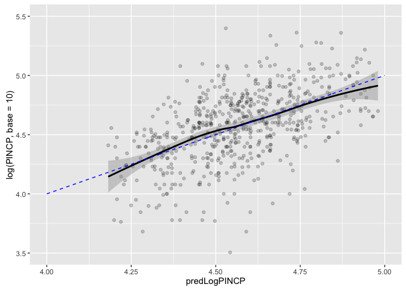
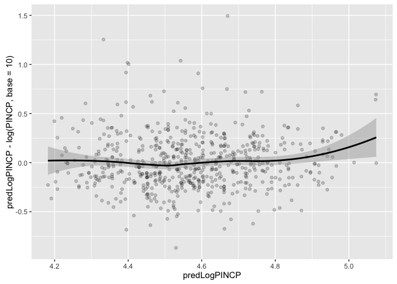
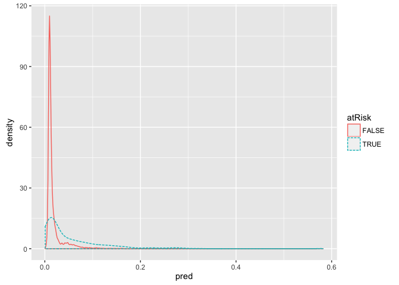
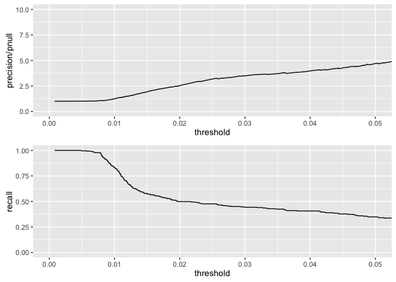

``` r
rm(list=ls())
source('runDir.R')
```

``` r
library('ggplot2')
runDir('../CodeExamples/c07_Linear_and_logistic_regression',
      '../PUMS',last=111)
```

    [1] "############################### start  100 Fri Jun 17 10:40:33 2016"
    [1] "#####  running  ../CodeExamples/c07_Linear_and_logistic_regression/00100_example_7.1_of_section_7.1.1.R"
    [1] "#####   in directory ../PUMS"

    > # example 7.1 of section 7.1.1 
    > # (example 7.1 of section 7.1.1)  : Linear and logistic regression : Using linear regression : Understanding linear regression 
    > # Title: Loading the PUMS data 
    > 
    > load("psub.RData")

    > dtrain <- subset(psub,ORIGRANDGROUP >= 500)

    > dtest <- subset(psub,ORIGRANDGROUP < 500)

    > model <- lm(log(PINCP,base=10) ~ AGEP + SEX + COW + SCHL,data=dtrain)

    > dtest$predLogPINCP <- predict(model,newdata=dtest)

    > dtrain$predLogPINCP <- predict(model,newdata=dtrain)
    [1] "############################### end  100 Fri Jun 17 10:40:34 2016"
    [1] "############################### start  101 Fri Jun 17 10:40:34 2016"
    [1] "#####  running  ../CodeExamples/c07_Linear_and_logistic_regression/00101_example_7.2_of_section_7.1.3.R"
    [1] "#####   in directory ../PUMS"

    > # example 7.2 of section 7.1.3 
    > # (example 7.2 of section 7.1.3)  : Linear and logistic regression : Using linear regression : Making predictions 
    > # Title: Plotting log income as a function of predicted log income 
    > 
    > library('ggplot2')

    > ggplot(data=dtest,aes(x=predLogPINCP,y=log(PINCP,base=10))) +
        geom_point(alpha=0.2,color="black") +
        geom_smooth(aes(x=predLogPINCP,
           y=log(PINCP,base=10)),color="black") +
        geom_line(aes(x=log(PINCP,base=10),
           y=log(PINCP,base=10)),color="blue",linetype=2) +
        scale_x_continuous(limits=c(4,5)) +
        scale_y_continuous(limits=c(3.5,5.5))

    Warning: Removed 9 rows containing non-finite values (stat_smooth).

    Warning: Removed 9 rows containing missing values (geom_point).

    Warning: Removed 67 rows containing missing values (geom_path).



    [1] "############################### end  101 Fri Jun 17 10:40:34 2016"
    [1] "############################### start  102 Fri Jun 17 10:40:34 2016"
    [1] "#####  running  ../CodeExamples/c07_Linear_and_logistic_regression/00102_example_7.3_of_section_7.1.3.R"
    [1] "#####   in directory ../PUMS"

    > # example 7.3 of section 7.1.3 
    > # (example 7.3 of section 7.1.3)  : Linear and logistic regression : Using linear regression : Making predictions 
    > # Title: Plotting residuals income as a function of predicted log income 
    > 
    > ggplot(data=dtest,aes(x=predLogPINCP,
                          y=predLogPINCP-log(PINCP,base=10))) +
       geom_point(alpha=0.2,color="black") +
       geom_smooth(aes(x=predLogPINCP,
                       y=predLogPINCP-log(PINCP,base=10)),
                       color="black")



    [1] "############################### end  102 Fri Jun 17 10:40:34 2016"
    [1] "############################### start  103 Fri Jun 17 10:40:34 2016"
    [1] "#####  running  ../CodeExamples/c07_Linear_and_logistic_regression/00103_example_7.4_of_section_7.1.3.R"
    [1] "#####   in directory ../PUMS"

    > # example 7.4 of section 7.1.3 
    > # (example 7.4 of section 7.1.3)  : Linear and logistic regression : Using linear regression : Making predictions 
    > # Title: Computing R-squared 
    > 
    > rsq <- function(y,f) { 1 - sum((y-f)^2)/sum((y-mean(y))^2) }

    > rsq(log(dtrain$PINCP,base=10),predict(model,newdata=dtrain))
    [1] 0.3382568

    > rsq(log(dtest$PINCP,base=10),predict(model,newdata=dtest))
    [1] 0.2605496
    [1] "############################### end  103 Fri Jun 17 10:40:34 2016"
    [1] "############################### start  104 Fri Jun 17 10:40:34 2016"
    [1] "#####  running  ../CodeExamples/c07_Linear_and_logistic_regression/00104_example_7.5_of_section_7.1.3.R"
    [1] "#####   in directory ../PUMS"

    > # example 7.5 of section 7.1.3 
    > # (example 7.5 of section 7.1.3)  : Linear and logistic regression : Using linear regression : Making predictions 
    > # Title: Calculating root mean square error 
    > 
    > rmse <- function(y, f) { sqrt(mean( (y-f)^2 )) }

    > rmse(log(dtrain$PINCP,base=10),predict(model,newdata=dtrain))
    [1] 0.2651856

    > rmse(log(dtest$PINCP,base=10),predict(model,newdata=dtest))
    [1] 0.2752171
    [1] "############################### end  104 Fri Jun 17 10:40:34 2016"
    [1] "############################### start  107 Fri Jun 17 10:40:34 2016"
    [1] "#####  running  ../CodeExamples/c07_Linear_and_logistic_regression/00107_example_7.6_of_section_7.1.5.R"
    [1] "#####   in directory ../PUMS"

    > # example 7.6 of section 7.1.5 
    > # (example 7.6 of section 7.1.5)  : Linear and logistic regression : Using linear regression : Reading the model summary and characterizing coefficient quality 
    > # Title: Summarizing residuals 
    > 
    > summary(log(dtrain$PINCP,base=10) - predict(model,newdata=dtrain))
        Min.  1st Qu.   Median     Mean  3rd Qu.     Max. 
    -1.29200 -0.14150  0.02458  0.00000  0.17630  0.62530 

    > ##     Min.  1st Qu.   Median     Mean  3rd Qu.     Max.
    > ## -1.29200 -0.14150  0.02458  0.00000  0.17630  0.62530
    > summary(log(dtest$PINCP,base=10) - predict(model,newdata=dtest))
         Min.   1st Qu.    Median      Mean   3rd Qu.      Max. 
    -1.494000 -0.165300  0.018920 -0.004637  0.175500  0.868100 

    > ##      Min.   1st Qu.    Median      Mean   3rd Qu.      Max.
    > ## -1.494000 -0.165300  0.018920 -0.004637  0.175500  0.868100
    > 
    [1] "############################### end  107 Fri Jun 17 10:40:34 2016"
    [1] "############################### start  109 Fri Jun 17 10:40:34 2016"
    [1] "#####  running  ../CodeExamples/c07_Linear_and_logistic_regression/00109_informalexample_7.9_of_section_7.1.5.R"
    [1] "#####   in directory ../PUMS"

    > # informalexample 7.9 of section 7.1.5 
    > # (informalexample 7.9 of section 7.1.5)  : Linear and logistic regression : Using linear regression : Reading the model summary and characterizing coefficient quality 
    > 
    > df <- dim(dtrain)[1] - dim(summary(model)$coefficients)[1]
    [1] "############################### end  109 Fri Jun 17 10:40:34 2016"
    [1] "############################### start  110 Fri Jun 17 10:40:34 2016"
    [1] "#####  running  ../CodeExamples/c07_Linear_and_logistic_regression/00110_informalexample_7.10_of_section_7.1.5.R"
    [1] "#####   in directory ../PUMS"

    > # informalexample 7.10 of section 7.1.5 
    > # (informalexample 7.10 of section 7.1.5)  : Linear and logistic regression : Using linear regression : Reading the model summary and characterizing coefficient quality 
    > 
    > modelResidualError <- sqrt(sum(residuals(model)^2)/df)
    [1] "############################### end  110 Fri Jun 17 10:40:34 2016"

``` r
rm(list=ls())
source('runDir.R')
```

``` r
runDir('../CodeExamples/c07_Linear_and_logistic_regression',
      '../CDC',first=112)
```

    [1] "############################### start  112 Fri Jun 17 10:40:34 2016"
    [1] "#####  running  ../CodeExamples/c07_Linear_and_logistic_regression/00112_example_7.7_of_section_7.2.1.R"
    [1] "#####   in directory ../CDC"

    > # example 7.7 of section 7.2.1 
    > # (example 7.7 of section 7.2.1)  : Linear and logistic regression : Using logistic regression : Understanding logistic regression 
    > # Title: Loading the CDC data 
    > 
    > load("NatalRiskData.rData")

    > train <- sdata[sdata$ORIGRANDGROUP<=5,]

    > test <- sdata[sdata$ORIGRANDGROUP>5,]
    [1] "############################### end  112 Fri Jun 17 10:40:34 2016"
    [1] "############################### start  113 Fri Jun 17 10:40:34 2016"
    [1] "#####  running  ../CodeExamples/c07_Linear_and_logistic_regression/00113_example_7.8_of_section_7.2.2.R"
    [1] "#####   in directory ../CDC"

    > # example 7.8 of section 7.2.2 
    > # (example 7.8 of section 7.2.2)  : Linear and logistic regression : Using logistic regression : Building a logistic regression model 
    > # Title: Building the model formula 
    > 
    > complications <- c("ULD_MECO","ULD_PRECIP","ULD_BREECH")

    >  riskfactors <- c("URF_DIAB", "URF_CHYPER", "URF_PHYPER",
                     "URF_ECLAM")

    > y <- "atRisk"

    > x <- c("PWGT",
           "UPREVIS",
           "CIG_REC",
           "GESTREC3",
           "DPLURAL",
           complications,
           riskfactors)

    > fmla <- paste(y, paste(x, collapse="+"), sep="~")
    [1] "############################### end  113 Fri Jun 17 10:40:34 2016"
    [1] "############################### start  114 Fri Jun 17 10:40:34 2016"
    [1] "#####  running  ../CodeExamples/c07_Linear_and_logistic_regression/00114_example_7.9_of_section_7.2.2.R"
    [1] "#####   in directory ../CDC"

    > # example 7.9 of section 7.2.2 
    > # (example 7.9 of section 7.2.2)  : Linear and logistic regression : Using logistic regression : Building a logistic regression model 
    > # Title: Fitting the logistic regression model 
    > 
    > print(fmla)
    [1] "atRisk~PWGT+UPREVIS+CIG_REC+GESTREC3+DPLURAL+ULD_MECO+ULD_PRECIP+ULD_BREECH+URF_DIAB+URF_CHYPER+URF_PHYPER+URF_ECLAM"

    > ## [1] "atRisk ~ PWGT+UPREVIS+CIG_REC+GESTREC3+DPLURAL+ULD_MECO+ULD_PRECIP+
    > ##                    ULD_BREECH+URF_DIAB+URF_CHYPER+URF_PHYPER+URF_ECLAM"
    > 
    > model <- glm(fmla, data=train, family=binomial(link="logit"))
    [1] "############################### end  114 Fri Jun 17 10:40:35 2016"
    [1] "############################### start  115 Fri Jun 17 10:40:35 2016"
    [1] "#####  running  ../CodeExamples/c07_Linear_and_logistic_regression/00115_example_7.10_of_section_7.2.3.R"
    [1] "#####   in directory ../CDC"

    > # example 7.10 of section 7.2.3 
    > # (example 7.10 of section 7.2.3)  : Linear and logistic regression : Using logistic regression : Making predictions 
    > # Title: Applying the logistic regression model 
    > 
    > train$pred <- predict(model, newdata=train, type="response")

    > test$pred <- predict(model, newdata=test, type="response")
    [1] "############################### end  115 Fri Jun 17 10:40:35 2016"
    [1] "############################### start  116 Fri Jun 17 10:40:35 2016"
    [1] "#####  running  ../CodeExamples/c07_Linear_and_logistic_regression/00116_example_7.11_of_section_7.2.3.R"
    [1] "#####   in directory ../CDC"

    > # example 7.11 of section 7.2.3 
    > # (example 7.11 of section 7.2.3)  : Linear and logistic regression : Using logistic regression : Making predictions 
    > # Title: Plotting distribution of prediction score grouped by known outcome 
    > 
    > library('ggplot2')

    > ggplot(train, aes(x=pred, color=atRisk, linetype=atRisk)) +
            geom_density()

    [1] "############################### end  116 Fri Jun 17 10:40:35 2016"
    [1] "############################### start  117 Fri Jun 17 10:40:35 2016"
    [1] "#####  running  ../CodeExamples/c07_Linear_and_logistic_regression/00117_example_7.12_of_section_7.2.3.R"
    [1] "#####   in directory ../CDC"

    > # example 7.12 of section 7.2.3 
    > # (example 7.12 of section 7.2.3)  : Linear and logistic regression : Using logistic regression : Making predictions 
    > # Title: Exploring modeling trade-offs 
    > 
    > library(ROCR)                                         # Note: 1 

    Loading required package: gplots


    Attaching package: 'gplots'

    The following object is masked from 'package:stats':

        lowess




    > library(grid)                                         # Note: 2 

    > predObj <- prediction(train$pred, train$atRisk)       # Note: 3 

    > precObj <- performance(predObj, measure="prec")       # Note: 4 

    > recObj <- performance(predObj, measure="rec")         # Note: 5 

    > precision <- (precObj@y.values)[[1]]                  # Note: 6 

    > prec.x <- (precObj@x.values)[[1]]                     # Note: 7 

    > recall <- (recObj@y.values)[[1]]

    > rocFrame <- data.frame(threshold=prec.x, precision=precision,
                           recall=recall)                   # Note: 8 

    > nplot <- function(plist) {                            # Note: 9 
       n <- length(plist)
       grid.newpage()
       pushViewport(viewport(layout=grid.layout(n,1)))
       vplayout=function(x,y) {viewport(layout.pos.row=x, layout.pos.col=y)}
       for(i in 1:n) {
         print(plist[[i]], vp=vplayout(i,1))
       }
     }

    > pnull <- mean(as.numeric(train$atRisk))               # Note: 10 

    > p1 <- ggplot(rocFrame, aes(x=threshold)) +            # Note: 11 
       geom_line(aes(y=precision/pnull)) +
       coord_cartesian(xlim = c(0,0.05), ylim=c(0,10) )

    > p2 <- ggplot(rocFrame, aes(x=threshold)) +            # Note: 12 
       geom_line(aes(y=recall)) +
       coord_cartesian(xlim = c(0,0.05) )

    > nplot(list(p1, p2))                                   # Note: 13

    Warning: Removed 1 rows containing missing values (geom_path).




    > # Note 1: 
    > #   Load ROCR library. 
    > 
    > # Note 2: 
    > #   Load grid library (you’ll need this for the 
    > #   nplot function below). 
    > 
    > # Note 3: 
    > #   Create ROCR prediction object. 
    > 
    > # Note 4: 
    > #   Create ROCR object to calculate precision as 
    > #   a function of threshold. 
    > 
    > # Note 5: 
    > #   Create ROCR object to calculate recall as a 
    > #   function of threshold. 
    > 
    > # Note 6: 
    > #   at ( @ ) symbol@ (at) symbolROCR objects are what R calls S4 objects; 
    > #   the slots (or fields) of an S4 object are stored 
    > #   as lists within the object. You extract the slots 
    > #   from an S4 object using @ notation. 
    > 
    > # Note 7: 
    > #   The x values (thresholds) are the same in 
    > #   both predObj and recObj, so you only need to 
    > #   extract them once. 
    > 
    > # Note 8: 
    > #   Build data frame with thresholds, precision, 
    > #   and recall. 
    > 
    > # Note 9: 
    > #   Function to plot multiple plots on one page 
    > #   (stacked). 
    > 
    > # Note 10: 
    > #   Calculate rate of at-risk births in the 
    > #   training set. 
    > 
    > # Note 11: 
    > #   Plot enrichment rate as a function of 
    > #   threshold. 
    > 
    > # Note 12: 
    > #   Plot recall as a function of 
    > #   threshold. 
    > 
    > # Note 13: 
    > #   Show both plots simultaneously. 
    > 
    [1] "############################### end  117 Fri Jun 17 10:40:35 2016"
    [1] "############################### start  118 Fri Jun 17 10:40:35 2016"
    [1] "#####  running  ../CodeExamples/c07_Linear_and_logistic_regression/00118_example_7.13_of_section_7.2.3.R"
    [1] "#####   in directory ../CDC"

    > # example 7.13 of section 7.2.3 
    > # (example 7.13 of section 7.2.3)  : Linear and logistic regression : Using logistic regression : Making predictions 
    > # Title: Evaluating our chosen model 
    > 
    > ctab.test <- table(pred=test$pred>0.02, atRisk=test$atRisk)   # Note: 1 

    > ctab.test                                                         # Note: 2 
           atRisk
    pred    FALSE TRUE
      FALSE  9487   93
      TRUE   2405  116

    > ##        atRisk
    > ## pred    FALSE TRUE
    > ##   FALSE  9487   93
    > ##   TRUE   2405  116
    > precision <- ctab.test[2,2]/sum(ctab.test[2,])

    > precision
    [1] 0.04601349

    > ## [1] 0.04601349
    > recall <- ctab.test[2,2]/sum(ctab.test[,2])

    > recall
    [1] 0.5550239

    > ## [1] 0.5550239
    > enrich <- precision/mean(as.numeric(test$atRisk))

    > enrich
    [1] 2.664159

    > ## [1] 2.664159
    > 
    > # Note 1: 
    > #   Build confusion matrix. 
    > 
    > # Note 2: 
    > #   Rows contain predicted negatives and 
    > #   positives; columns contain actual negatives and 
    > #   positives. 
    > 
    [1] "############################### end  118 Fri Jun 17 10:40:35 2016"
    [1] "############################### start  119 Fri Jun 17 10:40:35 2016"
    [1] "#####  running  ../CodeExamples/c07_Linear_and_logistic_regression/00119_example_7.14_of_section_7.2.4.R"
    [1] "#####   in directory ../CDC"

    > # example 7.14 of section 7.2.4 
    > # (example 7.14 of section 7.2.4)  : Linear and logistic regression : Using logistic regression : Finding relations and extracting advice from logistic models 
    > # Title: The model coefficients 
    > 
    > coefficients(model)
                 (Intercept)                     PWGT                  UPREVIS 
                 -4.41218940               0.00376166              -0.06328943 
                 CIG_RECTRUE       GESTREC3< 37 weeks DPLURALtriplet or higher 
                  0.31316930               1.54518311               1.39419294 
                 DPLURALtwin             ULD_MECOTRUE           ULD_PRECIPTRUE 
                  0.31231871               0.81842627               0.19172008 
              ULD_BREECHTRUE             URF_DIABTRUE           URF_CHYPERTRUE 
                  0.74923672              -0.34646672               0.56002503 
              URF_PHYPERTRUE            URF_ECLAMTRUE 
                  0.16159872               0.49806435 

    > ##              (Intercept)                     PWGT
    > ##              -4.41218940               0.00376166
    > ##                  UPREVIS              CIG_RECTRUE
    > ##              -0.06328943               0.31316930
    > ##       GESTREC3< 37 weeks DPLURALtriplet or higher
    > ##               1.54518311               1.39419294
    > ##              DPLURALtwin             ULD_MECOTRUE
    > ##               0.31231871               0.81842627
    > ##           ULD_PRECIPTRUE           ULD_BREECHTRUE
    > ##               0.19172008               0.74923672
    > ##             URF_DIABTRUE           URF_CHYPERTRUE
    > ##              -0.34646672               0.56002503
    > ##           URF_PHYPERTRUE            URF_ECLAMTRUE
    > ##               0.16159872               0.49806435
    > 
    [1] "############################### end  119 Fri Jun 17 10:40:35 2016"
    [1] "############################### start  120 Fri Jun 17 10:40:35 2016"
    [1] "#####  running  ../CodeExamples/c07_Linear_and_logistic_regression/00120_example_7.15_of_section_7.2.5.R"
    [1] "#####   in directory ../CDC"

    > # example 7.15 of section 7.2.5 
    > # (example 7.15 of section 7.2.5)  : Linear and logistic regression : Using logistic regression : Reading the model summary and characterizing coefficients 
    > # Title: The model summary 
    > 
    > summary(model)

    Call:
    glm(formula = fmla, family = binomial(link = "logit"), data = train)

    Deviance Residuals: 
        Min       1Q   Median       3Q      Max  
    -0.9732  -0.1818  -0.1511  -0.1358   3.2641  

    Coefficients:
                              Estimate Std. Error z value Pr(>|z|)    
    (Intercept)              -4.412189   0.289352 -15.249  < 2e-16 ***
    PWGT                      0.003762   0.001487   2.530 0.011417 *  
    UPREVIS                  -0.063289   0.015252  -4.150 3.33e-05 ***
    CIG_RECTRUE               0.313169   0.187230   1.673 0.094398 .  
    GESTREC3< 37 weeks        1.545183   0.140795  10.975  < 2e-16 ***
    DPLURALtriplet or higher  1.394193   0.498866   2.795 0.005194 ** 
    DPLURALtwin               0.312319   0.241088   1.295 0.195163    
    ULD_MECOTRUE              0.818426   0.235798   3.471 0.000519 ***
    ULD_PRECIPTRUE            0.191720   0.357680   0.536 0.591951    
    ULD_BREECHTRUE            0.749237   0.178129   4.206 2.60e-05 ***
    URF_DIABTRUE             -0.346467   0.287514  -1.205 0.228187    
    URF_CHYPERTRUE            0.560025   0.389678   1.437 0.150676    
    URF_PHYPERTRUE            0.161599   0.250003   0.646 0.518029    
    URF_ECLAMTRUE             0.498064   0.776948   0.641 0.521489    
    ---
    Signif. codes:  0 '***' 0.001 '**' 0.01 '*' 0.05 '.' 0.1 ' ' 1

    (Dispersion parameter for binomial family taken to be 1)

        Null deviance: 2698.7  on 14211  degrees of freedom
    Residual deviance: 2463.0  on 14198  degrees of freedom
    AIC: 2491

    Number of Fisher Scoring iterations: 7


    > ## Call:
    > ## glm(formula = fmla, family = binomial(link = "logit"), data = train)
    > ## 
    > ## Deviance Residuals:
    > ##     Min       1Q   Median       3Q      Max
    > ## -0.9732  -0.1818  -0.1511  -0.1358   3.2641
    > ## 
    > ## Coefficients:
    > ##                           Estimate Std. Error z value Pr(>|z|)
    > ## (Intercept)              -4.412189   0.289352 -15.249  < 2e-16 ***
    > ## PWGT                      0.003762   0.001487   2.530 0.011417 *
    > ## UPREVIS                  -0.063289   0.015252  -4.150 3.33e-05 ***
    > ## CIG_RECTRUE               0.313169   0.187230   1.673 0.094398 .
    > ## GESTREC3< 37 weeks        1.545183   0.140795  10.975  < 2e-16 ***
    > ## DPLURALtriplet or higher  1.394193   0.498866   2.795 0.005194 **
    > ## DPLURALtwin               0.312319   0.241088   1.295 0.195163
    > ## ULD_MECOTRUE              0.818426   0.235798   3.471 0.000519 ***
    > ## ULD_PRECIPTRUE            0.191720   0.357680   0.536 0.591951
    > ## ULD_BREECHTRUE            0.749237   0.178129   4.206 2.60e-05 ***
    > ## URF_DIABTRUE             -0.346467   0.287514  -1.205 0.228187
    > ## URF_CHYPERTRUE            0.560025   0.389678   1.437 0.150676
    > ## URF_PHYPERTRUE            0.161599   0.250003   0.646 0.518029
    > ## URF_ECLAMTRUE             0.498064   0.776948   0.641 0.521489
    > ## ---
    > ## Signif. codes:  0 ‘***’ 0.001 ‘**’ 0.01 ‘*’ 0.05 ‘.’ 0.1 ‘ ’ 1
    > ## 
    > ## (Dispersion parameter for binomial family taken to be 1)
    > ## 
    > ##    Null deviance: 2698.7  on 14211  degrees of freedom
    > ## Residual deviance: 2463.0  on 14198  degrees of freedom
    > ## AIC: 2491
    > ## 
    > ## Number of Fisher Scoring iterations: 7
    > 
    [1] "############################### end  120 Fri Jun 17 10:40:35 2016"
    [1] "############################### start  123 Fri Jun 17 10:40:35 2016"
    [1] "#####  running  ../CodeExamples/c07_Linear_and_logistic_regression/00123_example_7.16_of_section_7.2.5.R"
    [1] "#####   in directory ../CDC"

    > # example 7.16 of section 7.2.5 
    > # (example 7.16 of section 7.2.5)  : Linear and logistic regression : Using logistic regression : Reading the model summary and characterizing coefficients 
    > # Title: Calculating deviance residuals 
    > 
    > pred <- predict(model, newdata=train, type="response")    # Note: 1 

    > llcomponents <- function(y, py) {                         # Note: 2 
       y*log(py) + (1-y)*log(1-py)
     }

    > edev <- sign(as.numeric(train$atRisk) - pred) *           # Note: 3 
       sqrt(-2*llcomponents(as.numeric(train$atRisk), pred))

    > summary(edev)
       Min. 1st Qu.  Median    Mean 3rd Qu.    Max. 
    -0.9732 -0.1818 -0.1511 -0.1244 -0.1358  3.2640 

    > ##    Min. 1st Qu.  Median    Mean 3rd Qu.    Max.
    > ## -0.9732 -0.1818 -0.1511 -0.1244 -0.1358  3.2640
    > 
    > # Note 1: 
    > #   Create vector of predictions for training 
    > #   data. 
    > 
    > # Note 2: 
    > #   Function to return the log likelihoods for 
    > #   each data point. Argument y is the true outcome 
    > #   (as a numeric variable, 0/1); argument py is the 
    > #   predicted probability. 
    > 
    > # Note 3: 
    > #   Calculate deviance residuals. 
    > 
    [1] "############################### end  123 Fri Jun 17 10:40:35 2016"
    [1] "############################### start  126 Fri Jun 17 10:40:35 2016"
    [1] "#####  running  ../CodeExamples/c07_Linear_and_logistic_regression/00126_example_7.17_of_section_7.2.5.R"
    [1] "#####   in directory ../CDC"

    > # example 7.17 of section 7.2.5 
    > # (example 7.17 of section 7.2.5)  : Linear and logistic regression : Using logistic regression : Reading the model summary and characterizing coefficients 
    > # Title: Computing deviance 
    > 
    > loglikelihood <- function(y, py) {                                    # Note: 1 
       sum(y * log(py) + (1-y)*log(1 - py))
     }

    > pnull <- mean(as.numeric(train$atRisk))                               # Note: 2 

    > null.dev <- -2*loglikelihood(as.numeric(train$atRisk), pnull)         # Note: 3 

    > pnull
    [1] 0.01920912

    > ## [1] 0.01920912
    > null.dev
    [1] 2698.716

    > ## [1] 2698.716
    > model$null.deviance                                                   # Note: 4 
    [1] 2698.716

    > ## [1] 2698.716
    > 
    > pred <- predict(model, newdata=train, type="response")    # Note: 5 

    > resid.dev <- -2*loglikelihood(as.numeric(train$atRisk), pred)         # Note: 6 

    > resid.dev
    [1] 2462.992

    > ## [1] 2462.992
    > model$deviance                                                        # Note: 7 
    [1] 2462.992

    > ## [1] 2462.992
    > 
    > testy <- as.numeric(test$atRisk)                                      # Note: 8 

    > testpred <- predict(model, newdata=test,
                             type="response")

    > pnull.test <- mean(testy)

    > null.dev.test <- -2*loglikelihood(testy, pnull.test)

    > resid.dev.test <- -2*loglikelihood(testy, testpred)

    > pnull.test
    [1] 0.0172713

    > ## [1] 0.0172713
    > null.dev.test
    [1] 2110.91

    > ## [1] 2110.91
    > resid.dev.test
    [1] 1947.094

    > ## [1] 1947.094
    > 
    > # Note 1: 
    > #   Function to calculate the log likelihood of 
    > #   a dataset. Variable y is the outcome 
    > #   in numeric form (1 for positive examples, 0 for 
    > #   negative). Variable py is the 
    > #   predicted probability that 
    > #   y==1. 
    > 
    > # Note 2: 
    > #   Calculate rate of positive examples in 
    > #   dataset. 
    > 
    > # Note 3: 
    > #   Calculate null deviance. 
    > 
    > # Note 4: 
    > #   For training data, the null deviance is 
    > #   stored in the slot model$null.deviance. 
    > 
    > # Note 5: 
    > #   Predict probabilities for training 
    > #   data. 
    > 
    > # Note 6: 
    > #   Calculate deviance of model for training 
    > #   data. 
    > 
    > # Note 7: 
    > #   For training data, model deviance is stored 
    > #   in the slot model$deviance. 
    > 
    > # Note 8: 
    > #   Calculate null deviance and residual 
    > #   deviance for test data. 
    > 
    [1] "############################### end  126 Fri Jun 17 10:40:36 2016"
    [1] "############################### start  127 Fri Jun 17 10:40:36 2016"
    [1] "#####  running  ../CodeExamples/c07_Linear_and_logistic_regression/00127_example_7.18_of_section_7.2.5.R"
    [1] "#####   in directory ../CDC"

    > # example 7.18 of section 7.2.5 
    > # (example 7.18 of section 7.2.5)  : Linear and logistic regression : Using logistic regression : Reading the model summary and characterizing coefficients 
    > # Title: Calculating the significance of the observed fit 
    > 
    > df.null <- dim(train)[[1]] - 1                                # Note: 1 

    > df.model <- dim(train)[[1]] - length(model$coefficients)      # Note: 2 

    > df.null
    [1] 14211

    > ## [1] 14211
    > df.model
    [1] 14198

    > ## [1] 14198
    > 
    > delDev <- null.dev - resid.dev                                # Note: 3 

    > deldf <- df.null - df.model

    > p <- pchisq(delDev, deldf, lower.tail=F)                      # Note: 4 

    > delDev
    [1] 235.724

    > ## [1] 235.724
    > deldf
    [1] 13

    > ## [1] 13
    > p
    [1] 5.84896e-43

    > ## [1] 5.84896e-43
    > 
    > # Note 1: 
    > #   Null model has (number of data points - 1) 
    > #   degrees of freedom. 
    > 
    > # Note 2: 
    > #   Fitted model has (number of data points - 
    > #   number of coefficients) degrees of freedom. 
    > 
    > # Note 3: 
    > #   Compute difference in deviances and 
    > #   difference in degrees of freedom. 
    > 
    > # Note 4: 
    > #   Estimate probability of seeing the observed 
    > #   difference in deviances under null model (the 
    > #   p-value) using chi-squared distribution. 
    > 
    [1] "############################### end  127 Fri Jun 17 10:40:36 2016"
    [1] "############################### start  128 Fri Jun 17 10:40:36 2016"
    [1] "#####  running  ../CodeExamples/c07_Linear_and_logistic_regression/00128_example_7.19_of_section_7.2.5.R"
    [1] "#####   in directory ../CDC"

    > # example 7.19 of section 7.2.5 
    > # (example 7.19 of section 7.2.5)  : Linear and logistic regression : Using logistic regression : Reading the model summary and characterizing coefficients 
    > # Title: Calculating the pseudo R-squared 
    > 
    > pr2 <- 1-(resid.dev/null.dev)

    > print(pr2)
    [1] 0.08734674

    > ## [1] 0.08734674
    > pr2.test <- 1-(resid.dev.test/null.dev.test)

    > print(pr2.test)
    [1] 0.07760427

    > ## [1] 0.07760427
    > 
    [1] "############################### end  128 Fri Jun 17 10:40:36 2016"
    [1] "############################### start  129 Fri Jun 17 10:40:36 2016"
    [1] "#####  running  ../CodeExamples/c07_Linear_and_logistic_regression/00129_example_7.20_of_section_7.2.5.R"
    [1] "#####   in directory ../CDC"

    > # example 7.20 of section 7.2.5 
    > # (example 7.20 of section 7.2.5)  : Linear and logistic regression : Using logistic regression : Reading the model summary and characterizing coefficients 
    > # Title: Calculating the Akaike information criterion 
    > 
    > aic <- 2*(length(model$coefficients) -
              loglikelihood(as.numeric(train$atRisk), pred))

    > aic
    [1] 2490.992

    > ## [1] 2490.992
    > 
    [1] "############################### end  129 Fri Jun 17 10:40:36 2016"
