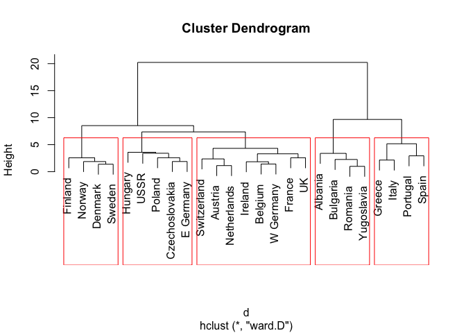
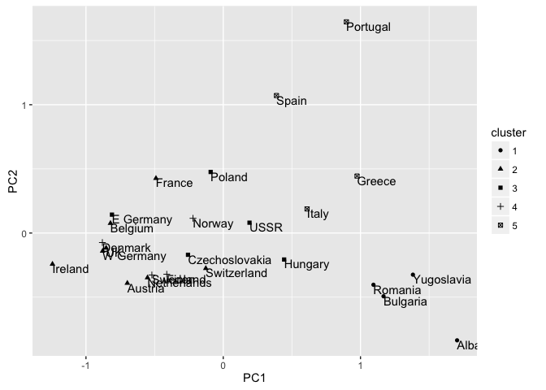
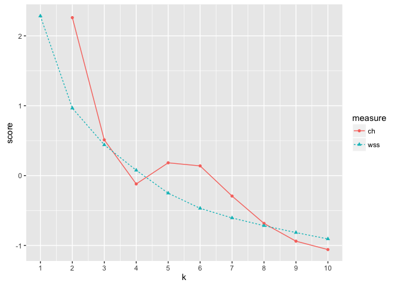
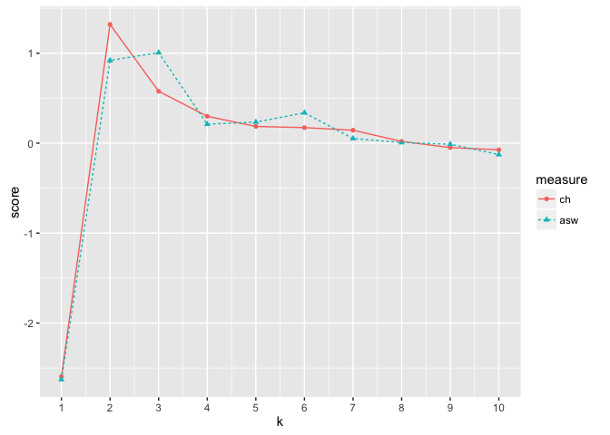
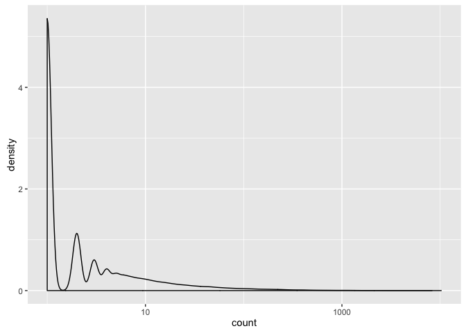

``` r
rm(list=ls())
source('runDir.R')
```

``` r
library('ggplot2')
runDir('../CodeExamples/c08_Unsupervised_methods',
      '../Protein',last=151)
```

    [1] "############################### start  136 Tue May  2 20:40:45 2017"
    [1] "#####  running  ../CodeExamples/c08_Unsupervised_methods/00136_example_8.1_of_section_8.1.2.R"
    [1] "#####   in directory ../Protein"

    > # example 8.1 of section 8.1.2 
    > # (example 8.1 of section 8.1.2)  : Unsupervised methods : Cluster analysis : Preparing the data 
    > # Title: Reading the protein data 
    > 
    > protein <- read.table("protein.txt", sep="\t", header=TRUE)

    > summary(protein)
               Country      RedMeat         WhiteMeat           Eggs      
     Albania       : 1   Min.   : 4.400   Min.   : 1.400   Min.   :0.500  
     Austria       : 1   1st Qu.: 7.800   1st Qu.: 4.900   1st Qu.:2.700  
     Belgium       : 1   Median : 9.500   Median : 7.800   Median :2.900  
     Bulgaria      : 1   Mean   : 9.828   Mean   : 7.896   Mean   :2.936  
     Czechoslovakia: 1   3rd Qu.:10.600   3rd Qu.:10.800   3rd Qu.:3.700  
     Denmark       : 1   Max.   :18.000   Max.   :14.000   Max.   :4.700  
     (Other)       :19                                                    
          Milk            Fish           Cereals          Starch     
     Min.   : 4.90   Min.   : 0.200   Min.   :18.60   Min.   :0.600  
     1st Qu.:11.10   1st Qu.: 2.100   1st Qu.:24.30   1st Qu.:3.100  
     Median :17.60   Median : 3.400   Median :28.00   Median :4.700  
     Mean   :17.11   Mean   : 4.284   Mean   :32.25   Mean   :4.276  
     3rd Qu.:23.30   3rd Qu.: 5.800   3rd Qu.:40.10   3rd Qu.:5.700  
     Max.   :33.70   Max.   :14.200   Max.   :56.70   Max.   :6.500  
                                                                     
          Nuts           Fr.Veg     
     Min.   :0.700   Min.   :1.400  
     1st Qu.:1.500   1st Qu.:2.900  
     Median :2.400   Median :3.800  
     Mean   :3.072   Mean   :4.136  
     3rd Qu.:4.700   3rd Qu.:4.900  
     Max.   :7.800   Max.   :7.900  
                                    

    > ##            Country      RedMeat         WhiteMeat           Eggs
    > ##  Albania       : 1   Min.   : 4.400   Min.   : 1.400   Min.   :0.500
    > ##  Austria       : 1   1st Qu.: 7.800   1st Qu.: 4.900   1st Qu.:2.700
    > ##  Belgium       : 1   Median : 9.500   Median : 7.800   Median :2.900
    > ##  Bulgaria      : 1   Mean   : 9.828   Mean   : 7.896   Mean   :2.936
    > ##  Czechoslovakia: 1   3rd Qu.:10.600   3rd Qu.:10.800   3rd Qu.:3.700
    > ##  Denmark       : 1   Max.   :18.000   Max.   :14.000   Max.   :4.700
    > ##  (Other)       :19
    > ##       Milk            Fish           Cereals          Starch
    > ##  Min.   : 4.90   Min.   : 0.200   Min.   :18.60   Min.   :0.600
    > ##  1st Qu.:11.10   1st Qu.: 2.100   1st Qu.:24.30   1st Qu.:3.100
    > ##  Median :17.60   Median : 3.400   Median :28.00   Median :4.700
    > ##  Mean   :17.11   Mean   : 4.284   Mean   :32.25   Mean   :4.276
    > ##  3rd Qu.:23.30   3rd Qu.: 5.800   3rd Qu.:40.10   3rd Qu.:5.700
    > ##  Max.   :33.70   Max.   :14.200   Max.   :56.70   Max.   :6.500
    > ##
    > ##       Nuts           Fr.Veg
    > ##  Min.   :0.700   Min.   :1.400
    > ##  1st Qu.:1.500   1st Qu.:2.900
    > ##  Median :2.400   Median :3.800
    > ##  Mean   :3.072   Mean   :4.136
    > ##  3rd Qu.:4.700   3rd Qu.:4.900
    > ##  Max.   :7.800   Max.   :7.900
    > 
    [1] "############################### end  136 Tue May  2 20:40:45 2017"
    [1] "############################### start  137 Tue May  2 20:40:45 2017"
    [1] "#####  running  ../CodeExamples/c08_Unsupervised_methods/00137_example_8.2_of_section_8.1.2.R"
    [1] "#####   in directory ../Protein"

    > # example 8.2 of section 8.1.2 
    > # (example 8.2 of section 8.1.2)  : Unsupervised methods : Cluster analysis : Preparing the data 
    > # Title: Rescaling the dataset 
    > 
    > vars.to.use <- colnames(protein)[-1]          # Note: 1 

    > pmatrix <- scale(protein[,vars.to.use])       # Note: 2 

    > pcenter <- attr(pmatrix, "scaled:center")     # Note: 3 

    > pscale <- attr(pmatrix, "scaled:scale")

    > attr(pmatrix, "scaled:center") <- NULL

    > attr(pmatrix, "scaled:scale") <- NULL

    > # Note 1: 
    > #   Use all the columns except the first 
    > #   (Country). 
    > 
    > # Note 2: 
    > #   The output of scale() is a matrix. For the 
    > #   purposes of this chapter, you can think of a 
    > #   matrix as a data frame with all numeric columns 
    > #   (this isn’t strictly true, but it’s close enough). 
    > 
    > # Note 3: 
    > #   The scale() function annotates its output 
    > #   with two attributes—scaled:center returns the mean 
    > #   values of all the columns, and scaled:scale 
    > #   returns the standard deviations. You’ll store 
    > #   these away so you can “unscale” the data 
    > #   later. 
    > 
    [1] "############################### end  137 Tue May  2 20:40:45 2017"
    [1] "############################### start  138 Tue May  2 20:40:45 2017"
    [1] "#####  running  ../CodeExamples/c08_Unsupervised_methods/00138_example_8.3_of_section_8.1.3.R"
    [1] "#####   in directory ../Protein"

    > # example 8.3 of section 8.1.3 
    > # (example 8.3 of section 8.1.3)  : Unsupervised methods : Cluster analysis : Hierarchical clustering with hclust 
    > # Title: Hierarchical clustering 
    > 
    > d <- dist(pmatrix, method="euclidean")    # Note: 1 

    > pfit <- hclust(d, method="ward.D")            # Note: 2 

    > plot(pfit, labels=protein$Country)        # Note: 3




    > # Note 1: 
    > #   Create the distance matrix. 
    > 
    > # Note 2: 
    > #   Do the clustering. 
    > 
    > # Note 3: 
    > #   Plot the dendrogram. 
    > 
    [1] "############################### end  138 Tue May  2 20:40:45 2017"
    [1] "############################### start  139 Tue May  2 20:40:45 2017"
    [1] "#####  running  ../CodeExamples/c08_Unsupervised_methods/00139_informalexample_8.5_of_section_8.1.3.R"
    [1] "#####   in directory ../Protein"

    > # informalexample 8.5 of section 8.1.3 
    > # (informalexample 8.5 of section 8.1.3)  : Unsupervised methods : Cluster analysis : Hierarchical clustering with hclust 
    > 
    > rect.hclust(pfit, k=5)
    [1] "############################### end  139 Tue May  2 20:40:45 2017"
    [1] "############################### start  140 Tue May  2 20:40:45 2017"
    [1] "#####  running  ../CodeExamples/c08_Unsupervised_methods/00140_example_8.4_of_section_8.1.3.R"
    [1] "#####   in directory ../Protein"

    > # example 8.4 of section 8.1.3 
    > # (example 8.4 of section 8.1.3)  : Unsupervised methods : Cluster analysis : Hierarchical clustering with hclust 
    > # Title: Extracting the clusters found by hclust() 
    > 
    > groups <- cutree(pfit, k=5)

    > print_clusters <- function(labels, k) {               # Note: 1 
       for(i in 1:k) {
         print(paste("cluster", i))
         print(protein[labels==i,c("Country","RedMeat","Fish","Fr.Veg")])
       }
     }

    > print_clusters(groups, 5)
    [1] "cluster 1"
          Country RedMeat Fish Fr.Veg
    1     Albania    10.1  0.2    1.7
    4    Bulgaria     7.8  1.2    4.2
    18    Romania     6.2  1.0    2.8
    25 Yugoslavia     4.4  0.6    3.2
    [1] "cluster 2"
           Country RedMeat Fish Fr.Veg
    2      Austria     8.9  2.1    4.3
    3      Belgium    13.5  4.5    4.0
    9       France    18.0  5.7    6.5
    12     Ireland    13.9  2.2    2.9
    14 Netherlands     9.5  2.5    3.7
    21 Switzerland    13.1  2.3    4.9
    22          UK    17.4  4.3    3.3
    24   W Germany    11.4  3.4    3.8
    [1] "cluster 3"
              Country RedMeat Fish Fr.Veg
    5  Czechoslovakia     9.7  2.0    4.0
    7       E Germany     8.4  5.4    3.6
    11        Hungary     5.3  0.3    4.2
    16         Poland     6.9  3.0    6.6
    23           USSR     9.3  3.0    2.9
    [1] "cluster 4"
       Country RedMeat Fish Fr.Veg
    6  Denmark    10.6  9.9    2.4
    8  Finland     9.5  5.8    1.4
    15  Norway     9.4  9.7    2.7
    20  Sweden     9.9  7.5    2.0
    [1] "cluster 5"
        Country RedMeat Fish Fr.Veg
    10   Greece    10.2  5.9    6.5
    13    Italy     9.0  3.4    6.7
    17 Portugal     6.2 14.2    7.9
    19    Spain     7.1  7.0    7.2

    > ## [1] "cluster 1"
    > ##       Country RedMeat Fish Fr.Veg
    > ## 1     Albania    10.1  0.2    1.7
    > ## 4    Bulgaria     7.8  1.2    4.2
    > ## 18    Romania     6.2  1.0    2.8
    > ## 25 Yugoslavia     4.4  0.6    3.2
    > ## [1] "cluster 2"
    > ##        Country RedMeat Fish Fr.Veg
    > ## 2      Austria     8.9  2.1    4.3
    > ## 3      Belgium    13.5  4.5    4.0
    > ## 9       France    18.0  5.7    6.5
    > ## 12     Ireland    13.9  2.2    2.9
    > ## 14 Netherlands     9.5  2.5    3.7
    > ## 21 Switzerland    13.1  2.3    4.9
    > ## 22          UK    17.4  4.3    3.3
    > ## 24   W Germany    11.4  3.4    3.8
    > ## [1] "cluster 3"
    > ##           Country RedMeat Fish Fr.Veg
    > ## 5  Czechoslovakia     9.7  2.0    4.0
    > ## 7       E Germany     8.4  5.4    3.6
    > ## 11        Hungary     5.3  0.3    4.2
    > ## 16         Poland     6.9  3.0    6.6
    > ## 23           USSR     9.3  3.0    2.9
    > ## [1] "cluster 4"
    > ##    Country RedMeat Fish Fr.Veg
    > ## 6  Denmark    10.6  9.9    2.4
    > ## 8  Finland     9.5  5.8    1.4
    > ## 15  Norway     9.4  9.7    2.7
    > ## 20  Sweden     9.9  7.5    2.0
    > ## [1] "cluster 5"
    > ##     Country RedMeat Fish Fr.Veg
    > ## 10   Greece    10.2  5.9    6.5
    > ## 13    Italy     9.0  3.4    6.7
    > ## 17 Portugal     6.2 14.2    7.9
    > ## 19    Spain     7.1  7.0    7.2
    > 
    > # Note 1: 
    > #   A convenience function for printing out the 
    > #   countries in each cluster, along with the values 
    > #   for red meat, fish, and fruit/vegetable 
    > #   consumption. We’ll use this function throughout 
    > #   this section. Note that the function is hardcoded 
    > #   for the protein dataset. 
    > 
    [1] "############################### end  140 Tue May  2 20:40:45 2017"
    [1] "############################### start  141 Tue May  2 20:40:45 2017"
    [1] "#####  running  ../CodeExamples/c08_Unsupervised_methods/00141_example_8.5_of_section_8.1.3.R"
    [1] "#####   in directory ../Protein"

    > # example 8.5 of section 8.1.3 
    > # (example 8.5 of section 8.1.3)  : Unsupervised methods : Cluster analysis : Hierarchical clustering with hclust 
    > # Title: Projecting the clusters on the first two principal components 
    > 
    > library(ggplot2)

    > princ <- prcomp(pmatrix)      # Note: 1 

    > nComp <- 2

    > project <- (pmatrix %*% princ$rotation)[,1:nComp]             # Note: 2 

    > project.plus <- cbind(as.data.frame(project),                 # Note: 3 
                          cluster=as.factor(groups),
                          country=protein$Country)

    > ggplot(project.plus, aes(x=PC1, y=PC2)) +                 # Note: 4 
       geom_point(aes(shape=cluster)) +
       geom_text(aes(label=country),
                 hjust=0, vjust=1)




    > # Note 1: 
    > #   Calculate the principal components of the 
    > #   data. 
    > 
    > # Note 2: 
    > #   The predict() function will rotate the data 
    > #   into the space described by the principal 
    > #   components. We only want the projection on the 
    > #   first two axes. 
    > 
    > # Note 3: 
    > #   Create a data frame with the transformed 
    > #   data, along with the cluster label and country 
    > #   label of each point. 
    > 
    > # Note 4: 
    > #   Plot it. 
    > 
    [1] "############################### end  141 Tue May  2 20:40:45 2017"
    [1] "############################### start  142 Tue May  2 20:40:45 2017"
    [1] "#####  running  ../CodeExamples/c08_Unsupervised_methods/00142_example_8.6_of_section_8.1.3.R"
    [1] "#####   in directory ../Protein"

    > # example 8.6 of section 8.1.3 
    > # (example 8.6 of section 8.1.3)  : Unsupervised methods : Cluster analysis : Hierarchical clustering with hclust 
    > # Title: Running clusterboot() on the protein data 
    > 
    > library(fpc)                                      # Note: 1 

    > kbest.p<-5                                                    # Note: 2 

    > cboot.hclust <- clusterboot(pmatrix,clustermethod=hclustCBI,  # Note: 3 
                                method="ward.D", k=kbest.p)
    boot 1 
    boot 2 
    boot 3 
    boot 4 
    boot 5 
    boot 6 
    boot 7 
    boot 8 
    boot 9 
    boot 10 
    boot 11 
    boot 12 
    boot 13 
    boot 14 
    boot 15 
    boot 16 
    boot 17 
    boot 18 
    boot 19 
    boot 20 
    boot 21 
    boot 22 
    boot 23 
    boot 24 
    boot 25 
    boot 26 
    boot 27 
    boot 28 
    boot 29 
    boot 30 
    boot 31 
    boot 32 
    boot 33 
    boot 34 
    boot 35 
    boot 36 
    boot 37 
    boot 38 
    boot 39 
    boot 40 
    boot 41 
    boot 42 
    boot 43 
    boot 44 
    boot 45 
    boot 46 
    boot 47 
    boot 48 
    boot 49 
    boot 50 
    boot 51 
    boot 52 
    boot 53 
    boot 54 
    boot 55 
    boot 56 
    boot 57 
    boot 58 
    boot 59 
    boot 60 
    boot 61 
    boot 62 
    boot 63 
    boot 64 
    boot 65 
    boot 66 
    boot 67 
    boot 68 
    boot 69 
    boot 70 
    boot 71 
    boot 72 
    boot 73 
    boot 74 
    boot 75 
    boot 76 
    boot 77 
    boot 78 
    boot 79 
    boot 80 
    boot 81 
    boot 82 
    boot 83 
    boot 84 
    boot 85 
    boot 86 
    boot 87 
    boot 88 
    boot 89 
    boot 90 
    boot 91 
    boot 92 
    boot 93 
    boot 94 
    boot 95 
    boot 96 
    boot 97 
    boot 98 
    boot 99 
    boot 100 

    > summary(cboot.hclust$result)                                  # Note: 4 
                  Length Class  Mode     
    result         7     hclust list     
    noise          1     -none- logical  
    nc             1     -none- numeric  
    clusterlist    5     -none- list     
    partition     25     -none- numeric  
    clustermethod  1     -none- character
    nccl           1     -none- numeric  

    > ##               Length Class  Mode
    > ## result         7     hclust list
    > ## noise          1     -none- logical
    > ## nc             1     -none- numeric
    > ## clusterlist    5     -none- list
    > ## partition     25     -none- numeric
    > ## clustermethod  1     -none- character
    > ## nccl           1     -none- numeric
    > 
    > groups<-cboot.hclust$result$partition                         # Note: 5 

    > print_clusters(groups, kbest.p)                               # Note: 6 
    [1] "cluster 1"
          Country RedMeat Fish Fr.Veg
    1     Albania    10.1  0.2    1.7
    4    Bulgaria     7.8  1.2    4.2
    18    Romania     6.2  1.0    2.8
    25 Yugoslavia     4.4  0.6    3.2
    [1] "cluster 2"
           Country RedMeat Fish Fr.Veg
    2      Austria     8.9  2.1    4.3
    3      Belgium    13.5  4.5    4.0
    9       France    18.0  5.7    6.5
    12     Ireland    13.9  2.2    2.9
    14 Netherlands     9.5  2.5    3.7
    21 Switzerland    13.1  2.3    4.9
    22          UK    17.4  4.3    3.3
    24   W Germany    11.4  3.4    3.8
    [1] "cluster 3"
              Country RedMeat Fish Fr.Veg
    5  Czechoslovakia     9.7  2.0    4.0
    7       E Germany     8.4  5.4    3.6
    11        Hungary     5.3  0.3    4.2
    16         Poland     6.9  3.0    6.6
    23           USSR     9.3  3.0    2.9
    [1] "cluster 4"
       Country RedMeat Fish Fr.Veg
    6  Denmark    10.6  9.9    2.4
    8  Finland     9.5  5.8    1.4
    15  Norway     9.4  9.7    2.7
    20  Sweden     9.9  7.5    2.0
    [1] "cluster 5"
        Country RedMeat Fish Fr.Veg
    10   Greece    10.2  5.9    6.5
    13    Italy     9.0  3.4    6.7
    17 Portugal     6.2 14.2    7.9
    19    Spain     7.1  7.0    7.2

    > ## [1] "cluster 1"
    > ##       Country RedMeat Fish Fr.Veg
    > ## 1     Albania    10.1  0.2    1.7
    > ## 4    Bulgaria     7.8  1.2    4.2
    > ## 18    Romania     6.2  1.0    2.8
    > ## 25 Yugoslavia     4.4  0.6    3.2
    > ## [1] "cluster 2"
    > ##        Country RedMeat Fish Fr.Veg
    > ## 2      Austria     8.9  2.1    4.3
    > ## 3      Belgium    13.5  4.5    4.0
    > ## 9       France    18.0  5.7    6.5
    > ## 12     Ireland    13.9  2.2    2.9
    > ## 14 Netherlands     9.5  2.5    3.7
    > ## 21 Switzerland    13.1  2.3    4.9
    > ## 22          UK    17.4  4.3    3.3
    > ## 24   W Germany    11.4  3.4    3.8
    > ## [1] "cluster 3"
    > ##           Country RedMeat Fish Fr.Veg
    > ## 5  Czechoslovakia     9.7  2.0    4.0
    > ## 7       E Germany     8.4  5.4    3.6
    > ## 11        Hungary     5.3  0.3    4.2
    > ## 16         Poland     6.9  3.0    6.6
    > ## 23           USSR     9.3  3.0    2.9
    > ## [1] "cluster 4"
    > ##    Country RedMeat Fish Fr.Veg
    > ## 6  Denmark    10.6  9.9    2.4
    > ## 8  Finland     9.5  5.8    1.4
    > ## 15  Norway     9.4  9.7    2.7
    > ## 20  Sweden     9.9  7.5    2.0
    > ## [1] "cluster 5"
    > ##     Country RedMeat Fish Fr.Veg
    > ## 10   Greece    10.2  5.9    6.5
    > ## 13    Italy     9.0  3.4    6.7
    > ## 17 Portugal     6.2 14.2    7.9
    > ## 19    Spain     7.1  7.0    7.2
    > cboot.hclust$bootmean                                     # Note: 7 
    [1] 0.7958333 0.7882421 0.6631746 0.9151190 0.7596667

    > ## [1] 0.7905000 0.7990913 0.6173056 0.9312857 0.7560000
    > cboot.hclust$bootbrd                                      # Note: 8 
    [1] 23 15 41 11 36

    > ## [1] 25 11 47  8 35
    > 
    > # Note 1: 
    > #   Load the fpc package. You may have to 
    > #   install it first. We’ll discuss installing R 
    > #   packages in appendix . 
    > 
    > # Note 2: 
    > #   Set the desired number of clusters. 
    > 
    > # Note 3: 
    > #   Run clusterboot() with hclust 
    > #   ('clustermethod=hclustCBI') using Ward’s method 
    > #   ('method="ward.D"') and kbest.p clusters 
    > #   ('k=kbest.p'). Return the results in an object 
    > #   called cboot.hclust. 
    > 
    > # Note 4: 
    > #   The results of the clustering are in 
    > #   cboot.hclust$result. The output of the hclust() 
    > #   function is in cboot.hclust$result$result. 
    > 
    > # Note 5: 
    > #   cboot.hclust$result$partition returns a 
    > #   vector of clusterlabels. 
    > 
    > # Note 6: 
    > #   The clusters are the same as those produced 
    > #   by a direct call to hclust(). 
    > 
    > # Note 7: 
    > #   The vector of cluster stabilities. 
    > 
    > # Note 8: 
    > #   The count of how many times each cluster was 
    > #   dissolved. By default clusterboot() runs 100 
    > #   bootstrap iterations. 
    > 
    [1] "############################### end  142 Tue May  2 20:40:46 2017"
    [1] "############################### start  143 Tue May  2 20:40:46 2017"
    [1] "#####  running  ../CodeExamples/c08_Unsupervised_methods/00143_example_8.7_of_section_8.1.3.R"
    [1] "#####   in directory ../Protein"

    > # example 8.7 of section 8.1.3 
    > # (example 8.7 of section 8.1.3)  : Unsupervised methods : Cluster analysis : Hierarchical clustering with hclust 
    > # Title: Calculating total within sum of squares 
    > 
    > sqr_edist <- function(x, y) {                 # Note: 1 
       sum((x-y)^2)
     }

    > wss.cluster <- function(clustermat) {         # Note: 2 
       c0 <- apply(clustermat, 2, FUN=mean)     # Note: 3 
       sum(apply(clustermat, 1, FUN=function(row){sqr_edist(row,c0)}))      # Note: 4 
     }

    > wss.total <- function(dmatrix, labels) {                                  # Note: 5 
       wsstot <- 0
       k <- length(unique(labels))
       for(i in 1:k)
         wsstot <- wsstot + wss.cluster(subset(dmatrix, labels==i))             # Note: 6 
       wsstot
     }

    > # Note 1: 
    > #   Function to calculate squared distance 
    > #   between two vectors. 
    > 
    > # Note 2: 
    > #   Function to calculate the WSS for a single 
    > #   cluster, which is represented as a matrix (one row 
    > #   for every point). 
    > 
    > # Note 3: 
    > #   Calculate the centroid of the cluster (the 
    > #   mean of all the points). 
    > 
    > # Note 4: 
    > #   Calculate the squared difference of every 
    > #   point in the cluster from the centroid, and sum 
    > #   all the distances. 
    > 
    > # Note 5: 
    > #   Function to compute the total WSS from a set 
    > #   of data points and cluster labels. 
    > 
    > # Note 6: 
    > #   Extract each cluster, calculate the 
    > #   cluster’s WSS, and sum all the values. 
    > 
    [1] "############################### end  143 Tue May  2 20:40:46 2017"
    [1] "############################### start  144 Tue May  2 20:40:46 2017"
    [1] "#####  running  ../CodeExamples/c08_Unsupervised_methods/00144_example_8.8_of_section_8.1.3.R"
    [1] "#####   in directory ../Protein"

    > # example 8.8 of section 8.1.3 
    > # (example 8.8 of section 8.1.3)  : Unsupervised methods : Cluster analysis : Hierarchical clustering with hclust 
    > # Title: The Calinski-Harabasz index 
    > 
    > totss <- function(dmatrix) {                  # Note: 1 
       grandmean <- apply(dmatrix, 2, FUN=mean)
       sum(apply(dmatrix, 1, FUN=function(row){sqr_edist(row, grandmean)}))
     }

    > ch_criterion <- function(dmatrix, kmax, method="kmeans") {        # Note: 2 
       if(!(method %in% c("kmeans", "hclust"))) {
         stop("method must be one of c('kmeans', 'hclust')")
       }
       npts <- dim(dmatrix)[1]  # number of rows.
     
       totss <- totss(dmatrix)                                          # Note: 3 
     
       wss <- numeric(kmax)
       crit <- numeric(kmax)
       wss[1] <- (npts-1)*sum(apply(dmatrix, 2, var))                   # Note: 4 
       for(k in 2:kmax) {                                               # Note: 5 
         if(method=="kmeans") {
           clustering<-kmeans(dmatrix, k, nstart=10, iter.max=100)
           wss[k] <- clustering$tot.withinss
         }else {  # hclust                                              # Note: 6 
           d <- dist(dmatrix, method="euclidean")
           pfit <- hclust(d, method="ward.D")
           labels <- cutree(pfit, k=k)
           wss[k] <- wss.total(dmatrix, labels)
         }
       }
       bss <- totss - wss                                               # Note: 7 
       crit.num <- bss/(0:(kmax-1))                                     # Note: 8 
       crit.denom <- wss/(npts - 1:kmax)                                # Note: 9 
       list(crit = crit.num/crit.denom, wss = wss, totss = totss)       # Note: 10 
     }

    > # Note 1: 
    > #   Convenience function to calculate the total 
    > #   sum of squares. 
    > 
    > # Note 2: 
    > #   A function to calculate the CH index for a 
    > #   number of clusters from 1 to kmax. 
    > 
    > # Note 3: 
    > #   The total sum of squares is independent of 
    > #   the clustering. 
    > 
    > # Note 4: 
    > #   Calculate WSS for k=1 (which is really just 
    > #   total sum of squares). 
    > 
    > # Note 5: 
    > #   Calculate WSS for k from 2 to kmax. kmeans() 
    > #   returns the total WSS as one of its 
    > #   outputs. 
    > 
    > # Note 6: 
    > #   For hclust(), calculate total WSS by 
    > #   hand. 
    > 
    > # Note 7: 
    > #   Calculate BSS for k from 1 to kmax. 
    > 
    > # Note 8: 
    > #   Normalize BSS by k-1. 
    > 
    > # Note 9: 
    > #   Normalize WSS by npts - k. 
    > 
    > # Note 10: 
    > #   Return a vector of CH indices and of WSS for 
    > #   k from 1 to kmax. Also return total sum of 
    > #   squares. 
    > 
    [1] "############################### end  144 Tue May  2 20:40:46 2017"
    [1] "############################### start  145 Tue May  2 20:40:46 2017"
    [1] "#####  running  ../CodeExamples/c08_Unsupervised_methods/00145_example_8.9_of_section_8.1.3.R"
    [1] "#####   in directory ../Protein"

    > # example 8.9 of section 8.1.3 
    > # (example 8.9 of section 8.1.3)  : Unsupervised methods : Cluster analysis : Hierarchical clustering with hclust 
    > # Title: Evaluating clusterings with different numbers of clusters 
    > 
    > library(reshape2)                                             # Note: 1 

    > clustcrit <- ch_criterion(pmatrix, 10, method="hclust")       # Note: 2 

    > critframe <- data.frame(k=1:10, ch=scale(clustcrit$crit),     # Note: 3 
                            wss=scale(clustcrit$wss))

    > critframe <- melt(critframe, id.vars=c("k"),                  # Note: 4 
                      variable.name="measure",
                      value.name="score")

    > ggplot(critframe, aes(x=k, y=score, color=measure)) +         # Note: 5 
       geom_point(aes(shape=measure)) + geom_line(aes(linetype=measure)) +
       scale_x_continuous(breaks=1:10, labels=1:10)

    Warning: Removed 1 rows containing missing values (geom_point).

    Warning: Removed 1 rows containing missing values (geom_path).




    > # Note 1: 
    > #   Load the reshape2 package (for the melt() 
    > #   function). 
    > 
    > # Note 2: 
    > #   Calculate both criteria for 1–10 
    > #   clusters. 
    > 
    > # Note 3: 
    > #   Create a data frame with the number of 
    > #   clusters, the CH criterion, and the WSS criterion. 
    > #   We’ll scale both the CH and WSS criteria to 
    > #   similar ranges so that we can plot them both on 
    > #   the same graph. 
    > 
    > # Note 4: 
    > #   Use the melt() function to put the data 
    > #   frame in a shape suitable for ggplot 
    > 
    > # Note 5: 
    > #   Plot it. 
    > 
    [1] "############################### end  145 Tue May  2 20:40:46 2017"
    [1] "############################### start  146 Tue May  2 20:40:46 2017"
    [1] "#####  running  ../CodeExamples/c08_Unsupervised_methods/00146_example_8.10_of_section_8.1.4.R"
    [1] "#####   in directory ../Protein"

    > # example 8.10 of section 8.1.4 
    > # (example 8.10 of section 8.1.4)  : Unsupervised methods : Cluster analysis : The k-means algorithm 
    > # Title: Running k-means with k=5 
    > 
    > pclusters <- kmeans(pmatrix, kbest.p, nstart=100, iter.max=100)       # Note: 1 

    > summary(pclusters)                                                # Note: 2 
                 Length Class  Mode   
    cluster      25     -none- numeric
    centers      45     -none- numeric
    totss         1     -none- numeric
    withinss      5     -none- numeric
    tot.withinss  1     -none- numeric
    betweenss     1     -none- numeric
    size          5     -none- numeric
    iter          1     -none- numeric
    ifault        1     -none- numeric

    > ##              Length Class  Mode
    > ## cluster      25     -none- numeric
    > ## centers      45     -none- numeric
    > ## totss         1     -none- numeric
    > ## withinss      5     -none- numeric
    > ## tot.withinss  1     -none- numeric
    > ## betweenss     1     -none- numeric
    > ## size          5     -none- numeric
    > 
    > pclusters$centers                                                 # Note: 3 
           RedMeat  WhiteMeat        Eggs       Milk       Fish    Cereals
    1  1.011180399  0.7421332  0.94084150  0.5700581 -0.2671539 -0.6877583
    2  0.006572897 -0.2290150  0.19147892  1.3458748  1.1582546 -0.8722721
    3 -0.570049402  0.5803879 -0.08589708 -0.4604938 -0.4537795  0.3181839
    4 -0.807569986 -0.8719354 -1.55330561 -1.0783324 -1.0386379  1.7200335
    5 -0.508801956 -1.1088009 -0.41248496 -0.8320414  0.9819154  0.1300253
          Starch       Nuts      Fr.Veg
    1  0.2288743 -0.5083895  0.02161979
    2  0.1676780 -0.9553392 -1.11480485
    3  0.7857609 -0.2679180  0.06873983
    4 -1.4234267  0.9961313 -0.64360439
    5 -0.1842010  1.3108846  1.62924487

    > ##        RedMeat  WhiteMeat        Eggs       Milk       Fish
    > ## 1 -0.807569986 -0.8719354 -1.55330561 -1.0783324 -1.0386379
    > ## 2  0.006572897 -0.2290150  0.19147892  1.3458748  1.1582546
    > ## 3 -0.570049402  0.5803879 -0.08589708 -0.4604938 -0.4537795
    > ## 4  1.011180399  0.7421332  0.94084150  0.5700581 -0.2671539
    > ## 5 -0.508801956 -1.1088009 -0.41248496 -0.8320414  0.9819154
    > ##      Cereals     Starch       Nuts      Fr.Veg
    > ## 1  1.7200335 -1.4234267  0.9961313 -0.64360439
    > ## 2 -0.8722721  0.1676780 -0.9553392 -1.11480485
    > ## 3  0.3181839  0.7857609 -0.2679180  0.06873983
    > ## 4 -0.6877583  0.2288743 -0.5083895  0.02161979
    > ## 5  0.1300253 -0.1842010  1.3108846  1.62924487
    > pclusters$size                                                    # Note: 4 
    [1] 8 4 5 4 4

    > ## [1] 4 4 5 8 4
    > 
    > groups <- pclusters$cluster                                       # Note: 5 

    > print_clusters(groups, kbest.p)                                   # Note: 6 
    [1] "cluster 1"
           Country RedMeat Fish Fr.Veg
    2      Austria     8.9  2.1    4.3
    3      Belgium    13.5  4.5    4.0
    9       France    18.0  5.7    6.5
    12     Ireland    13.9  2.2    2.9
    14 Netherlands     9.5  2.5    3.7
    21 Switzerland    13.1  2.3    4.9
    22          UK    17.4  4.3    3.3
    24   W Germany    11.4  3.4    3.8
    [1] "cluster 2"
       Country RedMeat Fish Fr.Veg
    6  Denmark    10.6  9.9    2.4
    8  Finland     9.5  5.8    1.4
    15  Norway     9.4  9.7    2.7
    20  Sweden     9.9  7.5    2.0
    [1] "cluster 3"
              Country RedMeat Fish Fr.Veg
    5  Czechoslovakia     9.7  2.0    4.0
    7       E Germany     8.4  5.4    3.6
    11        Hungary     5.3  0.3    4.2
    16         Poland     6.9  3.0    6.6
    23           USSR     9.3  3.0    2.9
    [1] "cluster 4"
          Country RedMeat Fish Fr.Veg
    1     Albania    10.1  0.2    1.7
    4    Bulgaria     7.8  1.2    4.2
    18    Romania     6.2  1.0    2.8
    25 Yugoslavia     4.4  0.6    3.2
    [1] "cluster 5"
        Country RedMeat Fish Fr.Veg
    10   Greece    10.2  5.9    6.5
    13    Italy     9.0  3.4    6.7
    17 Portugal     6.2 14.2    7.9
    19    Spain     7.1  7.0    7.2

    > ## [1] "cluster 1"
    > ##       Country RedMeat Fish Fr.Veg
    > ## 1     Albania    10.1  0.2    1.7
    > ## 4    Bulgaria     7.8  1.2    4.2
    > ## 18    Romania     6.2  1.0    2.8
    > ## 25 Yugoslavia     4.4  0.6    3.2
    > ## [1] "cluster 2"
    > ##    Country RedMeat Fish Fr.Veg
    > ## 6  Denmark    10.6  9.9    2.4
    > ## 8  Finland     9.5  5.8    1.4
    > ## 15  Norway     9.4  9.7    2.7
    > ## 20  Sweden     9.9  7.5    2.0
    > ## [1] "cluster 3"
    > ##           Country RedMeat Fish Fr.Veg
    > ## 5  Czechoslovakia     9.7  2.0    4.0
    > ## 7       E Germany     8.4  5.4    3.6
    > ## 11        Hungary     5.3  0.3    4.2
    > ## 16         Poland     6.9  3.0    6.6
    > ## 23           USSR     9.3  3.0    2.9
    > ## [1] "cluster 4"
    > ##        Country RedMeat Fish Fr.Veg
    > ## 2      Austria     8.9  2.1    4.3
    > ## 3      Belgium    13.5  4.5    4.0
    > ## 9       France    18.0  5.7    6.5
    > ## 12     Ireland    13.9  2.2    2.9
    > ## 14 Netherlands     9.5  2.5    3.7
    > ## 21 Switzerland    13.1  2.3    4.9
    > ## 22          UK    17.4  4.3    3.3
    > ## 24   W Germany    11.4  3.4    3.8
    > ## [1] "cluster 5"
    > ##     Country RedMeat Fish Fr.Veg
    > ## 10   Greece    10.2  5.9    6.5
    > ## 13    Italy     9.0  3.4    6.7
    > ## 17 Portugal     6.2 14.2    7.9
    > ## 19    Spain     7.1  7.0    7.2
    > 
    > # Note 1: 
    > #   Run kmeans() with five clusters (kbest.p=5), 
    > #   100 random starts, and 100 maximum iterations per 
    > #   run. 
    > 
    > # Note 2: 
    > #   kmeans() returns all the sum of squares 
    > #   measures. 
    > 
    > # Note 3: 
    > #   pclusters$centers is a matrix whose rows are 
    > #   the centroids of the clusters. Note that 
    > #   pclusters$centers is in the scaled coordinates, 
    > #   not the original protein coordinates. 
    > 
    > # Note 4: 
    > #   pclusters$size returns the number of points 
    > #   in each cluster. Generally (though not always) a 
    > #   good clustering will be fairly well balanced: no 
    > #   extremely small clusters and no extremely large 
    > #   ones. 
    > 
    > # Note 5: 
    > #   pclusters$cluster is a vector of cluster 
    > #   labels. 
    > 
    > # Note 6: 
    > #   In this case, kmeans() and hclust() returned 
    > #   the same clustering. This won’t always be 
    > #   true. 
    > 
    [1] "############################### end  146 Tue May  2 20:40:46 2017"
    [1] "############################### start  147 Tue May  2 20:40:46 2017"
    [1] "#####  running  ../CodeExamples/c08_Unsupervised_methods/00147_example_8.11_of_section_8.1.4.R"
    [1] "#####   in directory ../Protein"

    > # example 8.11 of section 8.1.4 
    > # (example 8.11 of section 8.1.4)  : Unsupervised methods : Cluster analysis : The k-means algorithm 
    > # Title: Plotting cluster criteria 
    > 
    > clustering.ch <- kmeansruns(pmatrix, krange=1:10, criterion="ch")     # Note: 1 

    > clustering.ch$bestk                                                   # Note: 2 
    [1] 2

    > ##  [1] 2
    > clustering.asw <- kmeansruns(pmatrix, krange=1:10, criterion="asw")   # Note: 3 

    > clustering.asw$bestk
    [1] 3

    > ##  [1] 3
    > 
    > clustering.ch$crit                                                    # Note: 4 
     [1]  0.000000 14.094814 11.417985 10.418801 10.011797  9.964967  9.861682
     [8]  9.412089  9.166676  9.075569

    > ##  [1]  0.000000 14.094814 11.417985 10.418801 10.011797  9.964967
    > ##  [7]  9.861682  9.412089  9.166676  9.075569
    > clustcrit$crit                                                        # Note: 5 
     [1]       NaN 12.215107 10.359587  9.690891 10.011797  9.964967  9.506978
     [8]  9.092065  8.822406  8.695065

    > ##  [1]       NaN 12.215107 10.359587  9.690891 10.011797  9.964967
    > ##  [7]  9.506978  9.092065  8.822406  8.695065
    > 
    > critframe <- data.frame(k=1:10, ch=scale(clustering.ch$crit),         # Note: 6 
                  asw=scale(clustering.asw$crit))

    > critframe <- melt(critframe, id.vars=c("k"),
                      variable.name="measure",
                       value.name="score")

    > ggplot(critframe, aes(x=k, y=score, color=measure)) +
        geom_point(aes(shape=measure)) + geom_line(aes(linetype=measure)) +
        scale_x_continuous(breaks=1:10, labels=1:10)




    > summary(clustering.ch)                                                # Note: 7 
                 Length Class  Mode   
    cluster      25     -none- numeric
    centers      18     -none- numeric
    totss         1     -none- numeric
    withinss      2     -none- numeric
    tot.withinss  1     -none- numeric
    betweenss     1     -none- numeric
    size          2     -none- numeric
    iter          1     -none- numeric
    ifault        1     -none- numeric
    crit         10     -none- numeric
    bestk         1     -none- numeric

    > ##              Length Class  Mode
    > ## cluster      25     -none- numeric
    > ## centers      18     -none- numeric
    > ## totss         1     -none- numeric
    > ## withinss      2     -none- numeric
    > ## tot.withinss  1     -none- numeric
    > ## betweenss     1     -none- numeric
    > ## size          2     -none- numeric
    > ## crit         10     -none- numeric
    > ## bestk         1     -none- numeric
    > 
    > # Note 1: 
    > #   Run kmeansruns() from 1–10 clusters, and the 
    > #   CH criterion. By default, kmeansruns() uses 100 
    > #   random starts and 100 maximum iterations per 
    > #   run. 
    > 
    > # Note 2: 
    > #   The CH criterion picks two clusters. 
    > 
    > # Note 3: 
    > #   Run kmeansruns() from 1–10 clusters, and the 
    > #   average silhouette width criterion. Average 
    > #   silhouette width picks 3 clusters. 
    > 
    > # Note 4: 
    > #   The vector of criterion values is called 
    > #   crit. 
    > 
    > # Note 5: 
    > #   Compare the CH values for kmeans() and 
    > #   hclust(). They’re not quite the same, because the 
    > #   two algorithms didn’t pick the same 
    > #   clusters. 
    > 
    > # Note 6: 
    > #   Plot the values for the two criteria. 
    > 
    > # Note 7: 
    > #   kmeansruns() also returns the output of 
    > #   kmeans for k=bestk. 
    > 
    [1] "############################### end  147 Tue May  2 20:40:47 2017"
    [1] "############################### start  148 Tue May  2 20:40:47 2017"
    [1] "#####  running  ../CodeExamples/c08_Unsupervised_methods/00148_example_8.12_of_section_8.1.4.R"
    [1] "#####   in directory ../Protein"

    > # example 8.12 of section 8.1.4 
    > # (example 8.12 of section 8.1.4)  : Unsupervised methods : Cluster analysis : The k-means algorithm 
    > # Title: Running clusterboot() with k-means 
    > 
    > kbest.p<-5

    > cboot<-clusterboot(pmatrix, clustermethod=kmeansCBI,
                 runs=100,iter.max=100,
                 krange=kbest.p, seed=15555)                # Note: 1 
    boot 1 
    boot 2 
    boot 3 
    boot 4 
    boot 5 
    boot 6 
    boot 7 
    boot 8 
    boot 9 
    boot 10 
    boot 11 
    boot 12 
    boot 13 
    boot 14 
    boot 15 
    boot 16 
    boot 17 
    boot 18 
    boot 19 
    boot 20 
    boot 21 
    boot 22 
    boot 23 
    boot 24 
    boot 25 
    boot 26 
    boot 27 
    boot 28 
    boot 29 
    boot 30 
    boot 31 
    boot 32 
    boot 33 
    boot 34 
    boot 35 
    boot 36 
    boot 37 
    boot 38 
    boot 39 
    boot 40 
    boot 41 
    boot 42 
    boot 43 
    boot 44 
    boot 45 
    boot 46 
    boot 47 
    boot 48 
    boot 49 
    boot 50 
    boot 51 
    boot 52 
    boot 53 
    boot 54 
    boot 55 
    boot 56 
    boot 57 
    boot 58 
    boot 59 
    boot 60 
    boot 61 
    boot 62 
    boot 63 
    boot 64 
    boot 65 
    boot 66 
    boot 67 
    boot 68 
    boot 69 
    boot 70 
    boot 71 
    boot 72 
    boot 73 
    boot 74 
    boot 75 
    boot 76 
    boot 77 
    boot 78 
    boot 79 
    boot 80 
    boot 81 
    boot 82 
    boot 83 
    boot 84 
    boot 85 
    boot 86 
    boot 87 
    boot 88 
    boot 89 
    boot 90 
    boot 91 
    boot 92 
    boot 93 
    boot 94 
    boot 95 
    boot 96 
    boot 97 
    boot 98 
    boot 99 
    boot 100 

    > groups <- cboot$result$partition

    > print_clusters(cboot$result$partition, kbest.p)
    [1] "cluster 1"
          Country RedMeat Fish Fr.Veg
    1     Albania    10.1  0.2    1.7
    4    Bulgaria     7.8  1.2    4.2
    18    Romania     6.2  1.0    2.8
    25 Yugoslavia     4.4  0.6    3.2
    [1] "cluster 2"
       Country RedMeat Fish Fr.Veg
    6  Denmark    10.6  9.9    2.4
    8  Finland     9.5  5.8    1.4
    15  Norway     9.4  9.7    2.7
    20  Sweden     9.9  7.5    2.0
    [1] "cluster 3"
              Country RedMeat Fish Fr.Veg
    5  Czechoslovakia     9.7  2.0    4.0
    7       E Germany     8.4  5.4    3.6
    11        Hungary     5.3  0.3    4.2
    16         Poland     6.9  3.0    6.6
    23           USSR     9.3  3.0    2.9
    [1] "cluster 4"
           Country RedMeat Fish Fr.Veg
    2      Austria     8.9  2.1    4.3
    3      Belgium    13.5  4.5    4.0
    9       France    18.0  5.7    6.5
    12     Ireland    13.9  2.2    2.9
    14 Netherlands     9.5  2.5    3.7
    21 Switzerland    13.1  2.3    4.9
    22          UK    17.4  4.3    3.3
    24   W Germany    11.4  3.4    3.8
    [1] "cluster 5"
        Country RedMeat Fish Fr.Veg
    10   Greece    10.2  5.9    6.5
    13    Italy     9.0  3.4    6.7
    17 Portugal     6.2 14.2    7.9
    19    Spain     7.1  7.0    7.2

    > ## [1] "cluster 1"
    > ##       Country RedMeat Fish Fr.Veg
    > ## 1     Albania    10.1  0.2    1.7
    > ## 4    Bulgaria     7.8  1.2    4.2
    > ## 18    Romania     6.2  1.0    2.8
    > ## 25 Yugoslavia     4.4  0.6    3.2
    > ## [1] "cluster 2"
    > ##    Country RedMeat Fish Fr.Veg
    > ## 6  Denmark    10.6  9.9    2.4
    > ## 8  Finland     9.5  5.8    1.4
    > ## 15  Norway     9.4  9.7    2.7
    > ## 20  Sweden     9.9  7.5    2.0
    > ## [1] "cluster 3"
    > ##           Country RedMeat Fish Fr.Veg
    > ## 5  Czechoslovakia     9.7  2.0    4.0
    > ## 7       E Germany     8.4  5.4    3.6
    > ## 11        Hungary     5.3  0.3    4.2
    > ## 16         Poland     6.9  3.0    6.6
    > ## 23           USSR     9.3  3.0    2.9
    > ## [1] "cluster 4"
    > ##        Country RedMeat Fish Fr.Veg
    > ## 2      Austria     8.9  2.1    4.3
    > ## 3      Belgium    13.5  4.5    4.0
    > ## 9       France    18.0  5.7    6.5
    > ## 12     Ireland    13.9  2.2    2.9
    > ## 14 Netherlands     9.5  2.5    3.7
    > ## 21 Switzerland    13.1  2.3    4.9
    > ## 22          UK    17.4  4.3    3.3
    > ## 24   W Germany    11.4  3.4    3.8
    > ## [1] "cluster 5"
    > ##    Country RedMeat Fish Fr.Veg
    > ## 10   Greece    10.2  5.9    6.5
    > ## 13    Italy     9.0  3.4    6.7
    > ## 17 Portugal     6.2 14.2    7.9
    > ## 19    Spain     7.1  7.0    7.2
    > cboot$bootmean
    [1] 0.8670000 0.8420714 0.6147024 0.7647341 0.7508333

    > ## [1] 0.8670000 0.8420714 0.6147024 0.7647341 0.7508333
    > cboot$bootbrd
    [1] 15 20 49 17 32

    > ## [1] 15 20 49 17 32
    > 
    > # Note 1: 
    > #   We’ve set the seed for the random generator 
    > #   so the results are reproducible. 
    > 
    [1] "############################### end  148 Tue May  2 20:40:51 2017"
    [1] "############################### start  149 Tue May  2 20:40:51 2017"
    [1] "#####  running  ../CodeExamples/c08_Unsupervised_methods/00149_example_8.13_of_section_8.1.5.R"
    [1] "#####   in directory ../Protein"

    > # example 8.13 of section 8.1.5 
    > # (example 8.13 of section 8.1.5)  : Unsupervised methods : Cluster analysis : Assigning new points to clusters 
    > # Title: A function to assign points to a cluster 
    > 
    > assign_cluster <- function(newpt, centers, xcenter=0, xscale=1) {     # Note: 1 
        xpt <- (newpt - xcenter)/xscale                                 # Note: 2 
        dists <- apply(centers, 1, FUN=function(c0){sqr_edist(c0, xpt)})    # Note: 3 
        which.min(dists)                                                    # Note: 4 
      }

    > # Note 1: 
    > #   A function to assign a new data point newpt to 
    > #   a clustering described by centers, a matrix where 
    > #   each row is a cluster centroid. If the data was 
    > #   scaled (using scale()) before clustering, then 
    > #   xcenter and xscale are the scaled:center and 
    > #   scaled:scale attributes, respectively. 
    > 
    > # Note 2: 
    > #   Center and scale the new data point. 
    > 
    > # Note 3: 
    > #   Calculate how far the new data point is from 
    > #   each of the cluster centers. 
    > 
    > # Note 4: 
    > #   Return the cluster number of the closest 
    > #   centroid. 
    > 
    [1] "############################### end  149 Tue May  2 20:40:51 2017"
    [1] "############################### start  150 Tue May  2 20:40:51 2017"
    [1] "#####  running  ../CodeExamples/c08_Unsupervised_methods/00150_example_8.14_of_section_8.1.5.R"
    [1] "#####   in directory ../Protein"

    > # example 8.14 of section 8.1.5 
    > # (example 8.14 of section 8.1.5)  : Unsupervised methods : Cluster analysis : Assigning new points to clusters 
    > # Title: An example of assigning points to cluster 
    > 
    > rnorm.multidim <- function(n, mean, sd, colstr="x") {     # Note: 1 
        ndim <- length(mean)
        data <- NULL
        for(i in 1:ndim) {
          col <- rnorm(n, mean=mean[[i]], sd=sd[[i]])
          data<-cbind(data, col)
        }
        cnames <- paste(colstr, 1:ndim, sep='')
        colnames(data) <- cnames
        data
      }

    > mean1 <- c(1, 1, 1)                       # Note: 2 

    > sd1 <- c(1, 2, 1)

    > mean2 <- c(10, -3, 5)

    > sd2 <- c(2, 1, 2)

    > mean3 <- c(-5, -5, -5)

    > sd3 <- c(1.5, 2, 1)

    > clust1 <- rnorm.multidim(100, mean1, sd1)             # Note: 3 

    > clust2 <- rnorm.multidim(100, mean2, sd2)

    > clust3 <- rnorm.multidim(100, mean3, sd3)

    > toydata <- rbind(clust3, rbind(clust1, clust2))

    > tmatrix <- scale(toydata)                             # Note: 4 

    > tcenter <- attr(tmatrix, "scaled:center")         # Note: 5 

    > tscale<-attr(tmatrix, "scaled:scale")

    > kbest.t <- 3

    > tclusters <- kmeans(tmatrix, kbest.t, nstart=100, iter.max=100)       # Note: 6 

    > tclusters$size                # Note: 7 
    [1] 101  99 100

    > ## [1] 100 101  99
    > 
    > unscale <- function(scaledpt, centervec, scalevec) {      # Note: 8 
        scaledpt*scalevec + centervec
     }

    > unscale(tclusters$centers[1,], tcenter, tscale)       # Note: 9 
           x1        x2        x3 
     9.630898 -3.084541  4.949446 

    > ##        x1        x2        x3
    > ##  9.978961 -3.097584  4.864689
    > mean2
    [1] 10 -3  5

    > ## [1] 10 -3  5
    > 
    > unscale(tclusters$centers[2,], tcenter, tscale)       # Note: 10 
           x1        x2        x3 
    -4.833429 -5.018246 -5.064261 

    > ##        x1        x2        x3
    > ## -4.979523 -4.927404 -4.908949
    > mean3
    [1] -5 -5 -5

    > ## [1] -5 -5 -5
    > 
    > unscale(tclusters$centers[3,], tcenter, tscale)       # Note: 11 
           x1        x2        x3 
    1.0029535 0.7651268 0.8445897 

    > ##        x1        x2        x3
    > ## 1.0003356 1.3037825 0.9571058
    > mean1
    [1] 1 1 1

    > ## [1] 1 1 1
    > 
    > assign_cluster(rnorm.multidim(1, mean1, sd1),     # Note: 12 
                     tclusters$centers,
                     tcenter, tscale)
    3 
    3 

    > ## 3                                                  # Note: 13 
    > ## 3
    > 
    > assign_cluster(rnorm.multidim(1, mean2, sd1),     # Note: 14 
                     tclusters$centers,
                     tcenter, tscale)
    1 
    1 

    > ## 1                                                  # Note: 15 
    > ## 1
    > 
    > assign_cluster(rnorm.multidim(1, mean3, sd1),         # Note: 16 
                     tclusters$centers,
                     tcenter, tscale)
    2 
    2 

    > ## 2                                              # Note: 17 
    > ## 2
    > 
    > # Note 1: 
    > #   A function to generate n points drawn from a 
    > #   multidimensional Gaussian distribution with 
    > #   centroid mean and standard deviation sd. The 
    > #   dimension of the distribution is given by the 
    > #   length of the vector mean. 
    > 
    > # Note 2: 
    > #   The parameters for three Gaussian 
    > #   distributions. 
    > 
    > # Note 3: 
    > #   Create a dataset with 100 points each drawn 
    > #   from the above distributions. 
    > 
    > # Note 4: 
    > #   Scale the dataset. 
    > 
    > # Note 5: 
    > #   Store the centering and scaling parameters for 
    > #   future use. 
    > 
    > # Note 6: 
    > #   Cluster the dataset, using k-means with three 
    > #   clusters. 
    > 
    > # Note 7: 
    > #   The resulting clusters are about the right 
    > #   size. 
    > 
    > # Note 8: 
    > #   A function to “unscale” data points (put them 
    > #   back in the coordinates of the original 
    > #   dataset). 
    > 
    > # Note 9: 
    > #   Unscale the first centroid. It corresponds to 
    > #   our original distribution 2. 
    > 
    > # Note 10: 
    > #   The second centroid corresponds to the 
    > #   original distribution 3. 
    > 
    > # Note 11: 
    > #   The third centroid corresponds to the original 
    > #   distribution 1. 
    > 
    > # Note 12: 
    > #   Generate a random point from the original 
    > #   distribution 1 and assign it to one of the 
    > #   discovered clusters. 
    > 
    > # Note 13: 
    > #   It’s assigned to cluster 3, as we would 
    > #   expect. 
    > 
    > # Note 14: 
    > #   Generate a random point from the original 
    > #   distribution 2 and assign it. 
    > 
    > # Note 15: 
    > #   It’s assigned to cluster 1. 
    > 
    > # Note 16: 
    > #   Generate a random point from the original 
    > #   distribution 3 and assign it. 
    > 
    > # Note 17: 
    > #   It’s assigned to cluster 2. 
    > 
    [1] "############################### end  150 Tue May  2 20:40:51 2017"

``` r
rm(list=ls())
source('runDir.R')
```

``` r
library('ggplot2')
runDir('../CodeExamples/c08_Unsupervised_methods',
      '../Bookdata',first=152)
```

    [1] "############################### start  152 Tue May  2 20:40:51 2017"
    [1] "#####  running  ../CodeExamples/c08_Unsupervised_methods/00152_example_8.15_of_section_8.2.3.R"
    [1] "#####   in directory ../Bookdata"

    > # example 8.15 of section 8.2.3 
    > # (example 8.15 of section 8.2.3)  : Unsupervised methods : Association rules : Mining association rules with the arules package 
    > # Title: Reading in the book data 
    > 
    > library(arules)   # Note: 1 

    Loading required package: Matrix


    Attaching package: 'arules'

    The following objects are masked from 'package:base':

        abbreviate, write


    > bookbaskets <- read.transactions("bookdata.tsv.gz", format="single",      # Note: 2 
                                      sep="\t",                     # Note: 3 
                                      cols=c("userid", "title"),        # Note: 4 
                                      rm.duplicates=T)          # Note: 5
    distribution of transactions with duplicates:
    items
      1   2   3   4   5   6   7   8   9  10  11  12  13  14  15  16  17  18 
    701 222 106  68  43  39  23  24  18  18  16  10   7   7  13   7   8   5 
     19  20  21  22  23  25  26  27  28  29  30  31  33  34  35  38  39  42 
      3   9   4   4   3   2   2   5   4   5   4   4   1   2   1   1   1   2 
     44  45  47  48  49  52  56  57  59  61  63  71  73  80  84  86  91  93 
      1   1   1   1   1   1   2   1   2   1   2   1   1   1   1   1   1   1 
     95  96  99 103 158 206 260 891 
      1   1   1   1   1   2   1   1 

    > # Note 1: 
    > #   Load the arules package. 
    > 
    > # Note 2: 
    > #   Specify the file and the file format. 
    > 
    > # Note 3: 
    > #   Specify the column separator (a tab). 
    > 
    > # Note 4: 
    > #   Specify the column of transaction IDs and of 
    > #   item IDs, respectively. 
    > 
    > # Note 5: 
    > #   Tell the function to look for and remove 
    > #   duplicate entries (for example, multiple entries 
    > #   for “The Hobbit” by the same user). 
    > 
    [1] "############################### end  152 Tue May  2 20:41:06 2017"
    [1] "############################### start  153 Tue May  2 20:41:06 2017"
    [1] "#####  running  ../CodeExamples/c08_Unsupervised_methods/00153_example_8.16_of_section_8.2.3.R"
    [1] "#####   in directory ../Bookdata"

    > # example 8.16 of section 8.2.3 
    > # (example 8.16 of section 8.2.3)  : Unsupervised methods : Association rules : Mining association rules with the arules package 
    > # Title: Examining the transaction data 
    > 
    > class(bookbaskets)                # Note: 1 
    [1] "transactions"
    attr(,"package")
    [1] "arules"

    > ## [1] "transactions"
    > ## attr(,"package")
    > ## [1] "arules"
    > bookbaskets                       # Note: 2 
    transactions in sparse format with
     92108 transactions (rows) and
     220447 items (columns)

    > ## transactions in sparse format with
    > ##  92108 transactions (rows) and
    > ##  220447 items (columns)
    > dim(bookbaskets)                  # Note: 3 
    [1]  92108 220447

    > ## [1]  92108 220447
    > colnames(bookbaskets)[1:5]        # Note: 4 
    [1] " A Light in the Storm: The Civil War Diary of Amelia Martin, Fenwick Island, Delaware, 1861"
    [2] " Always Have Popsicles"                                                                     
    [3] " Apple Magic"                                                                               
    [4] " Ask Lily"                                                                                  
    [5] " Beyond IBM: Leadership Marketing and Finance for the 1990s"                                

    > ## [1] " A Light in the Storm:[...]"
    > ## [2] " Always Have Popsicles"
    > ## [3] " Apple Magic"
    > ## [4] " Ask Lily"
    > ## [5] " Beyond IBM: Leadership Marketing and Finance for the 1990s"
    > rownames(bookbaskets)[1:5]            # Note: 5 
    [1] "10"     "1000"   "100001" "100002" "100004"

    > ## [1] "10"     "1000"   "100001" "100002" "100004"
    > 
    > # Note 1: 
    > #   The object is of class transactions. 
    > 
    > # Note 2: 
    > #   Printing the object tells you its 
    > #   dimensions. 
    > 
    > # Note 3: 
    > #   You can also use dim() to see the dimensions 
    > #   of the matrix. 
    > 
    > # Note 4: 
    > #   The columns are labeled by book 
    > #   title. 
    > 
    > # Note 5: 
    > #   The rows are labeled by customer. 
    > 
    [1] "############################### end  153 Tue May  2 20:41:06 2017"
    [1] "############################### start  154 Tue May  2 20:41:06 2017"
    [1] "#####  running  ../CodeExamples/c08_Unsupervised_methods/00154_informalexample_8.7_of_section_8.2.3.R"
    [1] "#####   in directory ../Bookdata"

    > # informalexample 8.7 of section 8.2.3 
    > # (informalexample 8.7 of section 8.2.3)  : Unsupervised methods : Association rules : Mining association rules with the arules package 
    > 
    > basketSizes <- size(bookbaskets)

    > summary(basketSizes)
       Min. 1st Qu.  Median    Mean 3rd Qu.    Max. 
        1.0     1.0     1.0    11.1     4.0 10250.0 

    > ##    Min. 1st Qu.  Median    Mean 3rd Qu.    Max.
    > ##     1.0     1.0     1.0    11.1     4.0 10250.0
    > 
    [1] "############################### end  154 Tue May  2 20:41:06 2017"
    [1] "############################### start  155 Tue May  2 20:41:06 2017"
    [1] "#####  running  ../CodeExamples/c08_Unsupervised_methods/00155_example_8.17_of_section_8.2.3.R"
    [1] "#####   in directory ../Bookdata"

    > # example 8.17 of section 8.2.3 
    > # (example 8.17 of section 8.2.3)  : Unsupervised methods : Association rules : Mining association rules with the arules package 
    > # Title: Examining the size distribution 
    > 
    > quantile(basketSizes, probs=seq(0,1,0.1))         # Note: 1 
       0%   10%   20%   30%   40%   50%   60%   70%   80%   90%  100% 
        1     1     1     1     1     1     2     3     5    13 10253 

    > ##    0%   10%   20%   30%   40%   50%   60%   70%   80%   90%  100%
    > ##     1     1     1     1     1     1     2     3     5    13 10253
    > library(ggplot2)                                  # Note: 2 

    > ggplot(data.frame(count=basketSizes)) +
       geom_density(aes(x=count)) +
       scale_x_log10()




    > # Note 1: 
    > #   Look at the basket size distribution, in 10% 
    > #   increments. 
    > 
    > # Note 2: 
    > #   Plot the distribution to get a better 
    > #   look. 
    > 
    [1] "############################### end  155 Tue May  2 20:41:06 2017"
    [1] "############################### start  156 Tue May  2 20:41:06 2017"
    [1] "#####  running  ../CodeExamples/c08_Unsupervised_methods/00156_informalexample_8.8_of_section_8.2.3.R"
    [1] "#####   in directory ../Bookdata"

    > # informalexample 8.8 of section 8.2.3 
    > # (informalexample 8.8 of section 8.2.3)  : Unsupervised methods : Association rules : Mining association rules with the arules package 
    > 
    > bookFreq <- itemFrequency(bookbaskets)

    > ## summary(bookFreq)
    > ##      Min.   1st Qu.    Median      Mean   3rd Qu.      Max.
    > ## 1.086e-05 1.086e-05 1.086e-05 5.035e-05 3.257e-05 2.716e-02
    > 
    > sum(bookFreq)
    [1] 11.09909

    > ## [1] 11.09909
    > 
    [1] "############################### end  156 Tue May  2 20:41:06 2017"
    [1] "############################### start  157 Tue May  2 20:41:06 2017"
    [1] "#####  running  ../CodeExamples/c08_Unsupervised_methods/00157_example_8.18_of_section_8.2.3.R"
    [1] "#####   in directory ../Bookdata"

    > # example 8.18 of section 8.2.3 
    > # (example 8.18 of section 8.2.3)  : Unsupervised methods : Association rules : Mining association rules with the arules package 
    > # Title: Finding the ten most frequent books 
    > 
    > bookCount <- (bookFreq/sum(bookFreq))*sum(basketSizes)        # Note: 1 

    > summary(bookCount)
        Min.  1st Qu.   Median     Mean  3rd Qu.     Max. 
       1.000    1.000    1.000    4.637    3.000 2502.000 

    > ##     Min.  1st Qu.   Median     Mean  3rd Qu.     Max.
    > ##    1.000    1.000    1.000    4.637    3.000 2502.000
    > orderedBooks <- sort(bookCount, decreasing=T)     # Note: 2 

    > orderedBooks[1:10]
                                        Wild Animus 
                                               2502 
                          The Lovely Bones: A Novel 
                                               1295 
                                  She's Come Undone 
                                                934 
                                  The Da Vinci Code 
                                                905 
              Harry Potter and the Sorcerer's Stone 
                                                832 
                         The Nanny Diaries: A Novel 
                                                821 
                                    A Painted House 
                                                819 
                              Bridget Jones's Diary 
                                                772 
                            The Secret Life of Bees 
                                                762 
    Divine Secrets of the Ya-Ya Sisterhood: A Novel 
                                                737 

    > ##                                     Wild Animus
    > ##                                            2502
    > ##                       The Lovely Bones: A Novel
    > ##                                            1295
    > ##                               She's Come Undone
    > ##                                             934
    > ##                               The Da Vinci Code
    > ##                                             905
    > ##           Harry Potter and the Sorcerer's Stone
    > ##                                             832
    > ##                      The Nanny Diaries: A Novel
    > ##                                             821
    > ##                                 A Painted House
    > ##                                             819
    > ##                           Bridget Jones's Diary
    > ##                                             772
    > ##                         The Secret Life of Bees
    > ##                                             762
    > ## Divine Secrets of the Ya-Ya Sisterhood: A Novel
    > ##                                             737
    > orderedBooks[1]/dim(bookbaskets)[1]                   # Note: 3 
    Wild Animus 
     0.02716376 

    > ## Wild Animus
    > ##  0.02716376
    > 
    > # Note 1: 
    > #   Get the absolute count of book 
    > #   occurrences. 
    > 
    > # Note 2: 
    > #   Sort the count and list the 10 most popular 
    > #   books. 
    > 
    > # Note 3: 
    > #   The most popular book in the dataset 
    > #   occurred in fewer than 3% of the baskets. 
    > 
    [1] "############################### end  157 Tue May  2 20:41:07 2017"
    [1] "############################### start  158 Tue May  2 20:41:07 2017"
    [1] "#####  running  ../CodeExamples/c08_Unsupervised_methods/00158_informalexample_8.9_of_section_8.2.3.R"
    [1] "#####   in directory ../Bookdata"

    > # informalexample 8.9 of section 8.2.3 
    > # (informalexample 8.9 of section 8.2.3)  : Unsupervised methods : Association rules : Mining association rules with the arules package 
    > 
    > bookbaskets_use <- bookbaskets[basketSizes > 1]

    > dim(bookbaskets_use)
    [1]  40822 220447

    > ## [1]  40822 220447
    > 
    [1] "############################### end  158 Tue May  2 20:41:07 2017"
    [1] "############################### start  159 Tue May  2 20:41:07 2017"
    [1] "#####  running  ../CodeExamples/c08_Unsupervised_methods/00159_example_8.19_of_section_8.2.3.R"
    [1] "#####   in directory ../Bookdata"

    > # example 8.19 of section 8.2.3 
    > # (example 8.19 of section 8.2.3)  : Unsupervised methods : Association rules : Mining association rules with the arules package 
    > # Title: Finding the association rules 
    > 
    > rules <- apriori(bookbaskets_use,                                     # Note: 1 
                     parameter =list(support = 0.002, confidence=0.75))
    Apriori

    Parameter specification:
     confidence minval smax arem  aval originalSupport maxtime support minlen
           0.75    0.1    1 none FALSE            TRUE       5   0.002      1
     maxlen target   ext
         10  rules FALSE

    Algorithmic control:
     filter tree heap memopt load sort verbose
        0.1 TRUE TRUE  FALSE TRUE    2    TRUE

    Absolute minimum support count: 81 

    set item appearances ...[0 item(s)] done [0.00s].
    set transactions ...[216031 item(s), 40822 transaction(s)] done [0.45s].
    sorting and recoding items ... [1256 item(s)] done [0.03s].
    creating transaction tree ... done [0.01s].
    checking subsets of size 1 2 3 4 5 done [0.05s].
    writing ... [191 rule(s)] done [0.00s].
    creating S4 object  ... done [0.05s].

    > summary(rules)
    set of 191 rules

    rule length distribution (lhs + rhs):sizes
      2   3   4   5 
     11 100  66  14 

       Min. 1st Qu.  Median    Mean 3rd Qu.    Max. 
      2.000   3.000   3.000   3.435   4.000   5.000 

    summary of quality measures:
        support           confidence          lift       
     Min.   :0.002009   Min.   :0.7500   Min.   : 40.89  
     1st Qu.:0.002131   1st Qu.:0.8113   1st Qu.: 86.44  
     Median :0.002278   Median :0.8468   Median :131.36  
     Mean   :0.002593   Mean   :0.8569   Mean   :129.68  
     3rd Qu.:0.002695   3rd Qu.:0.9065   3rd Qu.:158.77  
     Max.   :0.005830   Max.   :0.9882   Max.   :321.89  

    mining info:
                data ntransactions support confidence
     bookbaskets_use         40822   0.002       0.75

    > ## set of 191 rules                               # Note: 2 
    > ##
    > ## rule length distribution (lhs + rhs):sizes             # Note: 3 
    > ##   2   3   4   5
    > ##  11 100  66  14
    > ##
    > ##    Min. 1st Qu.  Median    Mean 3rd Qu.    Max.
    > ##   2.000   3.000   3.000   3.435   4.000   5.000
    > ##
    > ## summary of quality measures:                               # Note: 4 
    > ##     support           confidence          lift
    > ##  Min.   :0.002009   Min.   :0.7500   Min.   : 40.89
    > ##  1st Qu.:0.002131   1st Qu.:0.8113   1st Qu.: 86.44
    > ##  Median :0.002278   Median :0.8468   Median :131.36
    > ##  Mean   :0.002593   Mean   :0.8569   Mean   :129.68
    > ##  3rd Qu.:0.002695   3rd Qu.:0.9065   3rd Qu.:158.77
    > ##  Max.   :0.005830   Max.   :0.9882   Max.   :321.89
    > ##
    > ## mining info:                                               # Note: 5 
    > ##             data ntransactions support confidence
    > ##  bookbaskets_use         40822   0.002       0.75
    > 
    > # Note 1: 
    > #   Call apriori() with a minimum support of 
    > #   0.002 and a minimum confidence of 0.75. 
    > 
    > # Note 2: 
    > #   The summary of the apriori() output reports 
    > #   the number of rules found;... 
    > 
    > # Note 3: 
    > #   ...the distribution of rule lengths (in this 
    > #   example, most rules contain 3 items—2 on the left 
    > #   side, X (lhs), and one on the right side, Y 
    > #   (rhs));... 
    > 
    > # Note 4: 
    > #   ...a summary of rule quality measures, 
    > #   including support and confidence;... 
    > 
    > # Note 5: 
    > #   ...and some information on how apriori() was 
    > #   called. 
    > 
    [1] "############################### end  159 Tue May  2 20:41:08 2017"
    [1] "############################### start  160 Tue May  2 20:41:08 2017"
    [1] "#####  running  ../CodeExamples/c08_Unsupervised_methods/00160_example_8.20_of_section_8.2.3.R"
    [1] "#####   in directory ../Bookdata"

    > # example 8.20 of section 8.2.3 
    > # (example 8.20 of section 8.2.3)  : Unsupervised methods : Association rules : Mining association rules with the arules package 
    > # Title: Scoring rules 
    > 
    > measures <- interestMeasure(rules,                                # Note: 1 
                      measure=c("coverage", "fishersExactTest"),        # Note: 2 
                      transactions=bookbaskets_use)                 # Note: 3 

    > summary(measures)
        coverage        fishersExactTest    
     Min.   :0.002082   Min.   : 0.000e+00  
     1st Qu.:0.002511   1st Qu.: 0.000e+00  
     Median :0.002719   Median : 0.000e+00  
     Mean   :0.003039   Mean   :5.080e-138  
     3rd Qu.:0.003160   3rd Qu.: 0.000e+00  
     Max.   :0.006982   Max.   :9.702e-136  

    > ##     coverage        fishersExactTest
    > ##  Min.   :0.002082   Min.   : 0.000e+00
    > ##  1st Qu.:0.002511   1st Qu.: 0.000e+00
    > ##  Median :0.002719   Median : 0.000e+00
    > ##  Mean   :0.003039   Mean   :5.080e-138
    > ##  3rd Qu.:0.003160   3rd Qu.: 0.000e+00
    > ##  Max.   :0.006982   Max.   :9.702e-136
    > 
    > # Note 1: 
    > #   The call to interestMeasure() takes as 
    > #   arguments the discovered rules,... 
    > 
    > # Note 2: 
    > #   ...a list of interest measures to 
    > #   apply,... 
    > 
    > # Note 3: 
    > #   ...and a dataset to evaluate the interest 
    > #   measures over. This is usually the same set used 
    > #   to mine the rules, but it needn’t be. For 
    > #   instance, you can evaluate the rules over the full 
    > #   dataset, bookbaskets, to get coverage estimates 
    > #   that reflect all the customers, not just the ones 
    > #   who showed interest in more than one book. 
    > 
    [1] "############################### end  160 Tue May  2 20:41:08 2017"
    [1] "############################### start  161 Tue May  2 20:41:08 2017"
    [1] "#####  running  ../CodeExamples/c08_Unsupervised_methods/00161_informalexample_8.10_of_section_8.2.3.R"
    [1] "#####   in directory ../Bookdata"

    > # informalexample 8.10 of section 8.2.3 
    > # (informalexample 8.10 of section 8.2.3)  : Unsupervised methods : Association rules : Mining association rules with the arules package 
    > 
    > inspect(head((sort(rules, by="confidence")), n=5))
        lhs                                               rhs                                                support confidence      lift
    [1] {Four to Score,                                                                                                                  
         High Five,                                                                                                                      
         Seven Up,                                                                                                                       
         Two for the Dough}                            => {Three To Get Deadly : A Stephanie Plum Novel} 0.002057714  0.9882353 165.33500
    [2] {Harry Potter and the Order of the Phoenix,                                                                                      
         Harry Potter and the Prisoner of Azkaban,                                                                                       
         Harry Potter and the Sorcerer's Stone}        => {Harry Potter and the Chamber of Secrets}      0.002866102  0.9669421  72.82751
    [3] {Four to Score,                                                                                                                  
         High Five,                                                                                                                      
         One for the Money,                                                                                                              
         Two for the Dough}                            => {Three To Get Deadly : A Stephanie Plum Novel} 0.002082211  0.9659091 161.59976
    [4] {Four to Score,                                                                                                                  
         Seven Up,                                                                                                                       
         Three To Get Deadly : A Stephanie Plum Novel,                                                                                   
         Two for the Dough}                            => {High Five}                                    0.002057714  0.9655172 180.79975
    [5] {High Five,                                                                                                                      
         Seven Up,                                                                                                                       
         Three To Get Deadly : A Stephanie Plum Novel,                                                                                   
         Two for the Dough}                            => {Four to Score}                                0.002057714  0.9655172 167.72062
    [1] "############################### end  161 Tue May  2 20:41:08 2017"
    [1] "############################### start  162 Tue May  2 20:41:08 2017"
    [1] "#####  running  ../CodeExamples/c08_Unsupervised_methods/00162_example_8.21_of_section_8.2.3.R"
    [1] "#####   in directory ../Bookdata"

    > # example 8.21 of section 8.2.3 
    > # (example 8.21 of section 8.2.3)  : Unsupervised methods : Association rules : Mining association rules with the arules package 
    > # Title: Finding rules with restrictions 
    > 
    > brules <- apriori(bookbaskets_use,
                     parameter =list(support = 0.001,       # Note: 1 
                                     confidence=0.6),
                     appearance=list(rhs=c("The Lovely Bones: A Novel"),    # Note: 2 
                                     default="lhs"))                        # Note: 3 
    Apriori

    Parameter specification:
     confidence minval smax arem  aval originalSupport maxtime support minlen
            0.6    0.1    1 none FALSE            TRUE       5   0.001      1
     maxlen target   ext
         10  rules FALSE

    Algorithmic control:
     filter tree heap memopt load sort verbose
        0.1 TRUE TRUE  FALSE TRUE    2    TRUE

    Absolute minimum support count: 40 

    set item appearances ...[1 item(s)] done [0.00s].
    set transactions ...[216031 item(s), 40822 transaction(s)] done [0.42s].
    sorting and recoding items ... [3172 item(s)] done [0.03s].
    creating transaction tree ... done [0.01s].
    checking subsets of size 1 2 3 4 5 6 7 8 done [0.22s].
    writing ... [46 rule(s)] done [0.05s].
    creating S4 object  ... done [0.07s].

    > summary(brules)
    set of 46 rules

    rule length distribution (lhs + rhs):sizes
     3  4 
    44  2 

       Min. 1st Qu.  Median    Mean 3rd Qu.    Max. 
      3.000   3.000   3.000   3.043   3.000   4.000 

    summary of quality measures:
        support           confidence          lift      
     Min.   :0.001004   Min.   :0.6000   Min.   :21.81  
     1st Qu.:0.001029   1st Qu.:0.6118   1st Qu.:22.24  
     Median :0.001102   Median :0.6258   Median :22.75  
     Mean   :0.001132   Mean   :0.6365   Mean   :23.14  
     3rd Qu.:0.001219   3rd Qu.:0.6457   3rd Qu.:23.47  
     Max.   :0.001396   Max.   :0.7455   Max.   :27.10  

    mining info:
                data ntransactions support confidence
     bookbaskets_use         40822   0.001        0.6

    > ## set of 46 rules
    > ##
    > ## rule length distribution (lhs + rhs):sizes
    > ##  3  4
    > ## 44  2
    > ##
    > ##    Min. 1st Qu.  Median    Mean 3rd Qu.    Max.
    > ##   3.000   3.000   3.000   3.043   3.000   4.000
    > ##
    > ## summary of quality measures:
    > ##     support           confidence          lift
    > ##  Min.   :0.001004   Min.   :0.6000   Min.   :21.81
    > ##  1st Qu.:0.001029   1st Qu.:0.6118   1st Qu.:22.24
    > ##  Median :0.001102   Median :0.6258   Median :22.75
    > ##  Mean   :0.001132   Mean   :0.6365   Mean   :23.14
    > ##  3rd Qu.:0.001219   3rd Qu.:0.6457   3rd Qu.:23.47
    > ##  Max.   :0.001396   Max.   :0.7455   Max.   :27.10
    > ##
    > ## mining info:
    > ##             data ntransactions support confidence
    > ##  bookbaskets_use         40822   0.001        0.6
    > 
    > # Note 1: 
    > #   Relax the minimum support to 0.001 and the 
    > #   minimum confidence to 0.6. 
    > 
    > # Note 2: 
    > #   Only The Lovely Bones 
    > #   is allowed to appear on the right side of the 
    > #   rules. 
    > 
    > # Note 3: 
    > #   By default, all the books can go into the 
    > #   left side of the rules. 
    > 
    [1] "############################### end  162 Tue May  2 20:41:09 2017"
    [1] "############################### start  163 Tue May  2 20:41:09 2017"
    [1] "#####  running  ../CodeExamples/c08_Unsupervised_methods/00163_example_8.22_of_section_8.2.3.R"
    [1] "#####   in directory ../Bookdata"

    > # example 8.22 of section 8.2.3 
    > # (example 8.22 of section 8.2.3)  : Unsupervised methods : Association rules : Mining association rules with the arules package 
    > # Title: Inspecting rules 
    > 
    > brulesConf <- sort(brules, by="confidence")   # Note: 1 

    > inspect(head(lhs(brulesConf), n=5))       # Note: 2 
        items                                                       
    [1] {Divine Secrets of the Ya-Ya Sisterhood: A Novel,           
         Lucky : A Memoir}                                          
    [2] {Lucky : A Memoir,                                          
         The Notebook}                                              
    [3] {Lucky : A Memoir,                                          
         Wild Animus}                                               
    [4] {Midwives: A Novel,                                         
         Wicked: The Life and Times of the Wicked Witch of the West}
    [5] {Lucky : A Memoir,                                          
         Summer Sisters}                                            

    > ##   items
    > ## 1 {Divine Secrets of the Ya-Ya Sisterhood: A Novel,
    > ##    Lucky : A Memoir}
    > ## 2 {Lucky : A Memoir,
    > ##    The Notebook}
    > ## 3 {Lucky : A Memoir,
    > ##    Wild Animus}
    > ## 4 {Midwives: A Novel,
    > ##    Wicked: The Life and Times of the Wicked Witch of the West}
    > ## 5 {Lucky : A Memoir,
    > ##    Summer Sisters}
    > 
    > # Note 1: 
    > #   Sort the rules by confidence. 
    > 
    > # Note 2: 
    > #   Use the lhs() function to get the left 
    > #   itemsets of each rule; then inspect the top 
    > #   five. 
    > 
    [1] "############################### end  163 Tue May  2 20:41:10 2017"
    [1] "############################### start  164 Tue May  2 20:41:10 2017"
    [1] "#####  running  ../CodeExamples/c08_Unsupervised_methods/00164_example_8.23_of_section_8.2.3.R"
    [1] "#####   in directory ../Bookdata"

    > # example 8.23 of section 8.2.3 
    > # (example 8.23 of section 8.2.3)  : Unsupervised methods : Association rules : Mining association rules with the arules package 
    > # Title: Inspecting rules with restrictions 
    > 
    > brulesSub <- subset(brules, subset=!(lhs %in% "Lucky : A Memoir"))    # Note: 1 

    > brulesConf <- sort(brulesSub, by="confidence")

    > inspect(head(lhs(brulesConf), n=5))
        items                                                       
    [1] {Midwives: A Novel,                                         
         Wicked: The Life and Times of the Wicked Witch of the West}
    [2] {She's Come Undone,                                         
         The Secret Life of Bees,                                   
         Wild Animus}                                               
    [3] {A Walk to Remember,                                        
         The Nanny Diaries: A Novel}                                
    [4] {Beloved,                                                   
         The Red Tent}                                              
    [5] {The Da Vinci Code,                                         
         The Reader}                                                

    > ##   items
    > ## 1 {Midwives: A Novel,
    > ##    Wicked: The Life and Times of the Wicked Witch of the West}
    > ## 2 {She's Come Undone,
    > ##    The Secret Life of Bees,
    > ##    Wild Animus}
    > ## 3 {A Walk to Remember,
    > ##    The Nanny Diaries: A Novel}
    > ## 4 {Beloved,
    > ##    The Red Tent}
    > ## 5 {The Da Vinci Code,
    > ##    The Reader}
    > 
    > # Note 1: 
    > #   Restrict to the subset of rules where 
    > #   Lucky is not in the left 
    > #   side. 
    > 
    [1] "############################### end  164 Tue May  2 20:41:10 2017"
