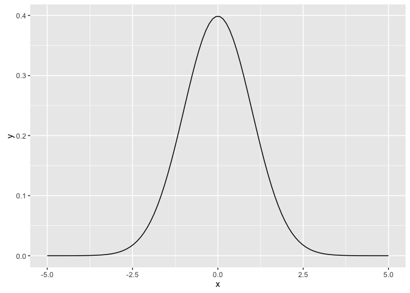
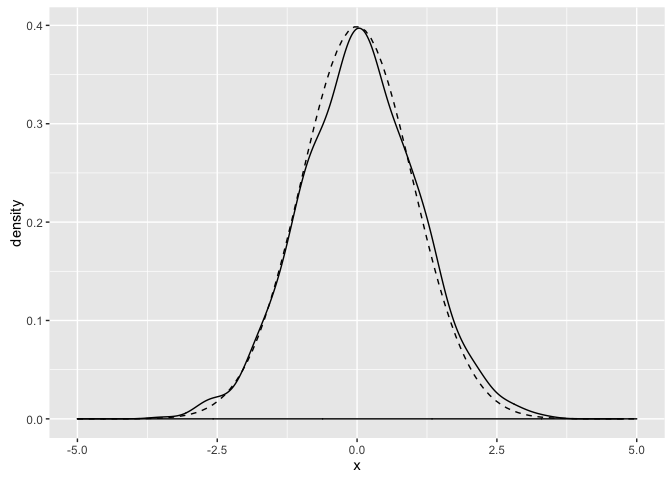
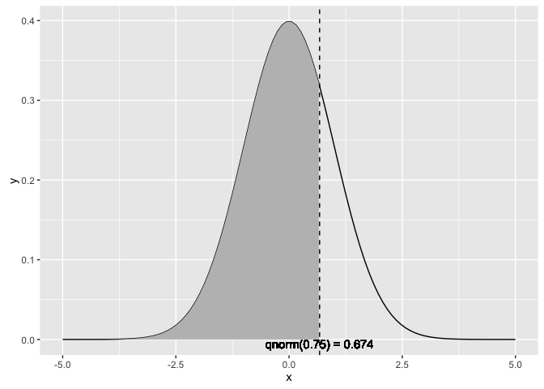
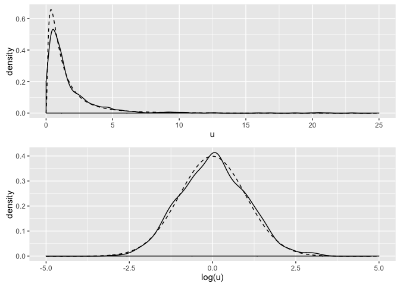
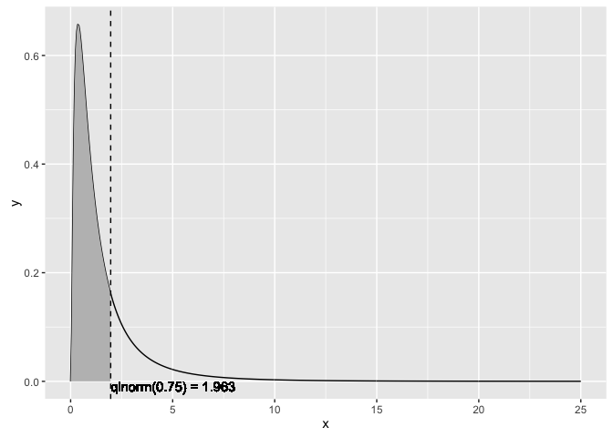
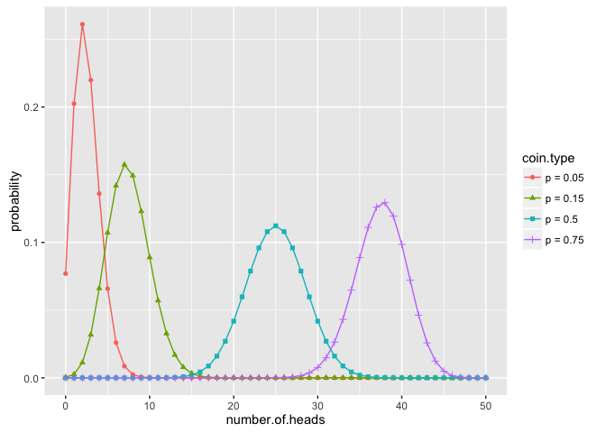
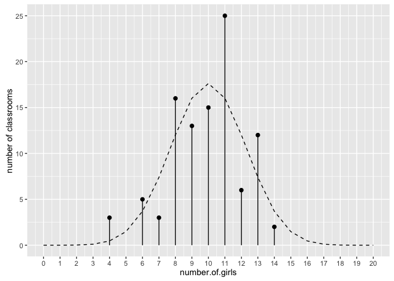
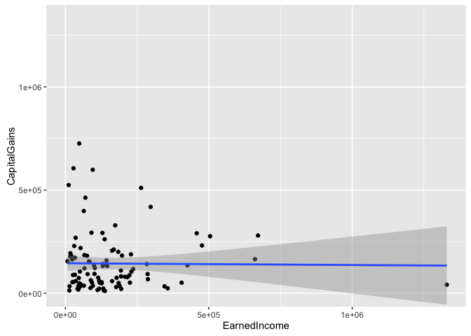
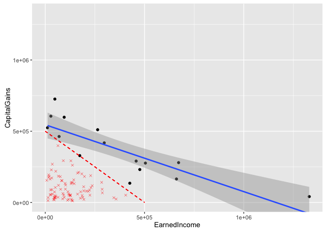

``` r
source('runDir.R')
```

``` r
runDir('../CodeExamples/x0B_Important_statistical_concepts',
       '../bioavailability')
```

    [1] "############################### start  246 Fri Jun 17 10:30:31 2016"
    [1] "#####  running  ../CodeExamples/x0B_Important_statistical_concepts/00246_example_B.1_of_section_B.1.1.R"
    [1] "#####   in directory ../bioavailability"

    > # example B.1 of section B.1.1 
    > # (example B.1 of section B.1.1)  : Important statistical concepts : Distributions : Normal distribution 
    > # Title: Plotting the theoretical normal density 
    > 
    > library(ggplot2)

    > x <- seq(from=-5, to=5, length.out=100) # the interval [-5 5]

    > f <- dnorm(x)                           # normal with mean 0 and sd 1

    > ggplot(data.frame(x=x,y=f), aes(x=x,y=y)) + geom_line()



    [1] "############################### end  246 Fri Jun 17 10:30:31 2016"
    [1] "############################### start  247 Fri Jun 17 10:30:31 2016"
    [1] "#####  running  ../CodeExamples/x0B_Important_statistical_concepts/00247_example_B.2_of_section_B.1.1.R"
    [1] "#####   in directory ../bioavailability"

    > # example B.2 of section B.1.1 
    > # (example B.2 of section B.1.1)  : Important statistical concepts : Distributions : Normal distribution 
    > # Title: Plotting an empirical normal density 
    > 
    > library(ggplot2)

    > # draw 1000 points from a normal with mean 0, sd 1
    > u <- rnorm(1000)

    > # plot the distribution of points,
    > # compared to normal curve as computed by dnorm() (dashed line)
    > ggplot(data.frame(x=u), aes(x=x)) + geom_density() +
        geom_line(data=data.frame(x=x,y=f), aes(x=x,y=y), linetype=2)



    [1] "############################### end  247 Fri Jun 17 10:30:31 2016"
    [1] "############################### start  248 Fri Jun 17 10:30:31 2016"
    [1] "#####  running  ../CodeExamples/x0B_Important_statistical_concepts/00248_example_B.3_of_section_B.1.1.R"
    [1] "#####   in directory ../bioavailability"

    > # example B.3 of section B.1.1 
    > # (example B.3 of section B.1.1)  : Important statistical concepts : Distributions : Normal distribution 
    > # Title: Working with the normal cdf 
    > 
    > # --- estimate probabilities (areas) under the curve ---
    > 
    > # 50% of the observations will be less than the mean
    > pnorm(0)
    [1] 0.5

    > # [1] 0.5
    > 
    > # about 2.3% of all observations are more than 2 standard
    > # deviations below the mean
    > pnorm(-2)
    [1] 0.02275013

    > # [1] 0.02275013
    > 
    > # about 95.4% of all observations are within 2 standard deviations
    > # from the mean
    > pnorm(2) - pnorm(-2)
    [1] 0.9544997

    > # [1] 0.9544997
    > 
    [1] "############################### end  248 Fri Jun 17 10:30:31 2016"
    [1] "############################### start  249 Fri Jun 17 10:30:31 2016"
    [1] "#####  running  ../CodeExamples/x0B_Important_statistical_concepts/00249_example_B.4_of_section_B.1.1.R"
    [1] "#####   in directory ../bioavailability"

    > # example B.4 of section B.1.1 
    > # (example B.4 of section B.1.1)  : Important statistical concepts : Distributions : Normal distribution 
    > # Title: Plotting x < qnorm(0.75) 
    > 
    > # --- return the quantiles corresponding to specific probabilities ---
    > 
    > # the median (50th percentile) of a normal is also the mean
    > qnorm(0.5)
    [1] 0

    > # [1] 0
    > 
    > # calculate the 75th percentile
    > qnorm(0.75)
    [1] 0.6744898

    > # [1] 0.6744898
    > pnorm(0.6744898)
    [1] 0.75

    > # [1] 0.75
    > 
    > # --- Illustrate the 75th percentile ---
    > 
    > # create a graph of the normal distribution with mean 0, sd 1
    > x <- seq(from=-5, to=5, length.out=100)

    > f <- dnorm(x)

    > nframe <- data.frame(x=x,y=f) 

    > # calculate the 75th percentile
    > line <- qnorm(0.75)

    > xstr <- sprintf("qnorm(0.75) = %1.3f", line)

    > # the part of the normal distribution to the left
    > # of the 75th percentile
    > nframe75 <- subset(nframe, nframe$x < line)

    > # Plot it. 
    > # The shaded area is 75% of the area under the normal curve
    > ggplot(nframe, aes(x=x,y=y)) + geom_line() +
       geom_area(data=nframe75, aes(x=x,y=y), fill="gray") + 
       geom_vline(aes(xintercept=line), linetype=2) +
       geom_text(x=line, y=0, label=xstr, vjust=1)



    [1] "############################### end  249 Fri Jun 17 10:30:31 2016"
    [1] "############################### start  250 Fri Jun 17 10:30:31 2016"
    [1] "#####  running  ../CodeExamples/x0B_Important_statistical_concepts/00250_example_B.5_of_section_B.1.3.R"
    [1] "#####   in directory ../bioavailability"

    > # example B.5 of section B.1.3 
    > # (example B.5 of section B.1.3)  : Important statistical concepts : Distributions : Lognormal distribution 
    > # Title: Demonstrating some properties of the lognormal distribution 
    > 
    > # draw 1001 samples from a lognormal with meanlog 0, sdlog 1
    > u <- rlnorm(1001)

    > # the mean of u is higher than the median
    > mean(u)
    [1] 1.729891

    > # [1] 1.638628
    > median(u)
    [1] 1.036753

    > # [1] 1.001051
    > 
    > # the mean of log(u) is approx meanlog=0
    > mean(log(u))
    [1] 0.0326221

    > # [1] -0.002942916
    > 
    > # the sd of log(u) is approx sdlog=1
    > sd(log(u))
    [1] 0.9978703

    > # [1] 0.9820357
    > 
    > # generate the lognormal with meanlog=0, sdlog=1
    > x <- seq(from=0, to=25, length.out=500)

    > f <- dlnorm(x)

    > # generate a normal with mean=0, sd=1
    > x2 <- seq(from=-5,to=5, length.out=500)

    > f2 <- dnorm(x2)

    > # make data frames
    > lnormframe <- data.frame(x=x,y=f)

    > normframe <- data.frame(x=x2, y=f2)

    > dframe <- data.frame(u=u)

    > # plot densityplots with theoretical curves superimposed
    > p1 <- ggplot(dframe, aes(x=u)) + geom_density() +
       geom_line(data=lnormframe, aes(x=x,y=y), linetype=2)

    > p2 <- ggplot(dframe, aes(x=log(u))) + geom_density() +
       geom_line(data=normframe, aes(x=x,y=y), linetype=2)

    > # functions to plot multiple plots on one page
    > library(grid)

    > nplot <- function(plist) {
       n <- length(plist)
       grid.newpage()
       pushViewport(viewport(layout=grid.layout(n,1)))
       vplayout<-function(x,y) {viewport(layout.pos.row=x, layout.pos.col=y)}
       for(i in 1:n) {
         print(plist[[i]], vp=vplayout(i,1))
       }
     }

    > # this is the plot that leads this section.
    > nplot(list(p1, p2))



    [1] "############################### end  250 Fri Jun 17 10:30:32 2016"
    [1] "############################### start  251 Fri Jun 17 10:30:32 2016"
    [1] "#####  running  ../CodeExamples/x0B_Important_statistical_concepts/00251_example_B.6_of_section_B.1.3.R"
    [1] "#####   in directory ../bioavailability"

    > # example B.6 of section B.1.3 
    > # (example B.6 of section B.1.3)  : Important statistical concepts : Distributions : Lognormal distribution 
    > # Title: Plotting the lognormal distribution 
    > 
    > # the 50th percentile (or median) of the lognormal with
    > # meanlog=0 and sdlog=10
    > qlnorm(0.5)
    [1] 1

    > # [1] 1
    > # the probability of seeing a value x less than 1
    > plnorm(1)
    [1] 0.5

    > # [1] 0.5
    > 
    > # the probability of observing a value x less than 10:
    > plnorm(10)
    [1] 0.9893489

    > # [1] 0.9893489
    > 
    > # -- show the 75th percentile of the lognormal 
    > 
    > # use lnormframe from previous example: the 
    > # theoretical lognormal curve
    > 
    > line <- qlnorm(0.75)

    > xstr <- sprintf("qlnorm(0.75) = %1.3f", line)

    > lnormframe75 <- subset(lnormframe, lnormframe$x < line)

    > # Plot it 
    > # The shaded area is 75% of the area under the lognormal curve
    > ggplot(lnormframe, aes(x=x,y=y)) + geom_line() +
       geom_area(data=lnormframe75, aes(x=x,y=y), fill="gray") + 
       geom_vline(aes(xintercept=line), linetype=2) +
       geom_text(x=line, y=0, label=xstr, hjust= 0, vjust=1)



    [1] "############################### end  251 Fri Jun 17 10:30:32 2016"
    [1] "############################### start  252 Fri Jun 17 10:30:32 2016"
    [1] "#####  running  ../CodeExamples/x0B_Important_statistical_concepts/00252_example_B.7_of_section_B.1.4.R"
    [1] "#####   in directory ../bioavailability"

    > # example B.7 of section B.1.4 
    > # (example B.7 of section B.1.4)  : Important statistical concepts : Distributions : Binomial distribution 
    > # Title: Plotting the binomial distribution 
    > 
    > library(ggplot2)

    > #
    > # use dbinom to produce the theoretical curves
    > #
    > 
    > numflips <- 50

    > # x is the number of heads that we see
    > x <- 0:numflips

    > # probability of heads for several different coins
    > p <- c(0.05, 0.15, 0.5, 0.75)

    > plabels <- paste("p =", p)

    > # calculate the probability of seeing x heads in numflips flips
    > # for all the coins. This probably isn't the most elegant
    > # way to do this, but at least it's easy to read
    > 
    > flips <- NULL

    > for(i in 1:length(p)) {
       coin <- p[i]
       label <- plabels[i]
       tmp <- data.frame(number.of.heads=x,
                        probability = dbinom(x, numflips, coin),
                        coin.type = label)
       flips <- rbind(flips, tmp)
     }

    > # plot it
    > # this is the plot that leads this section
    > ggplot(flips, aes(x=number.of.heads, y=probability)) +
       geom_point(aes(color=coin.type, shape=coin.type)) +
       geom_line(aes(color=coin.type))



    [1] "############################### end  252 Fri Jun 17 10:30:32 2016"
    [1] "############################### start  253 Fri Jun 17 10:30:32 2016"
    [1] "#####  running  ../CodeExamples/x0B_Important_statistical_concepts/00253_example_B.8_of_section_B.1.4.R"
    [1] "#####   in directory ../bioavailability"

    > # example B.8 of section B.1.4 
    > # (example B.8 of section B.1.4)  : Important statistical concepts : Distributions : Binomial distribution 
    > # Title: Working with the theoretical binomial distribution 
    > 
    > p = 0.5 # the percentage of females in this student population

    > class.size <- 20 # size of a classroom

    > numclasses <- 100 # how many classrooms we observe

    > # what might a typical outcome look like?
    > numFemales <- rbinom(numclasses, class.size, p)   # Note: 1 

    > # the theoretical counts (not necessarily integral)
    > probs <- dbinom(0:class.size, class.size, p)

    > tcount <- numclasses*probs

    > # the obvious way to plot this is with histogram or geom_bar
    > # but this might just look better
    > 
    > zero <- function(x) {0} # a dummy function that returns only 0

    > ggplot(data.frame(number.of.girls=numFemales, dummy=1),
       aes(x=number.of.girls, y=dummy)) + 
       # count the number of times you see x heads
       stat_summary(fun.y="sum", geom="point", size=2) +    # Note: 2 
       stat_summary(fun.ymax="sum", fun.ymin="zero", geom="linerange") + 
       # superimpose the theoretical number of times you see x heads
       geom_line(data=data.frame(x=0:class.size, y=probs),
                 aes(x=x, y=tcount), linetype=2) +
       scale_x_continuous(breaks=0:class.size, labels=0:class.size) +
       scale_y_continuous("number of classrooms")




    > # Note 1: 
    > #   Because we didn’t call set.seed, we 
    > #   expect different results each time we run this line. 
    > 
    > # Note 2: 
    > #   stat_summary is one of the ways to 
    > #   control data aggregation during plotting. In this case, we’re using it to 
    > #   place the dot and bar measured from the empirical data in with the 
    > #   theoretical density curve. 
    > 
    [1] "############################### end  253 Fri Jun 17 10:30:33 2016"
    [1] "############################### start  254 Fri Jun 17 10:30:33 2016"
    [1] "#####  running  ../CodeExamples/x0B_Important_statistical_concepts/00254_example_B.9_of_section_B.1.4.R"
    [1] "#####   in directory ../bioavailability"

    > # example B.9 of section B.1.4 
    > # (example B.9 of section B.1.4)  : Important statistical concepts : Distributions : Binomial distribution 
    > # Title: Simulating a binomial distribution 
    > 
    > # use rbinom to simulate flipping a coin of probability p N times
    > 
    > p75 <- 0.75 # a very unfair coin (mostly heads)

    > N <- 1000  # flip it several times

    > flips_v1 <- rbinom(N, 1, p75)

    > # Another way to generate unfair flips is to use runif:
    > # the probability that a uniform random number from [0 1)
    > # is less than p is exactly p. So "less than p" is "heads".
    > flips_v2 <- as.numeric(runif(N) < p75) 

    > prettyprint_flips <- function(flips) {
       outcome <- ifelse(flips==1, "heads", "tails")
       table(outcome)
     }

    > prettyprint_flips(flips_v1)
    outcome
    heads tails 
      737   263 

    > # outcome
    > # heads tails 
    > # 756   244 
    > prettyprint_flips(flips_v2)
    outcome
    heads tails 
      765   235 

    > # outcome
    > # heads tails 
    > # 743   257
    > 
    [1] "############################### end  254 Fri Jun 17 10:30:33 2016"
    [1] "############################### start  255 Fri Jun 17 10:30:33 2016"
    [1] "#####  running  ../CodeExamples/x0B_Important_statistical_concepts/00255_example_B.10_of_section_B.1.4.R"
    [1] "#####   in directory ../bioavailability"

    > # example B.10 of section B.1.4 
    > # (example B.10 of section B.1.4)  : Important statistical concepts : Distributions : Binomial distribution 
    > # Title: Working with the binomial distribution 
    > 
    > # pbinom example
    > 
    > nflips <- 100

    > nheads <- c(25, 45, 50, 60)  # number of heads

    > # what are the probabilities of observing at most that 
    > # number of heads on a fair coin?
    > left.tail <- pbinom(nheads, nflips, 0.5)

    > sprintf("%2.2f", left.tail)
    [1] "0.00" "0.18" "0.54" "0.98"

    > # [1] "0.00" "0.18" "0.54" "0.98"
    > 
    > # the probabilities of observing more than that
    > # number of heads on a fair coin?
    > right.tail <- pbinom(nheads, nflips, 0.5, lower.tail=F)

    > sprintf("%2.2f", right.tail)
    [1] "1.00" "0.82" "0.46" "0.02"

    > # [1] "1.00" "0.82" "0.46" "0.02"
    > 
    > # as expected:
    > left.tail+right.tail
    [1] 1 1 1 1

    > #  [1] 1 1 1 1 
    > 
    > # so if you flip a fair coin 100 times,
    > # you are guaranteed to see more than 10 heads, 
    > # almost guaranteed to see fewer than 60, and
    > # probably more than 45.
    > 
    > # qbinom example
    > 
    > nflips <- 100

    > # what's the 95% "central" interval of heads that you
    > # would expect to observe on 100 flips of a fair coin?
    > 
    > left.edge <- qbinom(0.025, nflips, 0.5)

    > right.edge <- qbinom(0.025, nflips, 0.5, lower.tail=F)

    > c(left.edge, right.edge)
    [1] 40 60

    > # [1] 40 60
    > 
    > # so with 95% probability you should see between 40 and 60 heads
    > 
    [1] "############################### end  255 Fri Jun 17 10:30:33 2016"
    [1] "############################### start  256 Fri Jun 17 10:30:33 2016"
    [1] "#####  running  ../CodeExamples/x0B_Important_statistical_concepts/00256_example_B.11_of_section_B.1.4.R"
    [1] "#####   in directory ../bioavailability"

    > # example B.11 of section B.1.4 
    > # (example B.11 of section B.1.4)  : Important statistical concepts : Distributions : Binomial distribution 
    > # Title: Working with the binomial cdf 
    > 
    > # because this is a discrete probability distribution, 
    > # pbinom and qbinom are not exact inverses of each other
    > 
    > # this direction works
    > pbinom(45, nflips, 0.5)
    [1] 0.1841008

    > # [1] 0.1841008
    > qbinom(0.1841008, nflips, 0.5)
    [1] 45

    > # [1] 45
    > 
    > # this direction won't be exact
    > qbinom(0.75, nflips, 0.5)
    [1] 53

    > # [1] 53
    > pbinom(53, nflips, 0.5)
    [1] 0.7579408

    > # [1] 0.7579408
    > 
    [1] "############################### end  256 Fri Jun 17 10:30:33 2016"
    [1] "############################### start  258 Fri Jun 17 10:30:33 2016"
    [1] "#####  running  ../CodeExamples/x0B_Important_statistical_concepts/00258_example_B.12_of_section_B.2.2.R"
    [1] "#####   in directory ../bioavailability"

    > # example B.12 of section B.2.2 
    > # (example B.12 of section B.2.2)  : Important statistical concepts : Statistical theory : A/B tests 
    > # Title: Building simulated A/B test data 
    > 
    > set.seed(123515)

    > d <- rbind(   # Note: 1 
        data.frame(group='A',converted=rbinom(100000,size=1,p=0.05)),   # Note: 2 
        data.frame(group='B',converted=rbinom(10000,size=1,p=0.055))    # Note: 3 
     )

    > # Note 1: 
    > #   Build a data frame to store simulated 
    > #   examples. 
    > 
    > # Note 2: 
    > #   Add 100,000 examples from the A group 
    > #   simulating a conversion rate of 5%. 
    > 
    > # Note 3: 
    > #   Add 10,000 examples from the B group 
    > #   simulating a conversion rate of 5.5%. 
    > 
    [1] "############################### end  258 Fri Jun 17 10:30:33 2016"
    [1] "############################### start  259 Fri Jun 17 10:30:33 2016"
    [1] "#####  running  ../CodeExamples/x0B_Important_statistical_concepts/00259_example_B.13_of_section_B.2.2.R"
    [1] "#####   in directory ../bioavailability"

    > # example B.13 of section B.2.2 
    > # (example B.13 of section B.2.2)  : Important statistical concepts : Statistical theory : A/B tests 
    > # Title: Summarizing the A/B test into a contingency table 
    > 
    > tab <- table(d)

    > print(tab)
         converted
    group     0     1
        A 94979  5021
        B  9398   602

    > ##      converted
    > ## group     0     1
    > ##     A 94979  5021
    > ##     B  9398   602
    > 
    [1] "############################### end  259 Fri Jun 17 10:30:33 2016"
    [1] "############################### start  260 Fri Jun 17 10:30:33 2016"
    [1] "#####  running  ../CodeExamples/x0B_Important_statistical_concepts/00260_example_B.14_of_section_B.2.2.R"
    [1] "#####   in directory ../bioavailability"

    > # example B.14 of section B.2.2 
    > # (example B.14 of section B.2.2)  : Important statistical concepts : Statistical theory : A/B tests 
    > # Title: Calculating the observed A and B rates 
    > 
    > aConversionRate <- tab['A','1']/sum(tab['A',])

    > print(aConversionRate)
    [1] 0.05021

    > ## [1] 0.05021
    > bConversionRate <- tab['B','1']/sum(tab['B',])

    > print(bConversionRate)
    [1] 0.0602

    > ## [1] 0.0602
    > commonRate <- sum(tab[,'1'])/sum(tab)

    > print(commonRate)
    [1] 0.05111818

    > ## [1] 0.05111818
    > 
    [1] "############################### end  260 Fri Jun 17 10:30:33 2016"
    [1] "############################### start  261 Fri Jun 17 10:30:33 2016"
    [1] "#####  running  ../CodeExamples/x0B_Important_statistical_concepts/00261_example_B.15_of_section_B.2.2.R"
    [1] "#####   in directory ../bioavailability"

    > # example B.15 of section B.2.2 
    > # (example B.15 of section B.2.2)  : Important statistical concepts : Statistical theory : A/B tests 
    > # Title: Calculating the significance of the observed difference in rates 
    > 
    > fisher.test(tab)

        Fisher's Exact Test for Count Data

    data:  tab
    p-value = 2.469e-05
    alternative hypothesis: true odds ratio is not equal to 1
    95 percent confidence interval:
     1.108716 1.322464
    sample estimates:
    odds ratio 
      1.211706 


    > ##    Fisher's Exact Test for Count Data
    > ##
    > ## data:  tab
    > ## p-value = 2.469e-05
    > ## alternative hypothesis: true odds ratio is not equal to 1
    > ## 95 percent confidence interval:
    > ##  1.108716 1.322464
    > ## sample estimates:
    > ## odds ratio 
    > ##   1.211706
    > 
    [1] "############################### end  261 Fri Jun 17 10:30:33 2016"
    [1] "############################### start  262 Fri Jun 17 10:30:33 2016"
    [1] "#####  running  ../CodeExamples/x0B_Important_statistical_concepts/00262_example_B.16_of_section_B.2.2.R"
    [1] "#####   in directory ../bioavailability"

    > # example B.16 of section B.2.2 
    > # (example B.16 of section B.2.2)  : Important statistical concepts : Statistical theory : A/B tests 
    > # Title: Computing frequentist significance 
    > 
    > print(pbinom(     # Note: 1 
        lower.tail=F,   # Note: 2 
        q=tab['B','1']-1,   # Note: 3 
        size=sum(tab['B',]),    # Note: 4 
        prob=commonRate     # Note: 5 
        )) 
    [1] 3.153319e-05

    > ## [1] 3.153319e-05
    > 
    > # Note 1: 
    > #   Use the pbinom() call to calculate how 
    > #   likely different observed counts are. 
    > 
    > # Note 2: 
    > #   Signal we want the probability of being 
    > #   greater than a given q. 
    > 
    > # Note 3: 
    > #   Ask for the probability of seeing at least as many conversions as our observed B groups 
    > #   did. 
    > 
    > # Note 4: 
    > #   Specify the total number of trials as 
    > #   equal to what we saw in our B group. 
    > 
    > # Note 5: 
    > #   Specify the conversion probability at the 
    > #   estimated common rate. 
    > 
    [1] "############################### end  262 Fri Jun 17 10:30:33 2016"
    [1] "############################### start  263 Fri Jun 17 10:30:33 2016"
    [1] "#####  running  ../CodeExamples/x0B_Important_statistical_concepts/00263_example_B.17_of_section_B.2.2.R"
    [1] "#####   in directory ../bioavailability"

    > # example B.17 of section B.2.2 
    > # (example B.17 of section B.2.2)  : Important statistical concepts : Statistical theory : A/B tests 
    > # Title: Bayesian estimate of the posterior tail mass 
    > 
    > print(pbeta(  # Note: 1 
        aConversionRate,    # Note: 2 
        shape1=commonRate+tab['B','1'],     # Note: 3 
        shape2=(1-commonRate)+tab['B','0']))    # Note: 4 
    [1] 4.731817e-06

    > ## [1] 4.731817e-06
    > 
    > # Note 1: 
    > #   pbeta() functionUse pbeta() to estimate how likely 
    > #   different observed conversion rates are. 
    > 
    > # Note 2: 
    > #   Ask for the probability of seeing a 
    > #   conversion rate no larger than aConversionRate. 
    > 
    > # Note 3: 
    > #   Estimate conversion count as prior 
    > #   commonRate plus the B observations. 
    > 
    > # Note 4: 
    > #   Estimate nonconversion count as prior 
    > #   1-commonRate plus the B observations. 
    > 
    [1] "############################### end  263 Fri Jun 17 10:30:33 2016"
    [1] "############################### start  264 Fri Jun 17 10:30:33 2016"
    [1] "#####  running  ../CodeExamples/x0B_Important_statistical_concepts/00264_example_B.18_of_section_B.2.2.R"
    [1] "#####   in directory ../bioavailability"

    > # example B.18 of section B.2.2 
    > # (example B.18 of section B.2.2)  : Important statistical concepts : Statistical theory : A/B tests 
    > # Title: Plotting the posterior distribution of the B group 
    > 
    > library('ggplot2')

    > plt <- data.frame(x=seq(from=0.04,to=0.07,length.out=301))

    > plt$density <- dbeta(plt$x,
        shape1=commonRate+tab['B','1'],
        shape2=(1-commonRate)+tab['B','0'])

    > ggplot(dat=plt) + 
        geom_line(aes(x=x,y=density)) + 
        geom_vline(aes(xintercept=bConversionRate)) +
        geom_vline(aes(xintercept=aConversionRate),linetype=2)


    [1] "############################### end  264 Fri Jun 17 10:30:33 2016"
    [1] "############################### start  265 Fri Jun 17 10:30:33 2016"
    [1] "#####  running  ../CodeExamples/x0B_Important_statistical_concepts/00265_example_B.19_of_section_B.2.3.R"
    [1] "#####   in directory ../bioavailability"

    > # example B.19 of section B.2.3 
    > # (example B.19 of section B.2.3)  : Important statistical concepts : Statistical theory : Power of tests 
    > # Title: Sample size estimate 
    > 
    > estimate <- function(targetRate,difference,errorProb) {
         ceiling(-log(errorProb)*targetRate/(difference^2))
     }

    > est <- estimate(0.045,0.004,0.05)

    > print(est)
    [1] 8426

    > ## [1] 8426
    > 
    [1] "############################### end  265 Fri Jun 17 10:30:33 2016"
    [1] "############################### start  266 Fri Jun 17 10:30:33 2016"
    [1] "#####  running  ../CodeExamples/x0B_Important_statistical_concepts/00266_example_B.20_of_section_B.2.3.R"
    [1] "#####   in directory ../bioavailability"

    > # example B.20 of section B.2.3 
    > # (example B.20 of section B.2.3)  : Important statistical concepts : Statistical theory : Power of tests 
    > # Title: Exact binomial sample size calculation 
    > 
    > errorProb <- function(targetRate,difference,size) {   # Note: 1 
        pbinom(ceiling((targetRate-difference)*size),
           size=size,prob=targetRate) 
     }

    > print(errorProb(0.045,0.004,est))     # Note: 2 
    [1] 0.04153646

    > ## [1] 0.04153646
    > 
    > binSearchNonPositive <- function(fEventuallyNegative) {   # Note: 3 
       low <- 1
       high <- low+1
       while(fEventuallyNegative(high)>0) {
         high <- 2*high
       }
       while(high>low+1) {
         m <- low + (high-low) %/% 2
         if(fEventuallyNegative(m)>0) {
            low <- m
         } else {
            high <- m
         }
       }
       high
     }

    > actualSize <- function(targetRate,difference,errorProb) {
        binSearchNonPositive(function(n) {
            errorProb(targetRate,difference,n) - errorProb })
     }

    > size <- actualSize(0.045,0.004,0.05)  # Note: 4 

    > print(size) 
    [1] 7623

    > ## [1] 7623
    > print(errorProb(0.045,0.004,size))
    [1] 0.04983659

    > ## [1] 0.04983659
    > 
    > # Note 1: 
    > #   Define a function that calculates the 
    > #   probability of seeing a low number of conversions, assuming the actual 
    > #   conversion rate is targetRate and the size of the experiment is size. Low is 
    > #   considered be a count that’s at least difference*size below the expected value 
    > #   targetRate*size. 
    > 
    > # Note 2: 
    > #   Calculate probability of a bad experiment using 
    > #   estimated experiment size. The failure odds are around 4% (under the 5% we’re 
    > #   designing for), which means the estimate size was slightly high. 
    > 
    > # Note 3: 
    > #   Define a binary search that finds a non-positive 
    > #   value of a function that’s guaranteed to be eventually negative. This search 
    > #   works around the minor non-monotonicity in errorProb() (due to rounding 
    > #   issues). 
    > 
    > # Note 4: 
    > #   Calculate the required sample size for our B 
    > #   experiment. 
    > 
    [1] "############################### end  266 Fri Jun 17 10:30:33 2016"
    [1] "############################### start  267 Fri Jun 17 10:30:33 2016"
    [1] "#####  running  ../CodeExamples/x0B_Important_statistical_concepts/00267_example_B.21_of_section_B.2.4.R"
    [1] "#####   in directory ../bioavailability"

    > # example B.21 of section B.2.4 
    > # (example B.21 of section B.2.4)  : Important statistical concepts : Statistical theory : Specialized statistical tests 
    > # Title: Building synthetic uncorrelated income example 
    > 
    > set.seed(235236)  # Note: 1 

    > d <- data.frame(EarnedIncome=100000*rlnorm(100),
                      CapitalGains=100000*rlnorm(100))      # Note: 2 

    > print(with(d,cor(EarnedIncome,CapitalGains)))
    [1] -0.01066116

    > # [1] -0.01066116     # Note: 3
    > 
    > # Note 1: 
    > #   Set the pseudo-random seed to a known 
    > #   value so the demonstration is repeatable. 
    > 
    > # Note 2: 
    > #   Generate our synthetic data. 
    > 
    > # Note 3: 
    > #   The correlation is -0.01, which is very near 0—indicating (as designed) no relation. 
    > 
    [1] "############################### end  267 Fri Jun 17 10:30:33 2016"
    [1] "############################### start  268 Fri Jun 17 10:30:33 2016"
    [1] "#####  running  ../CodeExamples/x0B_Important_statistical_concepts/00268_example_B.22_of_section_B.2.4.R"
    [1] "#####   in directory ../bioavailability"

    > # example B.22 of section B.2.4 
    > # (example B.22 of section B.2.4)  : Important statistical concepts : Statistical theory : Specialized statistical tests 
    > # Title: Calculating the (non)significance of the observed correlation 
    > 
    > with(d,cor(EarnedIncome,CapitalGains,method='spearman'))
    [1] 0.03083108

    > # [1] 0.03083108
    > with(d,cor.test(EarnedIncome,CapitalGains,method='spearman'))

        Spearman's rank correlation rho

    data:  EarnedIncome and CapitalGains
    S = 161510, p-value = 0.7604
    alternative hypothesis: true rho is not equal to 0
    sample estimates:
           rho 
    0.03083108 


    > #
    > #       Spearman's rank correlation rho
    > #
    > #data:  EarnedIncome and CapitalGains
    > #S = 161512, p-value = 0.7604
    > #alternative hypothesis: true rho is not equal to 0
    > #sample estimates:
    > #       rho
    > #0.03083108
    > 
    [1] "############################### end  268 Fri Jun 17 10:30:33 2016"
    [1] "############################### start  269 Fri Jun 17 10:30:33 2016"
    [1] "#####  running  ../CodeExamples/x0B_Important_statistical_concepts/00269_example_B.23_of_section_B.3.1.R"
    [1] "#####   in directory ../bioavailability"

    > # example B.23 of section B.3.1 
    > # (example B.23 of section B.3.1)  : Important statistical concepts : Examples of the statistical view of data : Sampling bias 
    > # Title: Misleading significance result from biased observations 
    > 
    > veryHighIncome <- subset(d, EarnedIncome+CapitalGains>=500000)

    > print(with(veryHighIncome,cor.test(EarnedIncome,CapitalGains,
         method='spearman')))

        Spearman's rank correlation rho

    data:  EarnedIncome and CapitalGains
    S = 1046, p-value < 2.2e-16
    alternative hypothesis: true rho is not equal to 0
    sample estimates:
           rho 
    -0.8678571 


    > #
    > #       Spearman's rank correlation rho
    > #
    > #data:  EarnedIncome and CapitalGains
    > #S = 1046, p-value < 2.2e-16
    > #alternative hypothesis: true rho is not equal to 0
    > #sample estimates:
    > #       rho
    > #-0.8678571
    > 
    [1] "############################### end  269 Fri Jun 17 10:30:33 2016"
    [1] "############################### start  270 Fri Jun 17 10:30:33 2016"
    [1] "#####  running  ../CodeExamples/x0B_Important_statistical_concepts/00270_example_B.24_of_section_B.3.1.R"
    [1] "#####   in directory ../bioavailability"

    > # example B.24 of section B.3.1 
    > # (example B.24 of section B.3.1)  : Important statistical concepts : Examples of the statistical view of data : Sampling bias 
    > # Title: Plotting biased view of income and capital gains 
    > 
    > library(ggplot2)

    > ggplot(data=d,aes(x=EarnedIncome,y=CapitalGains)) +
        geom_point() + geom_smooth(method='lm') +
        coord_cartesian(xlim=c(0,max(d)),ylim=c(0,max(d)))  # Note: 1 




    > ggplot(data=veryHighIncome,aes(x=EarnedIncome,y=CapitalGains)) +
        geom_point() + geom_smooth(method='lm') +
        geom_point(data=subset(d,EarnedIncome+CapitalGains<500000),
              aes(x=EarnedIncome,y=CapitalGains),
           shape=4,alpha=0.5,color='red') +
        geom_segment(x=0,xend=500000,y=500000,yend=0,
           linetype=2,alpha=0.5,color='red') +
        coord_cartesian(xlim=c(0,max(d)),ylim=c(0,max(d)))  # Note: 2 


    > print(with(subset(d,EarnedIncome+CapitalGains<500000),
         cor.test(EarnedIncome,CapitalGains,method='spearman')))    # Note: 3 

        Spearman's rank correlation rho

    data:  EarnedIncome and CapitalGains
    S = 107660, p-value = 0.6357
    alternative hypothesis: true rho is not equal to 0
    sample estimates:
            rho 
    -0.05202267 


    > #
    > #        Spearman's rank correlation rho
    > #
    > #data:  EarnedIncome and CapitalGains
    > #S = 107664, p-value = 0.6357
    > #alternative hypothesis: true rho is not equal to 0
    > #sample estimates:
    > #        rho
    > #-0.05202267
    > 
    > # Note 1: 
    > #   Plot all of the income data with linear 
    > #   trend line (and uncertainty band). 
    > 
    > # Note 2: 
    > #   Plot the very high income data and linear 
    > #   trend line (also include cut-off and portrayal of suppressed data). 
    > 
    > # Note 3: 
    > #   Compute correlation of suppressed 
    > #   data. 
    > 
    [1] "############################### end  270 Fri Jun 17 10:30:33 2016"
    [1] "############################### start  271 Fri Jun 17 10:30:33 2016"
    [1] "#####  running  ../CodeExamples/x0B_Important_statistical_concepts/00271_example_B.25_of_section_B.3.2.R"
    [1] "#####   in directory ../bioavailability"

    > # example B.25 of section B.3.2 
    > # (example B.25 of section B.3.2)  : Important statistical concepts : Examples of the statistical view of data : Omitted variable bias 
    > # Title: Summarizing our synthetic biological data 
    > 
    > load('synth.RData')

    > print(summary(s))
          week         Caco2A2BPapp       FractionHumanAbsorption
     Min.   :  1.00   Min.   :6.994e-08   Min.   :0.09347        
     1st Qu.: 25.75   1st Qu.:7.312e-07   1st Qu.:0.50343        
     Median : 50.50   Median :1.378e-05   Median :0.86937        
     Mean   : 50.50   Mean   :2.006e-05   Mean   :0.71492        
     3rd Qu.: 75.25   3rd Qu.:4.238e-05   3rd Qu.:0.93908        
     Max.   :100.00   Max.   :6.062e-05   Max.   :0.99170        

    > ##       week         Caco2A2BPapp       FractionHumanAbsorption
    > ##  Min.   :  1.00   Min.   :6.994e-08   Min.   :0.09347        
    > ##  1st Qu.: 25.75   1st Qu.:7.312e-07   1st Qu.:0.50343        
    > ##  Median : 50.50   Median :1.378e-05   Median :0.86937        
    > ##  Mean   : 50.50   Mean   :2.006e-05   Mean   :0.71492        
    > ##  3rd Qu.: 75.25   3rd Qu.:4.238e-05   3rd Qu.:0.93908        
    > ##  Max.   :100.00   Max.   :6.062e-05   Max.   :0.99170
    > head(s)
      week Caco2A2BPapp FractionHumanAbsorption
    1    1 6.061924e-05              0.11568186
    2    2 6.061924e-05              0.11732401
    3    3 6.061924e-05              0.09347046
    4    4 6.061924e-05              0.12893540
    5    5 5.461941e-05              0.19021858
    6    6 5.370623e-05              0.14892154

    > ##   week Caco2A2BPapp FractionHumanAbsorption
    > ## 1    1 6.061924e-05              0.11568186
    > ## 2    2 6.061924e-05              0.11732401
    > ## 3    3 6.061924e-05              0.09347046
    > ## 4    4 6.061924e-05              0.12893540
    > ## 5    5 5.461941e-05              0.19021858
    > ## 6    6 5.370623e-05              0.14892154
    > # View(s)     # Note: 1
    > 
    > # Note 1: 
    > #   Display a date in spreadsheet like 
    > #   window. View is one of the commands that has a much better implementation in 
    > #   RStudio than in basic R. 
    > 
    [1] "############################### end  271 Fri Jun 17 10:30:33 2016"
    [1] "############################### start  272 Fri Jun 17 10:30:33 2016"
    [1] "#####  running  ../CodeExamples/x0B_Important_statistical_concepts/00272_example_B.26_of_section_B.3.2.R"
    [1] "#####   in directory ../bioavailability"

    > # example B.26 of section B.3.2 
    > # (example B.26 of section B.3.2)  : Important statistical concepts : Examples of the statistical view of data : Omitted variable bias 
    > # Title: Building data that improves over time 
    > 
    > set.seed(2535251)

    > s <- data.frame(week=1:100)

    > s$Caco2A2BPapp <- sort(sample(d$Caco2A2BPapp,100,replace=T),
        decreasing=T)

    > sigmoid <- function(x) {1/(1+exp(-x))}

    > s$FractionHumanAbsorption <-  # Note: 1 
      sigmoid(
        7.5 + 0.5*log(s$Caco2A2BPapp) +     # Note: 2 
        s$week/10 - mean(s$week/10) +   # Note: 3 
        rnorm(100)/3    # Note: 4 
        )

    > write.table(s,'synth.csv',sep=',',
        quote=F,row.names=F)

    > # Note 1: 
    > #   Build synthetic examples. 
    > 
    > # Note 2: 
    > #   Add in Caco2 to absorption relation learned from original dataset. Note the relation is 
    > #   positive: better Caco2 always drives better absorption in our 
    > #   synthetic dataset. We’re log transforming Caco2, as it has over 3 
    > #   decades of range. 
    > 
    > # Note 3: 
    > #   Add in a mean-0 term that depends on time to simulate the effects of improvements as the 
    > #   project moves forward. 
    > 
    > # Note 4: 
    > #   Add in a mean-0 noise term. 
    > 
    [1] "############################### end  272 Fri Jun 17 10:30:33 2016"
    [1] "############################### start  273 Fri Jun 17 10:30:33 2016"
    [1] "#####  running  ../CodeExamples/x0B_Important_statistical_concepts/00273_example_B.27_of_section_B.3.2.R"
    [1] "#####   in directory ../bioavailability"

    > # example B.27 of section B.3.2 
    > # (example B.27 of section B.3.2)  : Important statistical concepts : Examples of the statistical view of data : Omitted variable bias 
    > # Title: A bad model (due to omitted variable bias) 
    > 
    > print(summary(glm(data=s,
        FractionHumanAbsorption~log(Caco2A2BPapp),
        family=binomial(link='logit'))))

    Warning: non-integer #successes in a binomial glm!


    Call:
    glm(formula = FractionHumanAbsorption ~ log(Caco2A2BPapp), family = binomial(link = "logit"), 
        data = s)

    Deviance Residuals: 
        Min       1Q   Median       3Q      Max  
    -0.6097  -0.2462  -0.1181   0.2022   0.5567  

    Coefficients:
                      Estimate Std. Error z value Pr(>|z|)    
    (Intercept)        -9.9893     2.7494  -3.633 0.000280 ***
    log(Caco2A2BPapp)  -0.9681     0.2568  -3.770 0.000163 ***
    ---
    Signif. codes:  0 '***' 0.001 '**' 0.01 '*' 0.05 '.' 0.1 ' ' 1

    (Dispersion parameter for binomial family taken to be 1)

        Null deviance: 43.7328  on 99  degrees of freedom
    Residual deviance:  9.4679  on 98  degrees of freedom
    AIC: 64.715

    Number of Fisher Scoring iterations: 6


    > ## Warning: non-integer #successes in a binomial glm!
    > ## 
    > ## Call:
    > ## glm(formula = FractionHumanAbsorption ~ log(Caco2A2BPapp), 
    > ##    family = binomial(link = "logit"), 
    > ##     data = s)
    > ## 
    > ## Deviance Residuals: 
    > ##    Min      1Q  Median      3Q     Max  
    > ## -0.609  -0.246  -0.118   0.202   0.557  
    > ## 
    > ## Coefficients:
    > ##                   Estimate Std. Error z value Pr(>|z|)    
    > ## (Intercept)        -10.003      2.752   -3.64  0.00028 ***
    > ## log(Caco2A2BPapp)   -0.969      0.257   -3.77  0.00016 ***
    > ## ---
    > ## Signif. codes:  0 '***' 0.001 '**' 0.01 '*' 0.05 '.' 0.1 ' ' 1
    > ## 
    > ## (Dispersion parameter for binomial family taken to be 1)
    > ## 
    > ##     Null deviance: 43.7821  on 99  degrees of freedom
    > ## Residual deviance:  9.4621  on 98  degrees of freedom
    > ## AIC: 64.7
    > ## 
    > ## Number of Fisher Scoring iterations: 6
    > 
    [1] "############################### end  273 Fri Jun 17 10:30:33 2016"
    [1] "############################### start  274 Fri Jun 17 10:30:33 2016"
    [1] "#####  running  ../CodeExamples/x0B_Important_statistical_concepts/00274_example_B.28_of_section_B.3.2.R"
    [1] "#####   in directory ../bioavailability"

    > # example B.28 of section B.3.2 
    > # (example B.28 of section B.3.2)  : Important statistical concepts : Examples of the statistical view of data : Omitted variable bias 
    > # Title: A better model 
    > 
    > print(summary(glm(data=s,
        FractionHumanAbsorption~week+log(Caco2A2BPapp),
        family=binomial(link='logit'))))

    Warning: non-integer #successes in a binomial glm!




    Call:
    glm(formula = FractionHumanAbsorption ~ week + log(Caco2A2BPapp), 
        family = binomial(link = "logit"), data = s)

    Deviance Residuals: 
         Min        1Q    Median        3Q       Max  
    -0.34737  -0.05685  -0.00104   0.07092   0.30367  

    Coefficients:
                      Estimate Std. Error z value Pr(>|z|)   
    (Intercept)        3.15105    4.68158   0.673  0.50090   
    week               0.10328    0.03857   2.678  0.00741 **
    log(Caco2A2BPapp)  0.56961    0.54162   1.052  0.29295   
    ---
    Signif. codes:  0 '***' 0.001 '**' 0.01 '*' 0.05 '.' 0.1 ' ' 1

    (Dispersion parameter for binomial family taken to be 1)

        Null deviance: 43.7328  on 99  degrees of freedom
    Residual deviance:  1.2596  on 97  degrees of freedom
    AIC: 47.829

    Number of Fisher Scoring iterations: 6


    > ## Warning: non-integer #successes in a binomial glm!
    > ## 
    > ## Call:
    > ## glm(formula = FractionHumanAbsorption ~ week + log(Caco2A2BPapp), 
    > ##     family = binomial(link = "logit"), data = s)
    > ## 
    > ## Deviance Residuals: 
    > ##     Min       1Q   Median       3Q      Max  
    > ## -0.3474  -0.0568  -0.0010   0.0709   0.3038  
    > ## 
    > ## Coefficients:
    > ##                   Estimate Std. Error z value Pr(>|z|)   
    > ## (Intercept)         3.1413     4.6837    0.67   0.5024   
    > ## week                0.1033     0.0386    2.68   0.0074 **
    > ## log(Caco2A2BPapp)   0.5689     0.5419    1.05   0.2938   
    > ## ---
    > ## Signif. codes:  0 '***' 0.001 '**' 0.01 '*' 0.05 '.' 0.1 ' ' 1
    > ## 
    > ## (Dispersion parameter for binomial family taken to be 1)
    > ## 
    > ##     Null deviance: 43.7821  on 99  degrees of freedom
    > ## Residual deviance:  1.2595  on 97  degrees of freedom
    > ## AIC: 47.82
    > ## 
    > ## Number of Fisher Scoring iterations: 6
    > 
    [1] "############################### end  274 Fri Jun 17 10:30:33 2016"
