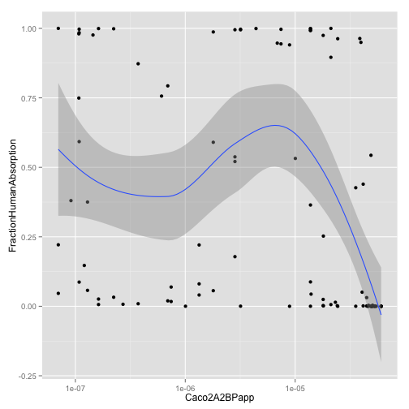

## Bioavailability example data

This data is copied from Figure 4 of the public promotional material found at: 
[Caco-2 Permeability Assay](http://www.cyprotex.com/admepk/in-vitro-permeability/caco-2-permeability/) and was converted to numeric estimates using [WebPlotDigitizer](http://arohatgi.info/WebPlotDigitizer/) .

The original Figure 4 is:


This graph relates the measured rate of [Caco2](http://en.wikipedia.org/wiki/Caco-2) permeability which is how fast a molecule travels across a monolayer of cells derived from a large intestine carcinoma.  The hope is that even though the immortal cell culture is not a working organ that Caco2 permeability rates predict how much of a drug will be ingested through a human small intestine (before passing to the large intestine, which is less involved in complicated absorption than the small intestine).  You can see Caco2 is a test by analogy: whole human absorption is estimated from a cell culture using different mechanisms than the actual complete human body.  So Caco2 doesn't determine the [ADME](http://en.wikipedia.org/wiki/ADME) properties of a drug, but is considered a useful signal or feature to measure.

And estimated data from the graph is stored in [caco2.csv](caco2.csv), which produces the following graph:


```r
library(ggplot2)
d <- read.table('caco2.csv',header=T,sep=',')
ggplot(d,aes(x=Caco2A2BPapp,y=FractionHumanAbsorption)) +
   geom_point() + scale_x_log10() + geom_smooth()
```

```
## geom_smooth: method="auto" and size of largest group is <1000, so using loess. Use 'method = x' to change the smoothing method.
```

 


This allows us to build a very crude logistic model (Beta regression would also be appropriate here) relating Caco2 permeability rate to human intestinal absorption:


```r
model <- glm(data=d, FractionHumanAbsorption~log(Caco2A2BPapp),
   family=binomial(link='logit'))
```

```
## Warning: non-integer #successes in a binomial glm!
```

```r
print(summary(model))
```

```
## 
## Call:
## glm(formula = FractionHumanAbsorption ~ log(Caco2A2BPapp), family = binomial(link = "logit"), 
##     data = d)
## 
## Deviance Residuals: 
##     Min       1Q   Median       3Q      Max  
## -0.8834  -0.1819   0.0211   0.3250   0.7046  
## 
## Coefficients:
##                   Estimate Std. Error z value Pr(>|z|)    
## (Intercept)          7.489      1.921    3.90  9.7e-05 ***
## log(Caco2A2BPapp)    0.499      0.144    3.48  0.00051 ***
## ---
## Signif. codes:  0 '***' 0.001 '**' 0.01 '*' 0.05 '.' 0.1 ' ' 1
## 
## (Dispersion parameter for binomial family taken to be 1)
## 
##     Null deviance: 23.4519  on 67  degrees of freedom
## Residual deviance:  8.8853  on 66  degrees of freedom
## AIC: 47.08
## 
## Number of Fisher Scoring iterations: 5
```

```r
d$model <- predict(model,newdata=d,type='response')
ggplot(d,) +
   geom_point(aes(x=Caco2A2BPapp,y=FractionHumanAbsorption)) + 
   geom_line(aes(x=Caco2A2BPapp,y=model)) +
   scale_x_log10()
```

 

```r
Intercept <- model$coefficients['(Intercept)']
cacoEffect <- model$coefficients['log(Caco2A2BPapp)']
```


This gives us the estimate that log() increase of cm/s unit measured of Caco2 permeability tends to increase the logit of human intestinal absorption fraction by 0.4992.  Which we will use to produce our deliberately problematic synthetic example.

What we want is a data-set that might be typical of a drug series being optimized.  So you would see the percent human absorption going up over time (as better and better drug candidates are made).  If the initial candidate drugs were optimized for Caco2 permeability you might also see Caco2 permeability go down as actual human ADME is optimized (as we move away from the initial Caco2 candidates).  A naive analysis of only data from such a series could easily (through [omitted variable bias](http://en.wikipedia.org/wiki/Omitted-variable_bias) (see also [confounding variables](http://en.wikipedia.org/wiki/Confounding_variable) and [nuisance variables](http://en.wikipedia.org/wiki/Nuisance_variable)) imply a relation that good Caco2 relates to bad ADME (when in fact we tend to believe good Caco2 relates to good ADME).  This is why you can not always get away with a simple "spray and pray" style of data analysis.

One way to fix this is to introduce candidate variables and re-try the modeling.  In our example the omitted variable will be date (which is often a good candidate).  Other ways to deal with the problem could be through appropriate [fixed effects models](http://en.wikipedia.org/wiki/Fixed_effects_model), [random effects models](http://en.wikipedia.org/wiki/Random_effects_model), control of priors, control of regularization or forcing orthogonalization of variables.

Our synthetic data set is given as:

```r
set.seed(2535251)
s <- data.frame(week=1:100)
s$Caco2A2BPapp <- sort(sample(d$Caco2A2BPapp,100,replace=T),decreasing=T)
sigmoid <- function(x) {1/(1+exp(-x))}
s$FractionHumanAbsorption <- sigmoid(Intercept + log(s$Caco2A2BPapp) + 
   10*log(s$week) - mean(10*log(s$week)) +
   5*rnorm(100))
write.table(s,'synth.csv',sep=',',quote=F,row.names=F)
print(summary(glm(data=s, FractionHumanAbsorption~log(Caco2A2BPapp),
   family=binomial(link='logit'))))
```

```
## Warning: non-integer #successes in a binomial glm!
```

```
## 
## Call:
## glm(formula = FractionHumanAbsorption ~ log(Caco2A2BPapp), family = binomial(link = "logit"), 
##     data = s)
## 
## Deviance Residuals: 
##    Min      1Q  Median      3Q     Max  
## -1.205  -0.758  -0.724   0.996   1.591  
## 
## Coefficients:
##                   Estimate Std. Error z value Pr(>|z|)   
## (Intercept)        -3.3057     1.1810   -2.80   0.0051 **
## log(Caco2A2BPapp)  -0.2203     0.0931   -2.37   0.0180 * 
## ---
## Signif. codes:  0 '***' 0.001 '**' 0.01 '*' 0.05 '.' 0.1 ' ' 1
## 
## (Dispersion parameter for binomial family taken to be 1)
## 
##     Null deviance: 95.279  on 99  degrees of freedom
## Residual deviance: 89.506  on 98  degrees of freedom
## AIC: 129
## 
## Number of Fisher Scoring iterations: 4
```

```r
ggplot(s,aes(x=Caco2A2BPapp,y=FractionHumanAbsorption)) +
    geom_point() + scale_x_log10() + geom_smooth()
```

```
## geom_smooth: method="auto" and size of largest group is <1000, so using loess. Use 'method = x' to change the smoothing method.
```

 


As you can see the deliberately inserted positive relation between log(Caco2) and absorption is hidden and lost on simple analyses.  The warning point to look for is "the sign of the Caco2 coefficient seems wrong."  The issue is that log(week) and log(Caco2) are (negatively) correlated, so if one is missing the opposite of the other can be used as substitute for prediction (leading to confusing coefficients).  This is a reminder that even a model making good predictions may not be actually be a good explanation.

To fix our problem we have to at least fit jointly with the omitted variable:


```r
print(summary(glm(data=s,FractionHumanAbsorption~log(week)+log(Caco2A2BPapp),
   family=binomial(link='logit'))))
```

```
## Warning: non-integer #successes in a binomial glm!
```

```
## 
## Call:
## glm(formula = FractionHumanAbsorption ~ log(week) + log(Caco2A2BPapp), 
##     family = binomial(link = "logit"), data = s)
## 
## Deviance Residuals: 
##    Min      1Q  Median      3Q     Max  
## -1.350  -0.823  -0.122   0.826   1.500  
## 
## Coefficients:
##                   Estimate Std. Error z value Pr(>|z|)   
## (Intercept)         -7.549      2.632   -2.87   0.0041 **
## log(week)            3.729      1.344    2.77   0.0055 **
## log(Caco2A2BPapp)    0.602      0.270    2.23   0.0258 * 
## ---
## Signif. codes:  0 '***' 0.001 '**' 0.01 '*' 0.05 '.' 0.1 ' ' 1
## 
## (Dispersion parameter for binomial family taken to be 1)
## 
##     Null deviance: 95.279  on 99  degrees of freedom
## Residual deviance: 72.520  on 97  degrees of freedom
## AIC: 112.5
## 
## Number of Fisher Scoring iterations: 6
```

Note: since we are guessing both variables and variable transforms (log()) this problem would be a good candidate for using a generalized additive model (as in the GAM package).

Notice we got reasonable (but not great) estimates of the coefficients for week and Caco2 effects.  But we may not always have data that is diverse enough to effect such a recovery (even when we correctly supply the omitted variable).  When that doesn't work we need to try and force effects onto the omitted variable.  At this point you have trouble and methods don't always give you all of what you want.  For example you might try to force all of the explanatory value onto the log(week) variable by using R's offset command (a technique that allows us to fit residuals in many circumstances see help(offset) and help(formula)):


```r
mF <- glm(data=s, FractionHumanAbsorption~log(week),
    family=binomial(link='logit'))
```

```
## Warning: non-integer #successes in a binomial glm!
```

```r
print(summary(mF))
```

```
## 
## Call:
## glm(formula = FractionHumanAbsorption ~ log(week), family = binomial(link = "logit"), 
##     data = s)
## 
## Deviance Residuals: 
##    Min      1Q  Median      3Q     Max  
## -1.254  -0.788  -0.378   0.936   1.555  
## 
## Coefficients:
##             Estimate Std. Error z value Pr(>|z|)    
## (Intercept)   -5.566      1.602   -3.47  0.00051 ***
## log(week)      1.306      0.401    3.26  0.00112 ** 
## ---
## Signif. codes:  0 '***' 0.001 '**' 0.01 '*' 0.05 '.' 0.1 ' ' 1
## 
## (Dispersion parameter for binomial family taken to be 1)
## 
##     Null deviance: 95.279  on 99  degrees of freedom
## Residual deviance: 78.718  on 98  degrees of freedom
## AIC: 117.7
## 
## Number of Fisher Scoring iterations: 5
```

```r
print(summary(glm(data=s,FractionHumanAbsorption~log(Caco2A2BPapp) +
   offset(mF$coefficients['log(week)']*log(week)),
   family=binomial(link='logit'))))
```

```
## Warning: non-integer #successes in a binomial glm!
## Warning: non-integer #successes in a binomial glm!
```

```
## 
## Call:
## glm(formula = FractionHumanAbsorption ~ log(Caco2A2BPapp) + offset(mF$coefficients["log(week)"] * 
##     log(week)), family = binomial(link = "logit"), data = s)
## 
## Deviance Residuals: 
##    Min      1Q  Median      3Q     Max  
## -1.139  -0.846  -0.408   1.061   1.436  
## 
## Coefficients:
##                   Estimate Std. Error z value Pr(>|z|)   
## (Intercept)        -4.1000     1.2627   -3.25   0.0012 **
## log(Caco2A2BPapp)   0.1152     0.0982    1.17   0.2406   
## ---
## Signif. codes:  0 '***' 0.001 '**' 0.01 '*' 0.05 '.' 0.1 ' ' 1
## 
## (Dispersion parameter for binomial family taken to be 1)
## 
##     Null deviance: 78.718  on 99  degrees of freedom
## Residual deviance: 77.371  on 98  degrees of freedom
## AIC: 116.3
## 
## Number of Fisher Scoring iterations: 4
```


Notice our estimate of both the log(week) coefficient and the log(Caco2) coefficients are much worse in this case.  So offset is not a silver bullet (though it did at least get the sign of the log(Caco2) coefficient right, but did not achieve significance for the estimate).


